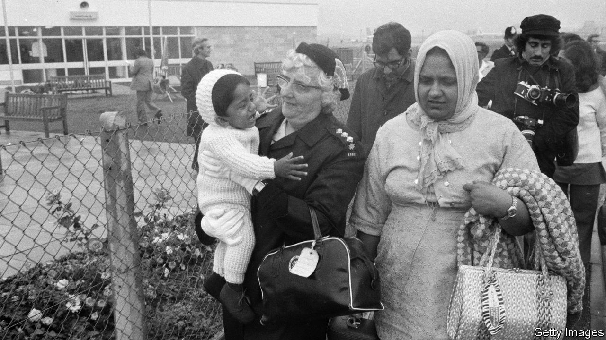

###### From Kampala to the Cabinet Room

# 50 years on from the arrival of the Ugandan Asians 

##### A milestone for one of Britain’s most successful immigrant groups 

 

> Aug 18th 2022 

Jaffer kapasi was just a teenager when he stepped off a charter plane at London’s Stansted airport in October 1972. It was very cold, he remembers, the more so perhaps since he and his family had boarded the plane in the sunshine of Uganda. His parents were disorientated and depressed. They spoke little English and were leaving behind a comfortable life in east Africa, complete with servants and chauffeurs. From the airport the family was taken by bus to a former army barracks in Essex, and then on to a similarly spartan camp in rural Wales. 

The Kapasis were victims of Idi Amin, the thuggish dictator of Uganda. On August 4th 1972 he had announced that all 76,000-odd people of Asian descent in the country had to leave within 90 days. Amin’s decree was an act of economic suicide. Ugandan Asians accounted for about 90% of the country’s tax revenues; with their expulsion, the economy all but collapsed. The consequences for Britain, one of the principal destinations for newly minted refugees, were far better. 

The forefathers of the deportees had emigrated in the late 19th century from Britain’s Indian empire to its colonies in east Africa. The majority came from the state of Gujarat. Some worked on the new railways; others became shopkeepers, and started to build thriving businesses. 

But with independence in the early 1960s came “Africanisation”. Resentment among Africans at the wealth of Asian immigrants prompted the new leaders of Kenya, Tanzania and Uganda to expropriate Asian-owned businesses. Thousands of Asians from Kenya had already been forced to leave for Britain by the time Amin took even more draconian action. Deportees from Uganda were allowed to leave with just £55 (in today’s money, £600 or $730) and two suitcases; stories abounded of troops at Entebbe airport stripping expelled Asians of watches and belts. 

Many Ugandan Asians had British passports. Around 28,000 came to Britain; Canada took in about 6,000 Ishmali Muslims. The prime minister, Edward Heath, insisted that it was the country’s “moral duty” to accept them. He was opposed by his rival in the ruling Conservative Party, Enoch Powell, a self-appointed tribune of the right who had whipped up anxiety about the dangers of immigration. Heath, courageously, stood firm. 

For many of the new immigrants the first months were tough and often humiliating. Men who had presided over entire engineering businesses had to take jobs as humble mechanics. Most of the women suddenly had to get jobs. There were skinheads to worry about on top of pervasive casual racism. About 10,000 of the new arrivals quickly moved to the Midlands town of Leicester, where the existing Asian community provided some support. 

Entrepreneurial Gujaratis started spotting business opportunities as soon as they landed in Britain. Literally. On the way from Stansted to their first barracks, Mr Kapasi’s father spied something odd about this new country. Many of the shops had already closed. In Leicester he opened a mini-supermarket that stayed open after 5pm and on Saturday afternoons. 

Many of the newcomers ended up building substantial businesses. Shahid Sheikh and his three brothers founded Clifton Packaging in 1981; it is now a leading food-packaging company. Another family made a fortune out of loo rolls with the Leicester Paper Company, sold to an Italian company for £42m. Nik Kocheta founded Morningside Pharmaceuticals in Loughborough, which has exported medicines to over 120 countries and employs almost 100 staff.

Economically, east African Asians have shone. It is estimated that they might have created 30,000 new jobs in Leicester alone. One recent academic study found that within 40 years of their arrival they were “significantly over-represented among professional and managerial occupations”. The authors concluded that this was “quite remarkable, given the many disadvantages with which the group arrived”. 

Politically, their contribution has been just as significant. Dolar (now Lord) Popat, who arrived from Uganda in 1971 as a 17-year-old with £10 in his pocket and subsequently became a successful businessman, argues that the Asians should have been more involved in politics in Uganda. That might have staved off the likes of Amin. They weren’t going to make the same mistake in their new home. Lord Popat and a few others joined the Conservative Party, convinced that if the Tories could just see beyond their skin colour they would recognise that the newcomers shared their political values. 

Uganda’s loss, Britain’s gain

His persistence eventually paid off. Under the leadership of David Cameron, ethnic minorities began to be fast-tracked into winnable seats for the Tories. Today, there are eight men and women of Ugandan Asian descent in the Houses of Parliament, including the home secretary, Priti Patel, and Shailesh Vara, secretary of state for Northern Ireland. Other east African Asians also punch above their weight politically: the initial line-up of contenders for the Tory leadership contest included Suella Braverman, the attorney-general, whose father arrived from Kenya in 1968.

Few would have predicted such an outcome when the Ugandan Asians started arriving 50 years ago. David Goodhart, a historian, has written that the east African Asians proved to be “the most successful non-European minority group in post-war Britain”. It’s hard to disagree. ■

