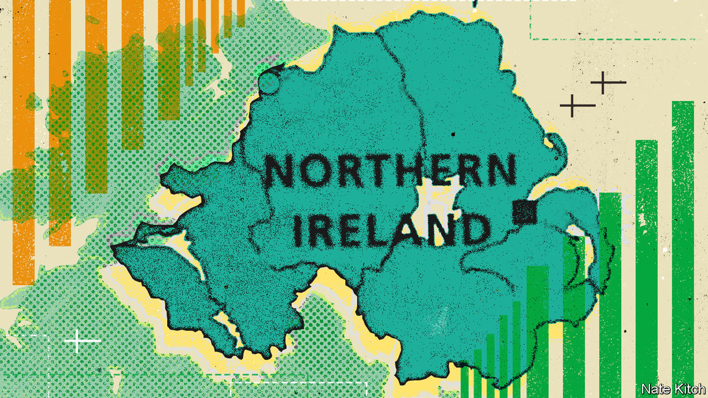

###### Counting on it

# Are Catholics now the majority in Northern Ireland? 

##### Census results due in the autumn will provide the answer 

 

> Aug 18th 2022 

Gerry adams was asked in 2001 whether a higher Catholic birth rate in Northern Ireland could deliver a united Ireland. The former leader of Sinn Féin, the political party which grew out of the Irish Republican Army (ira), replied: “Outbreeding [pro-British] unionists may be an enjoyable pastime for those who have the energy, but it hardly amounts to a political strategy.” Maybe so, but the size of the province’s Catholic population is soon to be a subject of intense political interest. 

In the autumn the results of the latest census, conducted in 2021, will show whether there are more Catholics, who are disposed to favour reunification, than Protestants, who want to stay in the United Kingdom. That would be a historic result; Northern Ireland’s borders were drawn in 1921 to preclude such an outcome, in the belief that a Catholic majority would want to sever ties to Britain. 

No one in Northern Ireland has ever rioted or planted bombs because they disagreed about transubstantiation. But religion has been the best indicator of political identity, which is why the census figure politicians will study most closely is not belief itself but the religion in which individuals were brought up. In the 2011 census, that showed the population to be 48% Protestant and 45% Catholic. (Immigration complicates these figures a little: the last census suggested that about 20,000 people from overwhelmingly Catholic Poland had moved to Northern Ireland, for example.)

If the latest census does show Catholics outnumbering Protestants, it will unnerve unionists and hearten nationalists. By 2008 Mr Adams himself had changed his tune, pointing to “demographic dynamics” as a reason why Irish reunification was a “realistic objective within a reasonable timescale”. In a focus group conducted last year, one Sinn Féin voter was blunt about how unity would come about: “We breed better than they do. They have big tvs; we have big families.” 

Yet demography is not destiny. A growing number of people are neither unionist nor nationalist (ie, pro-reunification). For the first time Northern Ireland has a cohort of constitutional swing voters, diluting the significance of religious labels. 

The link between Protestantism and unionism is stronger than that between Catholicism and nationalism. A recent poll found that Protestants (86%) were more likely than Catholics (64%) to say they had never changed their mind about Northern Ireland’s position in the United Kingdom. Many Catholics would vote to keep the union for pragmatic reasons like health care. 

Previous censuses have shown more modest Catholic population growth than anticipated. Last year’s total school enrolment—50% Catholic, 31% Protestant and 19% other—was fractionally higher for Catholics a decade ago. Any majority, now or in the future, may be slim. 

Whatever its outcome, the attention paid to the census is a mark of progress. The ira saw it as an activity of the British state. In 1981 Joanne Mathers, a 29-year-old mother, was gathering census forms in Derry (also known as Londonderry) when the ira shot her dead. Her killer has never been caught. Four decades later Conor Murphy, a former ira man and now a Sinn Féin minister, is in charge of the count.■

