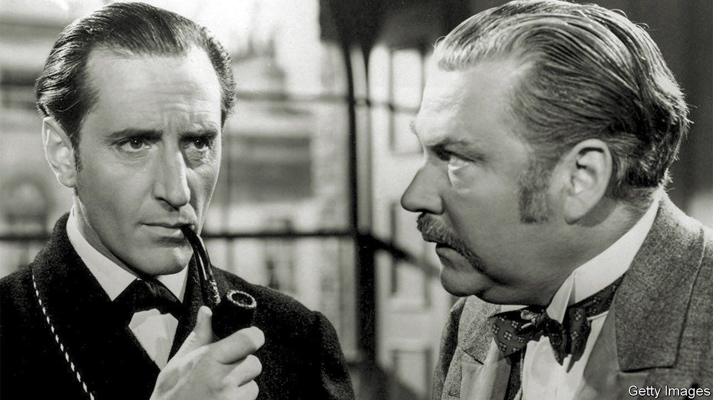

###### Eye of the Neidle

# In praise of financial professionals who turn into sleuths 

##### White-collar vigilantes fill the gap left by inadequate law enforcement 

 

> Aug 18th 2022 

Dan neidle is a formidable foe. In July he tweeted concerns about possible tax avoidance by Nadhim Zahawi, the chancellor of the exchequer. When Mr Zahawi co-founded YouGov, a polling firm, 22 years ago, he took no shares; instead they went to a family trust. Mr Zahawi, through his lawyers, has denied wrongdoing. 

Mr Zahawi’s lawyers also sent a stroppy letter to Mr Neidle, marked “confidential”, which he promptly published. Missives of this sort routinely go out to publishers and broadcasters on behalf of clients; many are designed to intimidate. Mr Neidle has written to the Solicitors Regulation Authority asking it to confirm that recipients are not legally bound to respect their confidentiality. If it does so, he reckons many of the bullying tactics employed in such letters would end abruptly.

Mr Neidle is not some hard-bitten investigative hack. Until May he headed the tax practice at one of London’s bluest-chip law firms, Clifford Chance. Mr Neidle gave up a lucrative partnership contract to set up a tiny tax-policy non-profit (motto: “understanding tax, improving tax”). He says he is more interested in helping to steer national policy than to expose individuals’ tax shenanigans. He cites as an example Britain’s tax regime for “non-doms”, which he thinks is “ripe for abolition”. 

The number of such poachers-turned-gamekeepers in finance is small but it is creeping up. Among others who have crossed the divide are Jolyon Maugham, a controversial tax barrister who has used his blog to expose tax-avoidance loopholes; and Tom Keatinge, once of JPMorgan Chase, a bank, and now at rusi, a think-tank, where he devotes much of his energy urging the British government to toughen up its financial-crime-fighting regime.

Another aisle-crosser is Tommaso Faccio, a former ey and Deloitte tax expert who now teaches accounting at the University of Nottingham and runs the secretariat for icrict, a committee of experts who want the international tax system to be fairer. The global financial crisis in 2007-09 was a turning-point: “It forced me to think harder about the impact that the tax-minimisation I was helping companies with was having on government finances. It reached the point where it was hard to sleep.” 

Antoine Deltour was one of the whistleblowers from pwc, a consultancy, who passed the “LuxLeaks” documents (revealing sweetheart deals between Luxembourg’s taxman and multinationals) to a journalist. Today Mr Deltour works for the French statistical office, and with two ngos that assist whistleblowers. “Journalists and ngos interested in financial and tax issues are attacking a fortress with at least two walls. The first is opacity, the second is complexity,” he says. “In both cases, the help of a citizen-professional is precious: first to access the information and then to decipher it.”

Such work is particularly important in countries, such as Britain, where enforcement is weak. Most of the big tax-dodging and money-laundering scandals of the past decade with a strong British nexus—including the “laundromat” schemes that rinsed dirty money from the former Soviet Union—were primarily the result of digging by journalists, campaigners and whistleblowers, not spade work by official investigators. Reports suggest that headcount at both the National Crime Agency and the Serious Fraud Office could fall by up to 40% as civil-service cuts bite. If so, more citizen-pros will be needed. ■

