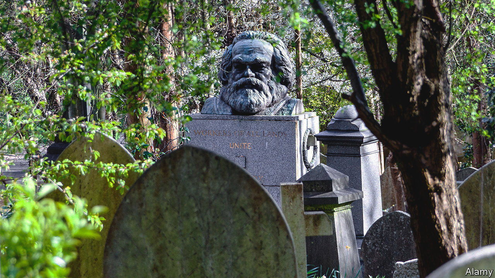

###### A grave shortage

# London’s cemeteries are selling second-hand graves. They need to 

##### For sale: vintage grave, one careful owner 

 

> Aug 18th 2022 

At two metres long and under a metre wide, the plot of land is bijou even by London standards. But plot 18946 is also scenic: like all the graves in Highgate Cemetery it offers an Edgar Allan Poe-ish, urns-and-ivy, discerning sort of resting place. Even more desirable are the neighbours, for just opposite is plot 24748: the original grave of one Karl Marx. Ian Dungavell, head of the Friends of Highgate Cemetery Trust, thinks that plot 18946 could command a premium price. For graves, as for grander residences, says Mr Dungavell, “it’s about location, location, location.”

“The bourgeoisie produces…its own gravediggers,” wrote Marx in “The Communist Manifesto”. He underestimated his enemy. The bourgeoisie also produces its own grave-entrepreneurs, grave-sellers and, now, grave-recyclers. In the quiet of London’s cemeteries, plots that have lain untouched for a century or so are starting to be opened; fresh inhabitants are being planted on top; and a desirable rate is being charged for doing so. 

This spring, an act of Parliament, rich in phrases about “human remains”, was passed that allows Highgate to reuse graves. Other London graveyards have been doing this for a few years. The stipulations are numerous. To be reused, a grave’s last burial must have been at least 75 years before; advance warning of each potential reuse must be given to the public on cemetery notices and in newspapers. Previous inhabitants are either left where they are, interred deeper (“lift and deepen”) or moved elsewhere (“lift and shift”). But for many, the prospect of shared accommodation is worth it. A fresh burial plot in the capital might cost you £10,000-23,000 ($12,040-27,700). A “heritage” grave can be had for thousands of pounds less. 

Reusing graves is not merely economical but essential. London’s living residents grumble that there is not enough space for them in the city. It is far worse for the dead ones. Part-metropolis, part-necropolis, London is well-known for having been built on bones (and squashier things). Victorian parish graveyards oozed “human putrescence”; mourners at funerals stood on boards to protect their feet from decomposing body parts. 

A shortage of grave space is a nationwide problem, but it is particularly acute in the capital. A 2011 audit found that, although some London boroughs had enough capacity for 20 more years of burials, others were already full. 

Other solutions to underground congestion exist. Large suburban cemeteries have been built. Cremation has been championed, successfully: 78% of Britons now choose this option. But even suburban cemeteries are now filling up, and many have profound religious objections to cremation. 

Grave reuse might sound startling, but it revives a long tradition. Few British bodies have rested in as much peace as sentimental grave inscriptions might imply; for centuries, many graves have been less freehold than leasehold properties. When Samuel Pepys, a 17th-century diarist, went to choose a grave for his brother, the gravedigger offered, for sixpence, to “jostle” along other corpses “that are not quite rotten, to make room for him”. It is better to think of churchyards less as elegiac dormitories for the dead (if they had been, they would have had to be much bigger) than as a sort of subterranean bone broth that was occasionally stirred, and then garnished with gravestones. 

Reuse fell out of fashion after a series of crises (notably cholera) led to a change in the law in 1832 that was designed to prevent overcrowding. London’s “magnificent seven” private cemeteries, Highgate among them, appeared. The great Victorian graveyard boom began; a market for meticulously numbered plots started up. Soon the invisible hand put paid to the presence of visible ones in London cemeteries. 

As soon as next year, however, some Highgate graves will start to be reused. A premium will be probably paid for prime spots. It’s enough to make Marx turn in his grave. Though not literally. If there is one thing the bourgeoisie understands, it’s the importance of heritage. Graves of historical significance such as Marx’s, says Mr Dungavell, will not be disturbed. ■

