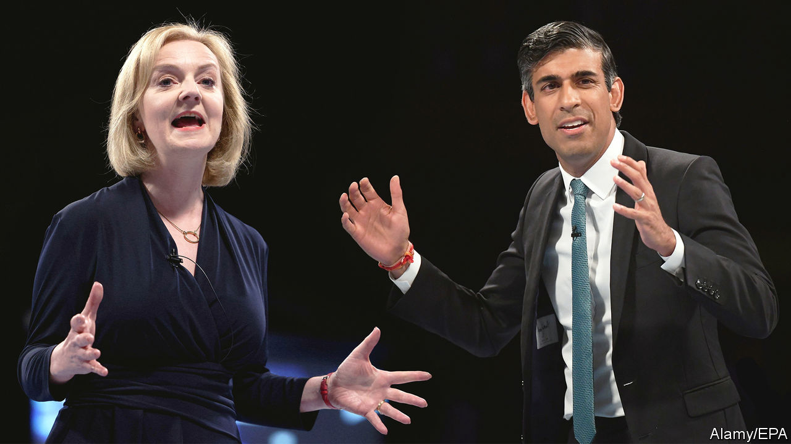
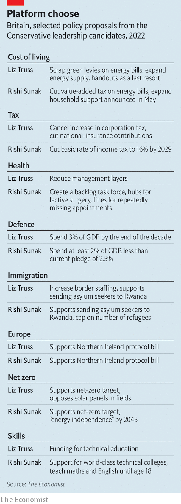

###### The maverick v the wonk

# Parsing the policies of Liz Truss and Rishi Sunak 

##### The economy shows up the differences between the Tory leadership contenders 

 

> Aug 18th 2022 

At the hustings to choose the new leader of the Conservative Party, and Britain’s next prime minister, Tory members have visceral responses to some issues. When , the candidates, offer up canards about aspiration and freedom, grunts of approval rumble around the room. When they say that fields are for food, not solar panels, members clap. Barbs about the French get throatier roars than attacks on Vladimir Putin. 

The crowd is more muted when it comes to the : cushioning households and firms against the immediate cost-of-living crisis, and dragging the country out of its long-run growth rut. There is just very little to cheer. In July annual inflation reached 10.1%, its highest level in 40 years. Workers’ real incomes suffered the largest annual drop on record in the second quarter of this year. 

 is also the area in which the differences between Mr Sunak and Ms Truss remain greatest. That is true not just of policies but also of philosophy and style. Mr Sunak is big on detail; Ms Truss is big-picture. He is a wonk and she is a maverick.

The gaps between them on economic policy have actually narrowed during the campaign. Mr Sunak started off by pledging no tax cuts until inflation was tamed. He pitched himself as the only candidate willing to tell voters hard truths. But as it became clear that  preferred the easier sort, he changed tack. He would temporarily scrap the 5% value-added tax on domestic energy bills, and is dangling big future cuts in the basic rate of income tax, from 19% in 2024 to 16% in 2029. These income-tax cuts would cost around 0.7% of gdp, according to ’s analysis of figures provided by Capital Economics, a research outfit.

To help with soaring energy costs this autumn, he would spend perhaps £3bn-5bn ($3.6bn-6bn) beefing up support for the neediest bill-payers. This pragmatism in the face of plummeting living standards does not extend beyond households to schools and hospitals, which also face climbing energy bills and rising wage pressures. He would fund the help through temporary borrowing and, implausibly, by squeezing savings from departments.

Mr Sunak’s longer-run growth agenda does not depart radically from existing plans—no great surprise given his role in crafting them when he was chancellor of the exchequer. He would enact a planned increase in corporation tax, from 19% to 25% in April 2023, and concentrate on strengthening incentives for investment. 

He argues that a falling headline corporate-tax rate in the 2010s did not obviously turbocharge investment, and that Britain’s treatment of capital spending is unusually stingy compared with its peers in the oecd, a club of mostly rich countries. He plans reforms to make it easier for firms to raise capital. He would beef up technical education and make teenagers study maths and English until the age of 18. 

Mr Sunak casts himself as pragmatic and competent: a fiscal conservative who will respond to the immediate crisis, a tech-savvy leader who can lower the tax burden after unlocking growth. But his claims to be a radical are not helped by comparisons with his opponent. 

No one could describe Ms Truss as cautious. She has consistently presented herself as a tax-cutter first and foremost. She wants to shake up institutions and do away with fusty economic orthodoxy. She is leery of handouts as a way of protecting people against rising energy bills. Her plans for growth are a Reaganite mixture of regulatory reforms, tax simplification and reduction in the size of the state.

 


In response to soaring gas prices, her first priority is to cut green levies on energy bills. These are meant to fund renewable-energy projects, and cost households around £153 a year (less than a tenth of the expected rise in average annual energy bills this autumn). Next she would expand North Sea gas supplies and allow fracking. She has left herself room to offer targeted support to poorer households when and if she gets into office, but has not committed herself to it in the same way as Mr Sunak.

Ms Truss is keener to spell out which other taxes she would cut. She would reverse a recent rise in national-insurance contributions, a payroll tax, and scrap the planned increase in corporation tax. Together, these changes would cost around 1% of gdp, but do very little to ease immediate pain for poorer households.

Beyond that, she would increase defence spending to 3% of gdp by the end of the next parliament, from around 2.1% now; she might allow a stay-at-home carer to transfer their tax-free personal allowance to a partner in paid work. This would take the cost of her pledges to around 1.8% of gdp. That need not spell financial disaster. But it would be imprudent given the long-term pressures of an ageing population and the transition to net zero.

Ms Truss’s argument is that tax cuts and other supply-side reforms will generate growth and pay for themselves. Some of those other reforms echo ones put forward by Mr Sunak: changes to financial regulations to unlock capital; investment zones that combine looser planning regulations with tax incentives.

But in general she has a more relaxed attitude towards the public finances than her rival, and she is much more critical of Britain’s institutions. She is suspicious of the Treasury, and thinks that regulatory frameworks which made sense when Britain led the world on privatisation need an overhaul. She would review the Bank of England’s mandate, an exercise last done in 2013. That is not unreasonable in theory, but would be worrying if she embraced discredited ideas like money-supply targets.

Ms Truss is much likelier than Mr Sunak to be able to put her plans into practice. Tax cuts and a tone of optimism seem to play better with party members; she is the heavy favourite to become prime minister when the result is announced on September 5th. She does not have the better policies—in areas like health care, she seems not to have policies at all—but she does seem to know how to win. ■

