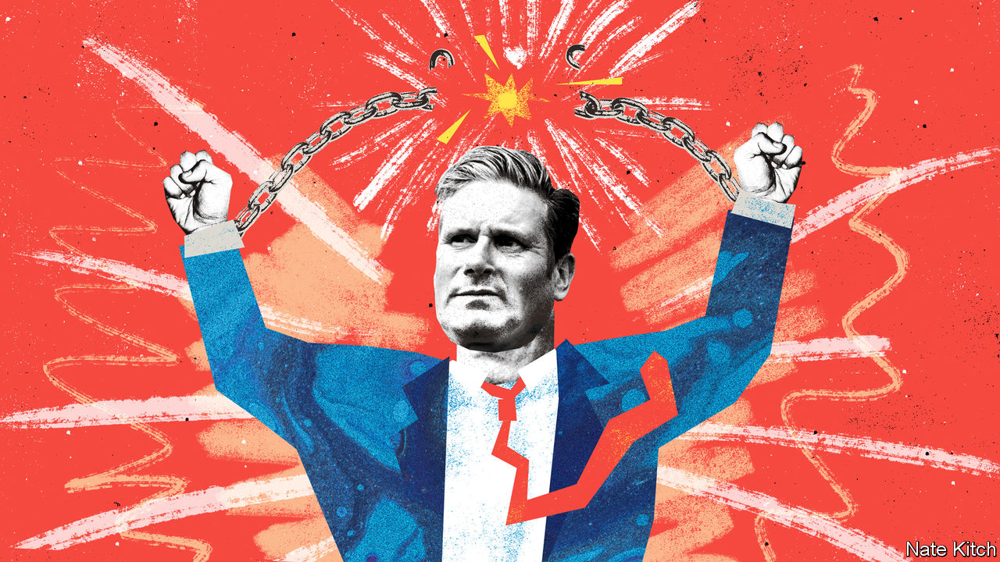

###### Bagehot

# Why Labour’s silly energy policy is smart politics 

##### The limits of technocracy 

 

> Aug 18th 2022 

Labour’s energy policy is a technocrat’s worst nightmare. Sir Keir Starmer’s party this week pledged to cap soaring annual average energy bills at £1,971 ($2,380) for the typical household, with the state paying the rest. At £29bn, or 1.3% of gdp, this promise is very expensive. Since energy prices are not likely to come down any time soon, the cost could double if the cap is extended beyond 2023. The policy is also badly targeted. Around £6bn will be spent on the top fifth of earners, who find the prospect of a £4,000 energy bill annoying but not impossible. It ignores businesses, which face astronomical bills.

Yet the policy is also refreshing. Sir Keir’s tenure has been marked by too much technocracy and too little raw politics. An overreliance on boffins lulls politicians into the idea that there is a correct answer to every problem. Rather than accepting that there are competing interests, whether based on economics or class or place, technocrats turn politics into an impossible search for nirvana. Clever-clever solutions beat simple ones. Puritans fear that someone, somewhere, may be happy; technocrats worry that a middle-class family may enjoy a free lunch. 

Labour’s energy promise shows that the party is throwing off its technocratic blinkers in favour of bolder political choices. Sir Keir’s pledge is unashamedly universal, which makes wonks wince. Other policies, such as increasing universal credit, a welfare payment, would help the poorest most. But it is not just the poor who will take a hit from rocketing energy prices. The median household income after tax is around £31,000; an extra £2,000 is not easily found. If you earn about £63,000, you are in the richest fifth of households. 

Inefficiencies are a fact of life in any democracy. It is not progressive to hand well-off pensioners £10,000, no questions asked, every year until they die. Yet it would be electoral suicide to do anything else. The British state is increasingly run on the creed of “universalism for me, but not for thee”, with working-age voters paying the price. On this occasion, Labour is offering everyone a handout. A technocratic wonderland in which every policy is perfectly progressive, with the poor paying least and receiving most and the rich vice versa is possible. But it would also probably result in officials hanging from meathooks on Whitehall. 

Technocracy can be the enemy of simplicity. Some policy solutions are inherently complex. Just as often, however, the real problem is that they are either expensive or unpopular (or both). Technocratic tinkering can frequently be a substitute for meaningful action. It is little wonder that British politicians fell in love with nudge theory, the idea that tiny tweaks can have big effects without the need for lots of money or for sweeping legislation. Instead, it proved to be the political equivalent of homeopathy. 

When it comes to their energy-cap policy, Labour has decided to do something different and pay the price upfront. It is big, it is dumb but it is wildly popular. A huge majority of all voters, including Conservative ones, support the idea of a freeze on energy bills, whose cost will partly be paid for by backdating a windfall tax on big energy companies and by some fiscal skulduggery. (Although the policy is “fully costed”, about £7bn is paid for by lower interest payments on inflation-linked government debt; reducing people’s energy bills will, Labour argues, reduce inflation.) Other than free puppies paid for with a paedophile tax, it is hard to imagine a policy with more appeal. 

By ditching the technocratic worldview, at least in this instance, Labour has avoided a common mistake among opposition politicians. In government it is often necessary to do something unpopular but right. In opposition it never is. Doing things voters do not like, such as telling them to swallow higher energy bills, shows an unseriousness about power. Labour is often scrutinised as if it is in government, whereas the Conservatives are somehow able to campaign as an opposition in office. With its energy policy Labour has turned this weakness into a strength. Pledging to knock £29bn off voters’ bills has the same effect on perceptions of the party as actually doing it. 

The consequences of politicians appealing only to the head rather than to the heart have been visible in the past six years. While Conservative zealots were dragging Britain out of the eu in the most chaotic way possible, and a Jeremy Corbyn-controlled opposition engaged in leftist populism, technocratic centrists stood in the middle of the political spectrum, tutting loudly while being hammered by both wings. Failing to appeal to people’s political instincts in such circumstances is akin to quoting Sun Tzu’s “The Art of War” in a bar fight. Policy is pointless without power. 

Technobabble

The new energy policy is expensive and ineffective. But it is nonetheless a step towards power for Labour. When it comes to making spending pledges, Labour is still enduring post-traumatic stress disorder. Until recently, grilling a shadow cabinet minister on the party’s spending plans resulted in a thousand-yard stare, with memories of their beating in the 2019 election under Mr Corbyn fresh in their minds. But Mr Corbyn’s failure was due more to the messenger than the message. After all, he lost heavily to Boris Johnson, who was merrily peddling a vision of free-spending, big-state Conservatism. 

Too much technocracy rather than too much radicalism is the biggest threat to the Labour Party. Unless the next prime minister is terminally insane, the Tories will put together a generous package of support in the autumn to get people through the cost-of-living crisis. If Labour cannot match or beat it, there is much less reason for people to vote for them. Putting the wishes of wonks before the desires of voters is the quickest way to ensure defeat. It might not be sensible. But trying to be sensible is sometimes politically rather silly. ■


