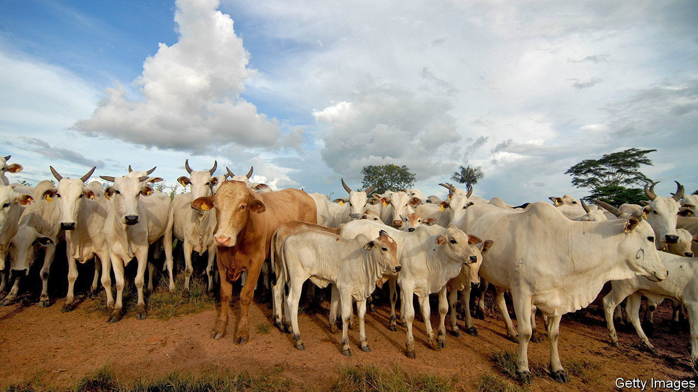
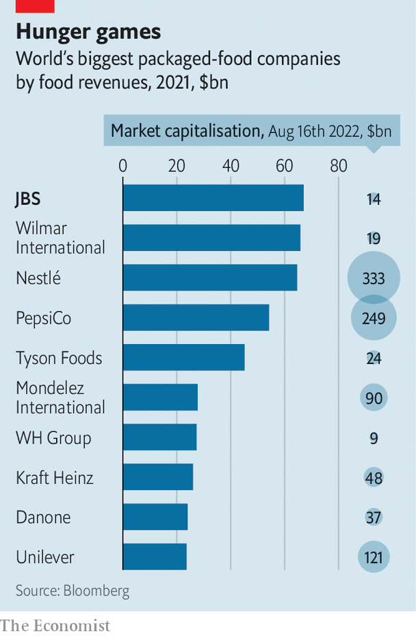

###### Lots of cattle, less hat

# Can JBS remain the world’s biggest food producer? 

##### The Brazilian giant now sells more grub than Nestlé 

 

> Aug 18th 2022 

Just over five years ago jbs and its then chief executive, Joesley Batista, embodied everything that was wrong with Brazilian business. Mr Batista, son of the meat giant’s eponymous founder, José Batista Sobrinho, was fleeing Brazilian prosecutors, his Italian-made yacht  in tow, over his role in a gargantuan bribery scandal. (He was eventually caught.) jbs was fending off accusations of selling dodgy meat and razing the Amazon to raise cattle (both of which it denies). Investors and customers stampeded out. 

“It took a lot of work to make sure what happened in the past didn’t happen again,” says Gilberto Tomazoni, who became the first non-Batista ceo in 2018. His efforts to rebuild jbs’s image—and investors’ trust—are paying off. On his watch its market value has nearly doubled, to $14bn. Last year it sold $67bn-worth of packaged food, more than any rival (see chart). On August 11th it reported revenues of 92bn reais ($19bn) in the second quarter, up by 7.7% year on year. 

 


Under Mr Tomazoni, jbs has “simplified and consolidated its ownership structure, making it more transparent to outsider investors,” explains Paulo Terra of fgv, a business school in São Paulo. It has drilled its 250,000 employees in compliance. It has also restructured its debt, selling off billions in assets to pay off creditors. That allowed it to go shopping. In 2021 jbs bought an American smoked-meat processor, an Australian hog breeder and an Italian sausage-maker. It is angling for a share of the seafood business, swallowing sellers of plant-based protein and gobbling up startups developing lab-grown meat. 

Geographical diversification has made the company more resilient. It controls a quarter of beef processing in America, and last year benefited from a combination of low live-cattle prices and a hunger for beef. Now that inflation has made pricey meat less appetising to Americans, dragging jbs’s beef sales there down by 4.6% year on year, it can lean more on growth in Australia and Brazil. At home in particular, a wider product range, which includes cheaper pork, poultry and fish, has helped it at a time when less diversified competitors struggle with rising prices of feed.

The whiff of scandal will continue to scare off some investors. Wesley, nephew of Joesley, was recently made the global president of operations. Joesley and his brother, both of whom spent time behind bars on charges of corruption, remain a powerful force. The family’s holding company, j&amp;f, retains a 42% stake. Some of their past deals remain under scrutiny. 

In America, accusations of price-fixing and worries about workers’ welfare have made meatpackers the focus of congressional probes. Criticism of its links to deforestation in the Amazon has pressed jbs to declare sustainability its “core business strategy” and to pledge to emit no net carbon by 2040. Humankind is “eating the planet”, admits Mr Tomazoni, so it needs to produce food in a new way. 

jbs may find it increasingly hard to sustain rapid growth. Even as sales rose, net profit declined last quarter, by 10% year on year, as drought shrank grazing lands and the cost of animal feed spiralled. Weakening demand in America will continue to squeeze profit margins in beef and pork. So will a slowdown in China, a smaller but faster-growing beef market where the middle class is eating more beef. jbs’s share price is down by 17% since its recent peak in April. Having whetted investors’ appetites, Mr Tomazoni will need to keep working hard in order to keep them sated. ■


