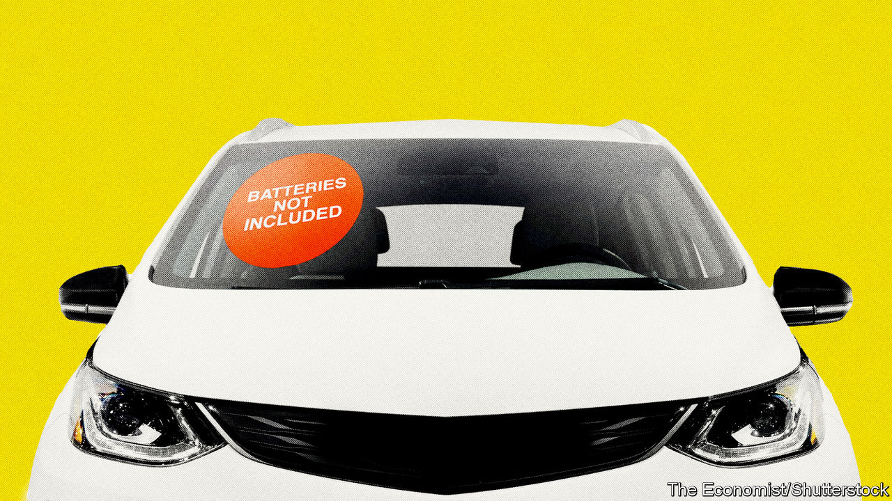
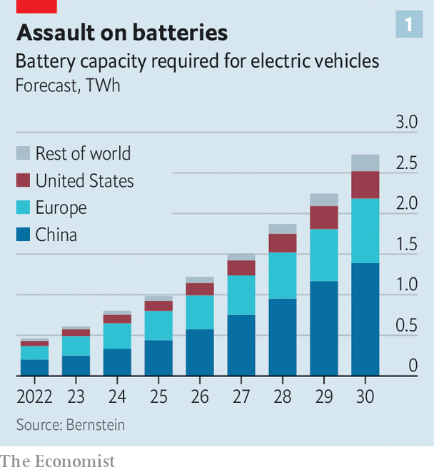
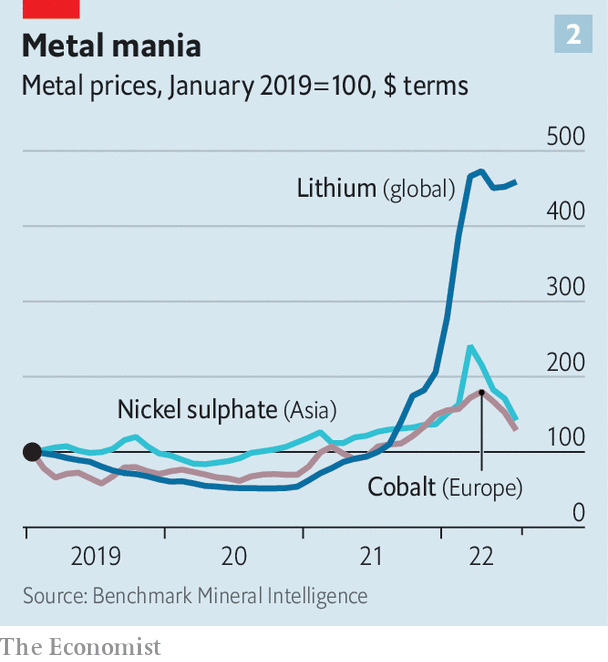
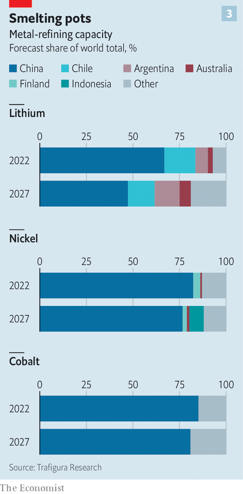

###### Cell-side analysis

# Could the EV boom run out of juice before it really gets going? 

##### Quite possibly, for want of batteries 

 

> Aug 14th 2022 

Electric vehicles (evs) appear unstoppable.  are outpledging themselves in terms of production goals. Industry analysts are . Battery-powered cars may zoom from 10% of global vehicle sales in 2021 to 40% by 2030, according to Bloombergnef. Depending on whom you ask, that could translate to between 25m and 40m evs a year. They, and the tens of millions manufactured between now and then, will need plenty of batteries. Bernstein reckons that demand from evs will grow six-fold by 2030 (see chart 1), to 2,700 gigawatt-hours (gwh). Rystad puts it at 4,000gwh. 

 


Such forecasts explain the frenzied activity up and down the battery value chain. The ferment stretches from the salt flats of Chile’s Atacama desert, where lithium is mined, to the plains of Hungary, where on August 12th catl of China, the world’s biggest battery-maker, announced a €7.3bn ($7.5bn) investment to build its second European “gigafactory”. 

It is, however, looking increasingly as though the activity is not quite frenzied enough, especially for the Western car companies that are desperate to reduce their dependence on China’s world-leading battery industry amid rising geopolitical tensions. Prices of battery metals have spiked (see chart 2) and are expected to push battery costs up in 2022 for the first time in more than a decade. 

In June Bloombergnef cast doubt on its earlier prediction that the cost of buying and running an ev would be as low as for a fossil-fuel car by 2024. More distant targets, such as the eu’s coming ban on new sales of carbon-burning cars by 2035, may not be met. Could the ev boom run out of juice before it gets going in earnest? 

 


On paper, there ought to be plenty of batteries to go round. Benchmark Minerals, a consultancy, has analysed manufacturers’ declared plans and found that, if they materialise, 282 new gigafactories should come online worldwide by 2031. That would take total global capacity to 5,800gwh. It is also a big “if”. Bernstein calculates that current and promised future supply from the six established battery-makers—byd and catl of China; lg, Samsung and sk Innovation of South Korea; and Panasonic of Japan—adds up to 1,360gwh by the end of the decade. The balance would have to come from newcomers, and being a newcomer in a capital-intensive industry is never easy. 

The optimistic overall capacity projections conceal other problems. Matteo Fini of s&amp;p Global Mobility, a consultancy, notes that gigafactories take three years to build but require longer—possibly a few extra years—to manufacture at full capacity. As such, actual output by 2030 may fall short. Moreover, manufacturers’ unique technologies and specifications mean that cells from one factory are usually not interchangeable with those from another, which could create further bottlenecks.

Most troubling for Western carmakers is China’s dominance of battery-making. The country houses close to 80% of the world’s current cell-manufacturing capacity. Benchmark Minerals forecasts that China’s share will decline in the next decade or so, but only a bit—to just under 70%. By then America would be home to just 12% of global capacity, with Europe accounting for most of the rest. 

Americans’ slower uptake of evs may ease the crunch for carmakers there. Deloitte, a consultancy, expects America to account for fewer than 5m vehicles of the 31m evs sold in 2030, compared with 15m in China and 8m in Europe. Detroit’s auto giants already have joint ventures with the big South Korean battery-makers to build domestic gigafactories. In July Ford and sk Innovation finalised a deal to build one in Tennessee and two in Kentucky, with the carmaker chipping in $6.6bn and sk Innovation $5.5bn. The same month it struck a deal to import catl batteries. General Motors and lg Energy are together putting more than $7bn into three battery factories in Michigan, Ohio and Tennessee.

It is Europe’s carmakers that seem most exposed. Volkswagen plans to construct six gigafactories of its own by 2030. Some, such as bmw, are teaming up with the South Koreans. Others, including Mercedes-Benz, are investing in European battery-making through a joint-venture called acc. A number of European startups, such as Northvolt of Sweden, which is backed by Volkswagen and Volvo, are also busily building capacity. Yet the continent’s car industry looks likely to remain quite reliant on Chinese manufacturers. Some of those batteries will be made locally: catl’s first investment in Europe, a battery factory in Germany, is set to begin operations at the end of the year. Some packs or their components may, however, still need to be imported from China. 

That is not a comfortable position to be in for European carmakers. It may become even less so if the eu enacts levies based on total lifecycle emissions from vehicles, including evs. Northvolt’s chief executive, Peter Carlsson, reckons that proposed eu tariffs on carbon-intensive imports could add 5-8% to the cost of a Chinese battery made using dirty coal power. That could be roughly equivalent to an extra $500, give or take, per pack. Such rules would boost his firm’s prospects, since it runs on clean Nordic hydroelectricity. It would also severely limit European carmakers’ ability to source batteries from abroad.

These manufacturing bottlenecks, serious though they are, look manageable next to those at the mining end of the battery value chain. Take nickel. Thanks to a production jump in Indonesia, which accounts for 37% of global output, the market seems well supplied. However, Indonesian nickel is not the high-grade sort usable in batteries. It can be made into battery-compatible stuff, but that means smelting it twice, which emits three times more carbon than refining higher-grade ores from places like Canada, New Caledonia or Russia. Those additional emissions defeat the purpose of making evs, notes Socrates Economou of Trafigura, a commodities trader. Carmakers, particularly European ones, may shun the stuff. 

 has become less of a pinch point. A price spike in 2018 prompted battery-makers to develop battery chemistries that use much less of it. Planned mine expansions in the Democratic Republic of Congo (drc), home to the world’s richest cobalt deposits, and Indonesia should also tide battery-makers over until 2027. After that things get trickier. Getting more of the metal may require manufacturers to embrace the drc’s artisanal mining, the formalisation of which has yet to bear fruit. Until it does, many Western carmakers say they would not touch the sector—where adults and many children toil in harsh conditions—with a barge-pole.

Most uncertainty concerns lithium. A shortage is forcing some manufacturers to cut production. For now consumer-electronics firms are bearing the brunt. But their gadgets’ smaller batteries represent a fraction of demand. ev-makers, whose battery packs use a lot more, could be next. 

By 2026 the lithium market is projected to tip back into surplus, thanks to planned new projects. However, most of these are in China and rely on lower-grade deposits which are much costlier to process than those of Australia’s hard-rock mines or Latin America’s brine ponds. Mr Economou estimates that a price of $35,000 per tonne of the battery-usable form of lithium carbonate is required to make such projects worthwhile—lower than today’s lofty levels, but three times those a year ago. 

High-grade lithium due to come from elsewhere should not be taken for granted, either. Chile’s new draft constitution, which will be put to a referendum in September, proposes nationalising all natural resources. Changes to the tax regime in Australia, which already has some of the highest mining levies in the world, could deter fresh investments in “green”-metal production. In late July the boss of Albemarle, the largest publicly traded lithium producer, warned that, despite efforts to unlock more supply, carmarkers faced a fierce battle for the metal until 2030. 

Because building mines can take anywhere between five and 25 years, there is little time left to get new ones up and running this decade. Big miners are reluctant to enter the business. Markets for green metals remain too small to be worth the hassle for the mining “majors”, says the development boss at one such firm. Despite their reputation for doing business in shady places, most lack the stomach to take a gamble on countries as tricky as the drc, where it is hard to enforce contracts. Smaller miners that usually get risky projects off the ground cannot raise capital on listed markets, where investors are queasy about the mining industry, which is considered risky and, ironically, environmentally unfriendly. 

The resulting dearth of capital is attracting private-equity firms (often founded by former mining executives) and manufacturers with a taste for vertical integration. Battery-makers like lg and catl have backed mining projects. Since the start of 2021 car firms have made around 20 investments in battery-grade nickel, and five others in lithium and cobalt. Most of these projects involved Western companies. In March, for example, Volkswagen announced a joint venture with two Chinese miners to secure nickel and cobalt for its ev factories in China. In July General Motors said it would pay Livent, a lithium producer, $200m upfront to secure lumps of the white metal. The American ev champion, Tesla, is signing deals left and right.

Mick Davis, a coal-mining veteran now at Vision Blue Resources, a firm that invests in smaller miners, doubts all this dealmaking will be enough to plug the funding gap. Recycling, which makes up a quarter of supply in many mature metals markets, is not expected to help much before 2030. Tweaks to battery designs may moderate demand for the scarcest metals somewhat, but at the risk of lower battery performance. Lithium in particular will remain hard to substitute. Technologies that do away with it entirely, such as sodium-based cathodes, are a long way off. 

 


Even if the West’s ev industry somehow managed to secure enough metals and battery-making capacity, it would still face a giant problem in the middle of the supply chain, refining, where China enjoys near-monopolies (see chart 3). Chinese companies refine nearly 70% of the world’s lithium, 84% of its nickel and 85% of its cobalt. Trafigura forecasts that the shares for the last two of these will remain above 75% for at least the next five years. And as with battery manufacturers, Chinese refiners gobble up dirty coal-generated electricity. On top of that, according to Trafigura, both European and North American firms are also expected to rely on foreign suppliers, often Chinese ones, for at least half the capacity to convert refined ores into the materials that go into batteries.

Western governments grasp the urgent need to diversify their suppliers. Last year Joe Biden, America’s president, unveiled a blueprint for a domestic battery supply chain. His huge infrastructure law, passed in 2021, set aside $3bn for battery-making in America. The Inflation Reduction Act, which he signed into law on August 16th, also includes sweeteners for the industry, so long as the ores, refined materials and components come from America or allied countries. The eu, which created a battery alliance in 2017 to co-ordinate public and private efforts, says €127bn was invested last year across the supply chain, with an additional €382bn expected by 2030. Most of this is likely to land downstream, helping the West become self-sufficient in the production of finished cells by 2027. 

That is something. And newfound deposits, better mining technology, cleverer battery chemistry and sacrifices on performance may yet combine to bring the market into balance. More probably, as Jean-François Lambert, a commodities consultant, puts it, the ev industry is “going to be living a big lie for quite some time”. ■


