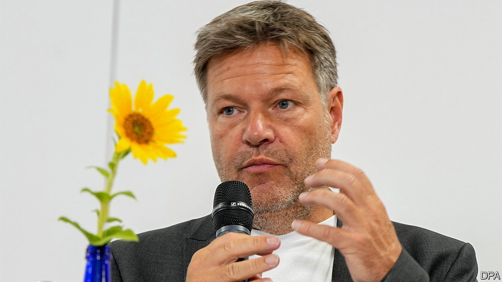

###### Pragmatic eco-warriors

# Germany’s Greens and Deutschland AG cross-pollinate 

##### Utopian environmentalists are evolving into business-friendlier pragmatists 

 

> Aug 18th 2022 

If germans were to elect their chancellor directly they would, a new poll implies, vote for Robert Habeck, the economy minister in Olaf Scholz’s coalition government. Mr Habeck and Annalena Baerbock, the foreign minister, who are both from the Greens, regularly top such surveys. The next chancellor could well be a Green.

Ten years ago this would have been a horror scenario for German business. They saw the Greens as a (prohibition party) whose Birkenstock-wearing leaders lived in an unrealistic Green Utopia with no internal-combustion engines or short-haul flights. ceos didn’t talk to the party—and the party ignored their concerns.

Since then the Greens have joined more state coalition governments, most notably in Germany’s industrial heartlands. Baden-Württemberg, a southern industrial powerhouse, has been led by a Green state premier, Winfried Kretschmann, for the past 11 years. The popular Mr Kretschmann is part of the moderate “” wing of the party that seeks to combine pro-business centrism and green concerns. North Rhine-Westphalia, the most populous state, is led by a coalition of Greens and the conservative Christian Democratic Union.

Government has made the Greens less Utopian. They have redefined themselves as allies rather than adversaries of German business. Their main aim—a carbon-neutral Germany in 20 years—is shared by most companies. In her “pact with industry” last year Ms Baerbock, who was then running for chancellor, proposed handouts for firms that cut their net emissions to zero and kept production at home.

“There is now lots of economic competence in the Green Party,” says Marcel Fratzscher, head of the German Institute for Economic Research, a think-tank. Danyal Bayaz, Baden-Württemberg’s Green finance minister, used to work for the Boston Consulting Group. In 2018 Kerstin Andreae, an economist who was then a Green member of the Bundestag, set up the party’s “economic council”. Members include ceos such as Martin Brudermüller of basf, a chemicals giant, and Gerd Chrzanowski of the Schwarz group, which owns Lidl, a discount grocer. Last year Joe Kaeser, the former boss of Siemens, an engineering giant, spoke at the Greens’ party conference.

Unlike old-school Greens, Mr Habeck is a good listener, says Matthias Berninger, a former Green mp who is now a lobbyist for Bayer, a drugmaker. Unlike Mr Scholz, he is a good talker. If he steers Germany’s economy through the winter, when Russia may cut off the flow of natural gas in response to eu sanctions over its war in Ukraine, business may see him as a good future chancellor, too.

For more expert analysis of the biggest stories in economics, business and markets, , our weekly newsletter.

