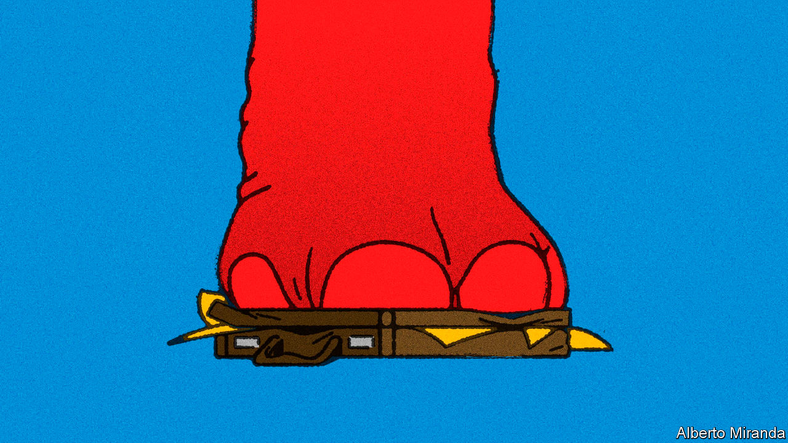
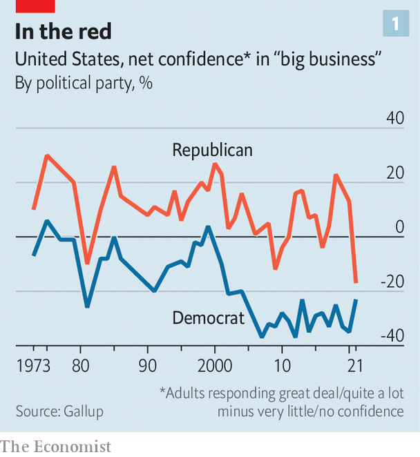
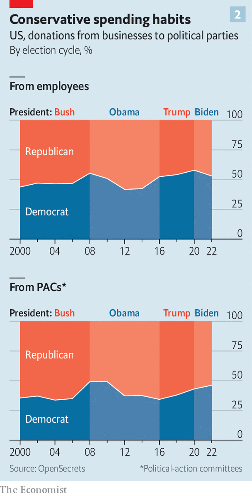

###### The elephant in the boardroom

# Republicans are falling out of love with America Inc 

##### That heralds risks for big business—and change for American capitalism 

 

> Aug 15th 2022 

To american executives, Rob Portman is the ideal politician. Clever, reasonable and experienced, he served as the top trade representative and budget director for George W. Bush, the Republican president from 2001 to 2009, before becoming a senator for Ohio more than a decade ago. Mr Portman has just one shortcoming: he is retiring. The party’s nominee to replace him is , backed by Donald Trump, the most recent Republican commander-in-chief. Mr Vance calls big technology firms “enemies of Western civilisation” and casts elite managers as part of “the regime”, with interests anathema to those of America’s heartland. 

The Democratic Party, with its leftier lean, remains companies’ most persistent headache—firms were caught off-guard this month when Senate Democrats approved a rise in corporate-tax rates and new restrictions on the pricing of drugs. But, in the words of an executive at a big financial firm, “We expect Democrats to hate us.” What is new is disdain from those on the right. There used to be a time, one lobbyist recalls with nostalgia, when “you would walk into a Republican office with a company and the question would be, ‘How can I help you?’” Those days are over. The prospect of Republicans sweeping the mid-term elections in November and recapturing the White House in 2024 no longer sends waves of relief through American boardrooms. 

Executives and lobbyists interviewed by , speaking on condition of anonymity, described Republicans as becoming more hostile in both tone and, increasingly, substance. Public brawls, such as , Florida’s Republican governor, over discussion of sexual orientation in classrooms, or Republicans blasting BlackRock, the world’s largest asset manager, for “woke” investments, are only its most obvious manifestations. “It used to be the axis was left to right,” says an executive at one of America’s biggest firms. “Now it is an axis from insiders to outsiders; everyone seems intent on proving they are not part of the superstructure, and that includes business.” 

Long-held right-of-centre orthodoxies—in favour of free trade and competition, against industrial policy—are in flux. As Republicans’ stance towards big business changes, so may the contours of American commerce. 

The close partnership between Republicans and business has helped shape American capitalism for decades. Companies’ profit-seeking pursuit of free trade abroad and free enterprise at home dovetailed with Republicans’ credo of individual freedom and anti-communism. By the 1990s even Bill Clinton and other Democrats embraced new trade deals, giving American multinational firms access to new markets and cheaper labour. 

As Glenn Hubbard, former dean of Columbia Business School and an economic adviser to Mr Bush, puts it, “Social support for the system was a given and you could argue over the parameters.” The 2012 presidential battle between Barack Obama and Mitt Romney “felt like a big deal at the time”, says Rawi Abdelal of Harvard Business School. “But in terms of the business stakes, it wouldn’t have mattered at all.” 

Four years later Republicans were still attracting about two-thirds of spending by corporate political-action committees (pacs), which give money to candidates in federal elections, and a big corporate-tax cut in 2017 went on to be the main legislative achievement of Mr Trump’s term. Yet Mr Trump had campaigned on the feeling of ordinary Americans that they were being left behind. Executives hoping that his fiery campaign rhetoric would be doused by presidential restraint had to contend instead with his trade war with China, curbs on immigration and contentious positions on climate change and race. Bosses felt compelled to speak out against his policies, which appalled many of their employees and customers. In the eyes of Trump supporters, such pronouncements cast the ceos as members of the progressive elite bent on undermining their champion. 

After Mr Trump’s defeat by Mr Biden, companies wondered if their old alliance with Republicans might be restored. In July 17 Republican senators voted in favour of a bill that provides, among other things, $52bn in subsidies to compete with China by manufacturing more semiconductors in America—which chipmakers such as Intel naturally applauded. This month nearly all Republicans opposed the Democrats’ $700bn climate and health-care bill, known as the , which raises taxes on large companies and enables the government to haggle with drugmakers over the price of some prescription medicines. 

This apparent business-friendliness-as-usual conceals a deeper shift, however. The Republican Party has attracted more working-class voters—an evolution accelerated by Mr Trump’s willingness, on paper if not always in practice, to put the interests of the American worker ahead of those of the American multinational. 

 


For most of the past 50 years more Republicans had a lot of confidence in big business than had little or no confidence in it, often by double-digit margins, according to Gallup polls. Last year the mistrustful outnumbered the trusting by a record 17 percentage points, worse than at the height of the global financial crisis of 2007-09 (see chart 1). Republican election war-chests are increasingly filled either by small donors or the extremely rich. Both these groups are likelier to favour ideologues over pragmatists, notes Sarah Bryner of OpenSecrets, an ngo which tracks campaign finance and lobbying. 

The result of all this is growing Republican support for policies that are hostile to America Inc. Josh Hawley, a senator from Missouri, wants companies with more than $1bn in annual revenue to pay their staff at least $15 an hour. His colleague from Florida, Marco Rubio, has backed the formation of workers’ councils at companies, an alternative to unions. In March Tom Cotton of Arkansas called for Americans to “reject the ideology of globalism” by , banning some American investments in China and suggesting Congress should “punish offshoring to China”. Republicans in Congress have co-sponsored several bills with Democrats to rein in big tech. Mr Vance, who has a good shot at joining them after the mid-terms, has proposed raising taxes on companies that move jobs abroad. Mr Trump himself repeatedly promised to lower drug prices. 

The fact that Republicans opposed the ira—and other business-wary Democratic initiatives—may mean simply that they loathe Democrats more than they dislike big business. Many bosses fret that the Republican Party will enact punitive policies once it is back in power. “There is no person who says, ‘Don’t worry’,” sighs one pharmaceutical executive. “You ignore what a politician says publicly at your peril,” warns another business bigwig. 

That is already evident at the state level, where Republicans often control all levers of government and are therefore free to enact their agenda in a way that is impossible in gridlocked Washington. After Disney spoke out against a law in Florida that restricts discussion of gender and sexual orientation in schools, Mr DeSantis revoked the company’s special tax status. Texas has a new law that restricts the state’s business with firms that “discriminate against firearm and ammunition industries”. Kentucky, Texas and West Virginia have passed similar laws barring business with banks and other firms that boycott fossil-fuel producers; about a dozen other Republican-controlled states are considering doing the same.

Such laws present a problem for companies. In July West Virginia’s treasurer said that the anti-fossil-fuel policies of some of America’s biggest financial firms—BlackRock, Goldman Sachs, JPMorgan Chase, Morgan Stanley and Wells Fargo—made them ineligible for state contracts. The definition of what counts as discriminating or boycotting is hazy. JPMorgan Chase, which does not lend to firms that sell military-style weapons to consumers, first said that the Texan law prevented it from underwriting municipal-bond deals in that state, then bid for a contract (unsuccessfully). In Texas, Republican lawmakers are threatening to prosecute firms that pay for staff to travel out of state for abortions, which the Texan legislature has severely restricted. 

Right-wing culture-warriors have always been part of the Republican Party, but the line between them and their pro-business country-club colleagues has collapsed. These days, worries a business grandee, both parties see it as “acceptable to use state power to get private entities to conform to their viewpoints”. “esg is a four-letter word in some Republican offices,” says Heather Podesta of Invariant, a lobbying firm, referring to the practice, championed by BlackRock among others, of considering environmental, social and governance factors, not just returns, in investment decisions. Senator Ted Cruz of Texas has blamed Larry Fink, BlackRock’s boss, for high petrol prices. “Every time you fill up your tank,” he growled in May, “you can thank Larry for the massive and inappropriate esg pressure.”

 


Companies are adjusting to this new, more volatile political reality. Some are creating formal processes for reviewing the risks of speaking out on social issues that may provoke a political backlash, including from Republicans. The way firms describe their strategies to politicians is changing, too. Lobbying is no longer confined to the parties’ leaders in the two houses of Congress. Because politicians in both parties are increasingly willing to defy the leadership, says an executive, “you have to go member by member”. Neil Bradley, policy chief of the us Chamber of Commerce, which represents American big business, says that his organisation has had to redouble efforts to “find people who have interest in governing”. 

Sometimes that means supporting more Democrats. In 2020 the chamber endorsed more vulnerable freshman Democratic incumbents, who were mostly moderates, than in previous years. That prompted Kevin McCarthy, the leading Republican in the House of Representatives, to say he didn’t want the organisation’s endorsement “because they have sold out”. So far this year corporate pacs have funnelled 54% of their campaign donations to Republicans, down from 63% in 2012. Firms’ employees have beaten an even hastier retreat, with just 46% donating to Republican candidates, compared with 58% ten years ago, according to OpenSecrets (see chart 2). 

If the upshot is divided government, that would suit American business just fine. As one executive remarks, “We might not have improvements, but we won’t get more cataclysmic policies.” ■


