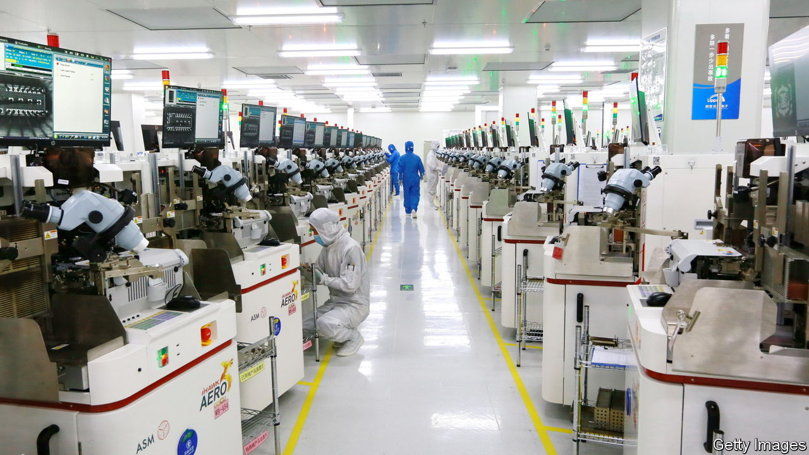

###### Big Fund, big problems

# China’s chips push is mired in corruption allegations 

##### The state’s money is not producing the expected results 

 

> Aug 18th 2022 

China’s habit of pouring cash into strategic industries creates opportunities for corruption. Just look at the microchip business. The “Big Fund” was created in 2014 to spur self-reliance in chipmaking. Backed by state investors, it has raised 343bn yuan ($50bn). But several of the fund’s executives are suspected of corruption, including its head, Ding Wenwu. 

The investigation may be motivated by more than just concern over graft. Chips are used in everything from mobile phones to missiles, which is why China’s leaders don’t want to rely on other countries to make them. But the progress of China’s chip industry has not met expectations. Self-reliance may be decades away, if it is achievable at all.

China still imports a large share of its chips. It also depends on other countries for the equipment needed to make them. America refuses to sell Chinese chipmakers tools or to provide its companies with advanced semiconductors. On August 9th President Joe Biden signed a law that offers $52bn in subsidies and incentives to America’s chip industry. It was designed, in part, to counter China’s efforts.

China’s chip industry ran into trouble from the start. One of its first “home-grown” chips, unveiled in 2003, was exposed as American. The promise of state aid has caused the industry to expand, perhaps too quickly. Some 22,000 new chip companies registered in China in 2020. That year a firm in Hubei province folded after accepting millions of yuan in local subsidies. Last year cash-strapped Tsinghua Unigroup, a big state-backed manufacturer, was forced to restructure. Its former head is thought to be under investigation.

China’s expectations were unrealistic. It started making chips long after America, South Korea and Taiwan, which lead the world. Still, China now produces a hefty share of the world’s less advanced chips. And its largest chipmaker, Semiconductor Manufacturing International Corp, is said to have produced a chip that is considered advanced, if not cutting-edge. 

Some argue that the Big Fund’s main goal, of attracting private investment, has been accomplished. Attracting talent is now the biggest hurdle, says Wang Xiaolong of icwise, a consultancy. Leaders in Beijing may not be so forgiving. The state’s money is not producing the expected results. Someone must be blamed. ■

