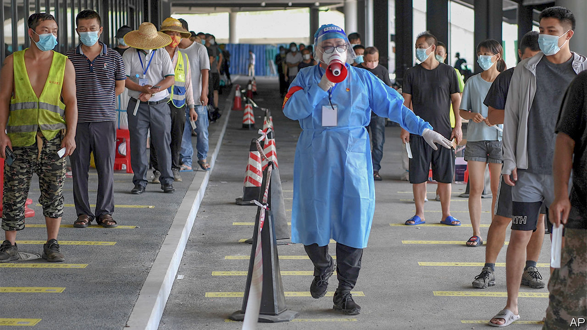
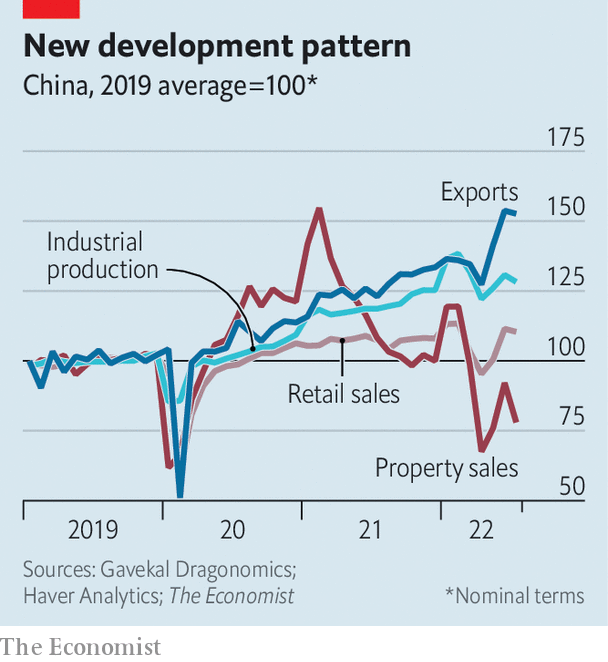
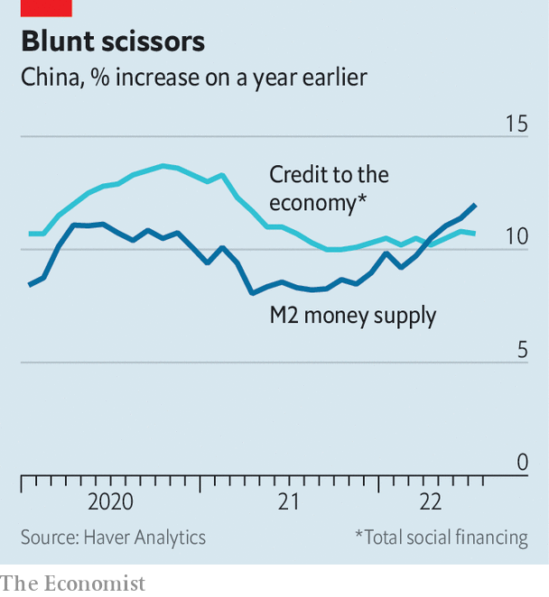

###### No way out

# China’s economy is beset by problems 

##### The zero-covid policy is just one 

 

> Aug 18th 2022 

When shanghai lifted its two-month lockdown in June, it hoped to see citizens flocking back to the shops in relief. Instead it has witnessed people fleeing a store in alarm. On August 13th health authorities discovered that a close contact of a child infected with covid-19 had visited an ikea outlet in the city. Under Shanghai’s strict virus-control regulations, the store had to be immediately locked down, so that everyone inside could be whisked off to quarantine. But panicked shoppers rushed for the exits, pushing past guards. 

Similar perils face anyone in China bold enough to take a holiday. As many as 150,000 tourists have been stranded on the resort island of Hainan, where a covid outbreak has infected over 13,000 people this month. Those hoping to leave have faced onerous testing requirements (pictured) and widespread flight cancellations. Videos circulating online show families sleeping on the floor of an airport.

China’s zero-covid policy has left its economy equally trapped. The impact is both direct and indirect, hampering both supply and sentiment. 

The most profound effects are not always the most obvious. Hainan, for example, accounts for only 5% of China’s tourism revenues, according to Tao Chuan and Shao Xiang of Soochow Securities, a broker. Tourism as a whole accounts for only 4% of China’s gdp. Lockdowns elsewhere in the country have been relatively short in recent weeks. Despite great alarm about disrupted global supply chains, China’s exports have continued to grow strongly. On a visit to a port in the export hub of Shenzhen, Li Keqiang, the prime minister, likened the country’s reforms and the port’s achievements to an irreversible river. 

Given the drought now afflicting six of China’s provinces, it was perhaps an unfortunate metaphor. But Mr Li’s pep talk was at least tacit acknowledgment of the damage China’s covid-crushing measures have done to morale. For every trapped shopper or tourist, there are thousands of others who will not shop, travel or spend to avoid a similar fate. Consumer confidence in the second quarter was the lowest on record. As a result, China’s consumption has lagged behind industry and exports (see chart). Retail sales in July were only 2.7% higher than a year ago. When adjusted for inflation, they shrank.

 


Sales of furniture have been particularly weak—and not just because people dare not enter ikea. Buying furniture is closely tied to home purchases, which have plunged. Sales of residential property fell by over 28% in July, compared with a year earlier. Weak sales have in turn put downward pressure on prices. 

To cap it all, people who buy a flat in advance can no longer be sure it will actually be built. Many distressed developers lack the cash required to complete construction and can no longer find anyone to lend it to them. That has contributed to long delays in finishing pre-sold properties, prompting a growing number of buyers to threaten to stop repaying their mortgages. 

 


The accumulation of bad economic data has finally prompted the central bank to act. It reduced two interest rates by 0.1 percentage points on August 15th, bucking the global trend towards tighter monetary policy. But these cuts may not be effective, because demand for loans is so weak. Since April China’s money supply (broadly measured) has been growing faster than its broad stock of credit (see chart). This has not happened since 2015, according to Jiang Peishan and Sun Liping of Haitong Securities, another broker. It suggests an eagerness to hoard money rather than borrow it. “Funds are idling,” they argue. That raises fears of a liquidity trap, whereby monetary policy becomes ineffective in reviving growth.

If monetary policy is losing its bite, the onus falls more firmly on fiscal policy to rescue China’s economy. Investment in infrastructure is already growing quickly. But the central government has yet to step in decisively to revive the property market. It has told China Bond Issuance, a state-owned credit insurer, to underwrite bond sales by a handful of private property developers, including a unit of Longfor Group. There is also talk of a 300bn-yuan ($44bn) rescue fund. But so far the central government has been largely content to let cash-strapped local governments cobble together rescue plans on their own.

What explains its diffidence? The cost of finishing stalled projects is large but calculable. Andrew Batson of Gavekal Dragonomics, a research firm, has put it in the range of 2trn-4.8trn yuan, or 1.8-4.2% of last year’s gdp. A full restoration of confidence might, however, require something closer to a “blanket guarantee” that all pre-sold properties would be built, says Houze Song of Macropolo, a think-tank. That would be an “open-ended commitment”, which could come at an “exorbitant cost”.

Such a guarantee could also skew incentives. Mr Song compares it with deposit insurance. One difference is that deposit insurance discourages bank runs, thereby reducing the risk it insures. A backstop for pre-sales, by contrast, might have the opposite effect. It could make it more likely that property developers will run into trouble, especially if it allowed reckless operators to pre-sell flats more easily.

The commitment to zero-covid and to ending China’s housing excesses comes from the top. Both goals have been repeatedly emphasised by Xi Jinping, China’s leader, whose personal philosophy, Xi Jinping Thought, looms over everything. But as he prepares to secure a third term at a Communist Party congress later this year, those iron commitments have left the economy in a jam. The economic setting for the congress is not what Xi Jinping thought it would be. Nor is it anything Xi Jinping Thought appears able to solve. ■


