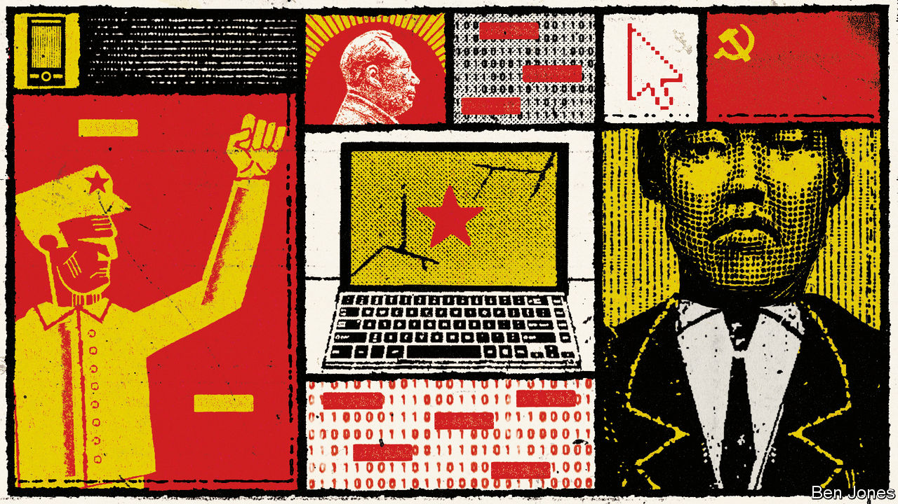

###### Seeing red

# Mao-loving websites are in a grey zone between propaganda and dissent 

##### They are often useful to the Communist Party, but sometimes argue with its organs 

 

> Aug 18th 2022 

Red song society is redder than red. For more than a decade the privately run website and its social-media accounts have been pumping out articles that praise Mao Zedong and Marxism more enthusiastically than most Communist Party officials do. It sees no fault with the late dictator; it attacks capitalism—and its growth in China—with a vengeance. “Sing red songs; promote righteous ways” is its motto, handwritten at the top of the home page.

The website is one of several in China that are run by neo-Maoists. Their essays portray life in Mao’s day as fairer—a time when the state provided urban workers with free housing, education and health care. They are usually careful not to criticise today’s party, but sometimes their misgivings are palpable. Recent legal complaints against Red Song Society, made by a party-controlled media company, have been stirring them.

Neo-Maoist websites, as well as others run by nationalists of a less ideological hue, often serve a useful purpose for the party. They can amplify its message, especially its criticisms of the West. The neo-Maoist ones also show that the party’s founding beliefs still enjoy support (although Red Song Society’s account on Weibo, a Twitter-like service, has fewer followers than that of the us embassy’s visa section). Among officials, the flare-up of neo-Maoist discontent will not be welcome.

The furore erupted in July when Red Song Society published what it described as a lawyer’s letter from a subsidiary of Hubei Daily Media Group, the biggest media company in Hubei province. The firm is based in Wuhan, the provincial capital, nearly 900km north of Shenzhen, where the website is registered. The letter accused Red Song Society of republishing news reports from the group’s outlets without permission. It asked for their deletion and compensatory payment that the website says could force it to close. On August 12th another letter, this time from the group’s lawyers, accused Red Song Society of libellous attacks against Hubei Daily Media. The website published this too, with an indignant response.

Comments and articles in neo-Maoist forums have echoed the website’s view that the party’s media should be grateful that others recycle their news—surely, they argue, that is the point of propaganda. But independent websites and social-media accounts, even those that champion party rule, operate in tricky territory. They cannot republish news unless produced by media on a government “white list” (Hubei Daily Media’s outlets are on it). Even those media can be prickly. Shortly before its latest difficulties, Red Song Society said it had persuaded another large provincial newspaper to drop a similar copyright case.

The neo-Maoists know well that the government watches them warily. In 2012 several of their favourite forums were temporarily closed, apparently because of their support for Bo Xilai, a red-song-loving rival to China’s then leader-in-waiting, Xi Jinping. Mr Bo was arrested that year and jailed for abuse of power. Neo-Maoist websites now avoid mentioning him.

But Red Song Society has invited followers to join groups on WeChat, a messaging service, to discuss its dispute with Hubei Daily Media. Some comment on other matters, too, such as whether the party responded forcefully enough to the recent visit to Taiwan by Nancy Pelosi, the speaker of America’s House of Representatives. Others, nervously, advise participants to steer clear of sensitive topics. ■

