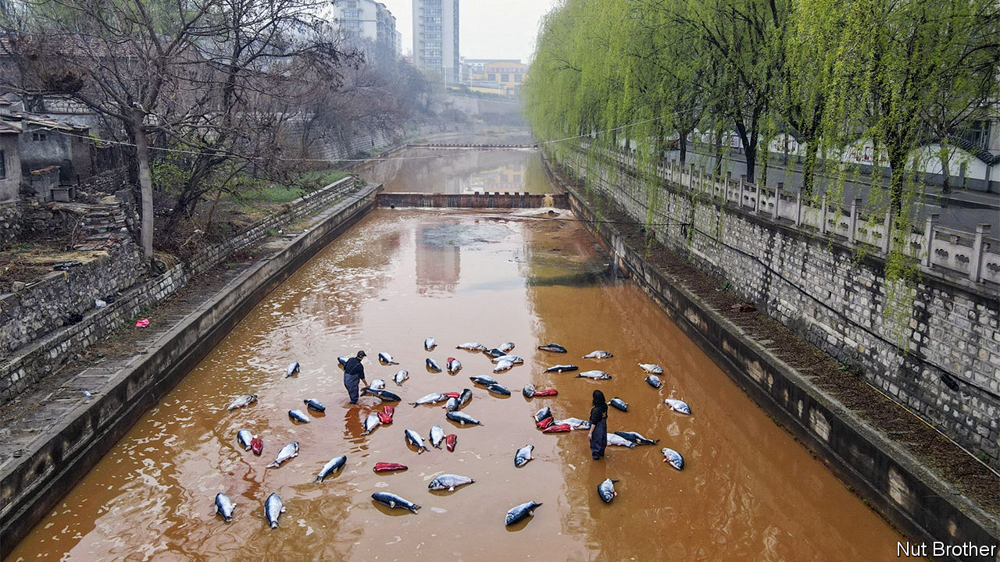

###### Airing grievances

# The creative ways Chinese activists protest pollution 

##### A public payphone in Beijing provides an outlet for frustration 

 

> Aug 18th 2022 

Public payphones don’t usually ring. So when one started buzzing in Beijing recently, people picked it up. On the other end of the line were residents of Huludao, some 400km away. All had the same story. The city’s factories were polluting the air. Some nights it smelled of chocolate; other nights, of chemicals. Most people kept their windows shut, yet they still struggled to breathe. The government refused to act, said residents. So some started calling the payphone.

The effort is one of several creative ways in which activists and artists are raising awareness of China’s pollution problems. An artist known as Nut Brother has played a role in many of the projects, including the hotline between Huludao and Beijing. Last year he filled a dirty canal with toy fish and peppers in the city of Zibo, turning the waterway into a “hot pot” (pictured). Lately he has led concerts by musicians dressed in hazmat suits and gas masks. They sing about air, soil and water pollution.

In 2015 Nut Brother walked around Beijing with a large vacuum cleaner and acted as if he was cleaning the city’s smog-filled air. This coincided with much media coverage of the problem. It helped that Beijing is China’s capital and thus home to its chief decision-makers, who also had to breathe the air. The local authorities were already in the process of compelling heavy industries and coal-fired power stations to reduce emissions. Over the past decade, pollution levels in the city have dropped.

Activists face a harder task in cities like Huludao, in China’s north-eastern rustbelt. Its population is shrinking and greying. Poorer cities cannot afford to pick and choose projects, so dirtier industries are moving north from the more developed south, says Wu Fengshi of the University of New South Wales in Australia. Officials in Huludao have struggled to keep the economy on track, let alone deal with pollution. A study in 2020 found worrying levels of heavy metals in residents’ hair. One of its districts is known for its high cancer rates. 

China’s regulators have asked the public to be on the lookout for polluting businesses. President Xi Jinping often talks about the value of blue skies and clean rivers. But the government does not like it when its failures are exposed. Environmental protests, once somewhat common in China, are now rare. Since 2012 the authorities have cracked down on environmental ngos and activists. They did not appreciate the Huludao-to-Beijing hotline.

When your correspondent visited the payphone in Beijing last month, a car with a Huludao police sticker was parked nearby. Anyone who picked up the phone was filmed by unidentified men, then moved along by police from Beijing, who noted down their names. The official reason given by the police, one they often use, was that those answering calls risked spreading covid-19. The phone continued ringing. Eventually, the handset was taken off the hook.

A few days later a woman from Huludao, who had been bold enough to give interviews to reporters about the pollution, retracted her comments. In a video posted on social media, she apologised for lying and “stirring up” the issue. “Actually Huludao is great,” she said.

Still, the hotline had an effect. Stories describing the “most magical payphone in Beijing’‘ were shared widely on social media. The press reported on Huludao’s strange smells. As pressure mounted, the local government said it was investigating several companies and suspending production in some factories. In recent days the city’s air has improved. 

But residents doubt that the factories will remain closed for long. After past pauses, they started producing more at night, when pollution is less visible, say residents. “The earth is no good here, the air is no good here,” says one. “The government won’t bother to fix it.”■


