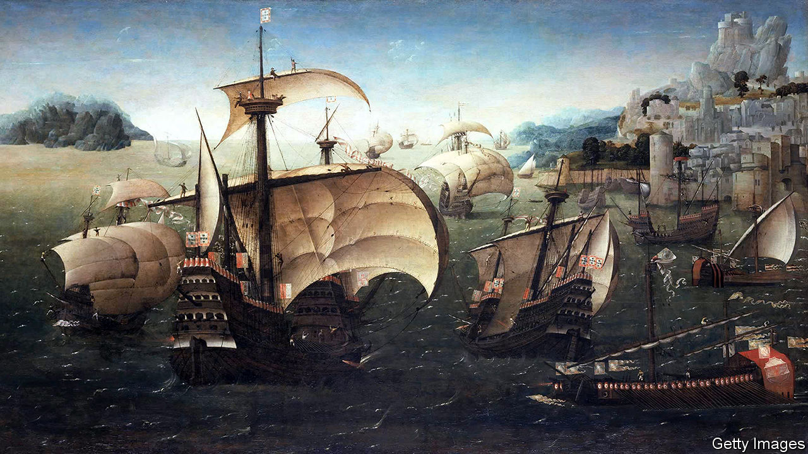

###### The age of discovery

# Damião de Góis and Luís de Camões embodied contrasting world views 

##### Edward Wilson-Lee’s double biography is also a chronicle of debates in Renaissance thought 

 

> Aug 17th 2022 

By Edward Wilson-Lee. 

“Many historians begin their chronicles by praising history, but these praises always sell the matter short,” wrote Damião de Góis, a Portuguese royal archivist, in his account of the reign of Manuel I, published in 1566-7. “History is infinite,” de Góis reckoned, “and cannot be confined within any limits.”

It is an unusual manifesto for a chronicle, one of history’s drier literary forms. But to fulfil his expansive vision of his task, de Góis ranged freely across everything from the history of the Shia faith to the scholarship of Queen Mother Eleni of Abyssinia. Edward Wilson-Lee applauds such generous curiosity; in some ways he seeks to replicate it. His new book, “A History of Water”, is in part an exploration of de Góis’s life and thought, but it is also an argument for globalisation, for openness and undogmatic ideas about the world.

De Góis was well-travelled. As a young man in the 1520s he worked in the great mercantile city of Antwerp; later he went on diplomatic trips to Denmark, Poland, Prussia and Russia. His adventures exposed him to the intellectual ferment of the era. He lived with Erasmus in Freiburg, working as the elderly philosopher’s secretary. He dined with Martin Luther in Wittenberg. Ignatius Loyola, the founder of the Jesuits, visited de Góis in Padua.

He travelled farther still in his reading and writing. Portugal had initiated the age of exploration and was, in this period, the primary conduit—for goods, information and, less happily, people—between Europe and the rest of the globe. The royal archive in the Torre do Tombo, the Tower of Records, was a central clearing-house for Europe’s awareness of the world beyond. De Góis, always drawn to marginal voices and ideas, had access to it all. In the Tower of Records he contemplated “the chaotic fullness of the world”.

Even in the 16th century, globalisation was provoking a reaction. Luther grumbled that “foreign trade…would not be permitted if we had proper government and princes”. When de Góis ate with him, he was served hazelnuts and apples: local produce free from ornament, ostentation and otherness. In this and other subtle ways, the book addresses the wider intellectual debates of the Reformation and of humanist and Renaissance thought.

Mr Wilson-Lee interleaves the life of de Góis with that of his contemporary, Luis de Camões, the author of “The Lusiads”, an epic poem celebrating Portugal’s voyages of discovery. Often in prison and always in penury, de Camões led a violent, disreputable existence. He spent 17 years in exile in far-flung Portuguese trading posts in Goa, Macau, Mozambique and elsewhere.

While de Camões may have briefly worked under de Góis, Mr Wilson-Lee is less interested in how their lives intersected than how they embodied Europe’s different responses to its discoveries. “A History of Water” artfully juxtaposes the confined spaces inhabited by its subjects—de Góis in his tower and de Camões in his various prisons—with the period’s great intellectual investigations. Where de Góis widened his horizons to let more of the world in, de Camões took his narrowness with him: he framed Portugal’s voyaging as a reclaiming of a classical destiny and a triumph over pagan disorder. The Inquisition arrested de Góis in 1571, aged almost 70, as his Catholicism was too diluted for their liking. It imprisoned him for 19 months, interrogating him throughout. 

“A History of Water” explores European bafflement and fear at new ideas, and the book itself presents as a puzzle within a puzzle. It opens with the accidental death—or perhaps murder—of de Góis in January 1574, soon after the Inquisition released him. Sources described him as burnt to death, or strangled; Mr Wilson-Lee offers his own provocative account. 

The author ponders the questions posed by a moment in history when societies “might have become global”—that is, might have embraced pluralism, as de Góis did—“but didn’t”. He resists offering simplistic answers as to why Europe chose its imperial course, yet there are many things to wonder at in the book’s pages, as well as some things to despair of. The journey is enthralling throughout—as all explorations should be. ■

