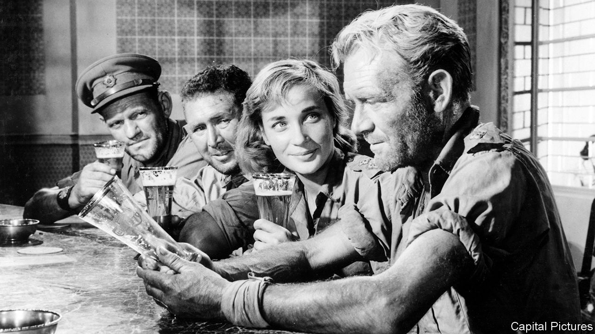

###### Back Story

# In art, as in life, boundaries blur when a heatwave strikes 

##### In the heat people change states. The temperature liberates and suffocates 

 

> Aug 18th 2022 

In “summertime”, the livin’ is easy and the tempo is slow. Humidity seeps through the sultry rhythm of George Gershwin’s aria. In “Bathers at Asnières”, Georges Seurat’s painting of day-trippers on the banks of the Seine, shoulders slump beneath a hazy sky. Heat induces languor and stillness—but also debauchery and frenzy. Think of the febrile staff party in “Dirty Dancing”, or Glenn Frey sweating out the lyrics for “The Heat is On”, as, in the music video, Eddie Murphy swings from the back of a lorry.

In art, as in life, temperatures like those that have been scorching Europe and America provoke contradictory reactions, alike only in being as extreme as the weather. Heat liberates and suffocates. It opens up new worlds, ripe with feverish possibilities, or shrinks the universe to a pool or a patch of shade. People change states, their emotions rising with the warm air. Like crushed ice in a mint julep, boundaries dissolve.

Including the social and erotic kinds, as men and women from diverse backgrounds collide on streets and beaches, often wearing next to nothing—a recipe for bliss or disaster, depending on your point of view. “Hot weather encourage[s] loose morals,” warns a character in Ian McEwan’s “Atonement”. “Fewer layers of clothing, a thousand more places to meet. Out of doors, out of control.” In his song “Hot in the City”, Billy Idol has a different take: “Don’t forget you’re young,” he drools, “on a hot summer’s night.” A bondage-themed video underlines what he means.

The borders between the generations can evaporate, too, as unsupervised children roam about and get embroiled in grown-up business, sometimes combustibly. In “To Kill a Mockingbird”, on Alabama days so hot that “stiff collars wilted by nine in the morning” and “ladies bathed before noon”, Scout and Jem hang around the courthouse or try to make Boo Radley come out. Life stands still, then speeds up, lassitude, excitement and catastrophe succeeding one another like readings on a thermometer. 

The gospel of doomed heatwave flings is “The Go-Between”, L.P. Hartley’s stew of ages, classes and sex, in which the soaring mercury reflects the flush of embarrassment and the swelter of desire. “In the heat the senses, the mind, the heart, the body, all told a different tale,” says the sun-addled narrator. “One felt another person, one was another person.” A footman has a drier impression: “Quite a lot of people have gone mad.” 

Heat warps perceptions along with morals, clouding visions or clarifying them. Secrets bubble into the open, fizzed along by ill-advised boozing. “Liquor goes fast in hot weather,” Stanley sneers at poor, clammy Blanche in “A Streetcar Named Desire”. In “The Great Gatsby”, on a day too hot to move, Daisy, Tom, Nick and Gatsby take a fateful jaunt into New York and drink cocktails in a hotel. Sweat races down backs, tempers fray, truths are told, feelings run high and out of control. The beauty that had bloomed in a fierce summer shrivels and decays. 

For if heat is a catalyst for sex, it also figures in that other great theme of art and life: death. It can be lethal and torturous as well as a heady thrill. In “The Good, the Bad and the Ugly”, Clint Eastwood is marched through a boiling wasteland by a vengeful Eli Wallach, who cackles dementedly from beneath a pink parasol. In “Walkabout”, two children lost in the ochre outback contend with scorpions and snakes. The hero of “Lawrence of Arabia” endures an all-night camel trek in search of water. Such scenes once felt dystopian and otherworldly; today they are more like bulletins from an arriving future. 

When heat like this is on, it can seem to last for ever—right up until it breaks, and seems only ever to have been a mirage. In between, fleetingly, is the ecstasy of relief. The best cooling-off scene in cinema comes at the climax of “Ice Cold in Alex” (pictured), a wartime adventure in which three parched Brits struggle across a north African desert in the company of a likeable German spy. Led by Captain Anson (John Mills), they make it to a bar they have fantasised about through quicksand and ambushes.

The Brits know, but the spy doesn’t, that he is about to be arrested and possibly shot. As the clock ticks down on his fate, a parallel drama unfolds—over whether the beers served by an agonisingly unhurried barman will be as sublime as everyone hopes. After a reverential pause, Anson downs his in one. “Worth waiting for,” he pronounces: a line that fits both a heatwave’s delights and the merciful moment when it lifts. ■


