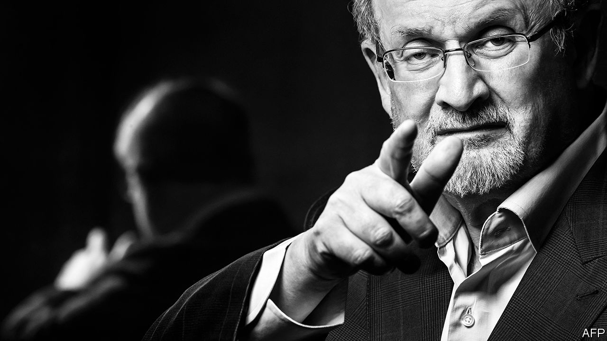

###### Freedom fighter

# Salman Rushdie is a champion of imagination, ambiguity and liberty 

##### The author has long tracked the world’s slide into rancorous sectarianism 

 

> Aug 15th 2022 

Since infancy Salman Rushdie has been tenaciously resilient. In 1949, aged two, he fell gravely ill with typhoid and his father scoured pharmacies in Bombay to find a new, life-saving drug. In 1984 a bout of double pneumonia put him in hospital in London. After 1989, when Ayatollah Khomeini, the supreme leader of Iran, issued a that called for his murder, Britain’s security services thwarted several assassination plots. In March 2020 the writer, then 72 and asthmatic, spent weeks seriously sick with covid-19. Now he is recovering from the ten knife injuries to his eyes, neck and torso inflicted on August 12th at a literary event in Chautauqua, New York. Sir Salman is persevering once again. 

That tussle with pneumonia helped him quit smoking. A doctor likened his wretched coughing fits to the trailer of a movie about lung cancer and asked if he “would like to see the film”. No thanks, Sir Salman said, and the author believes the metaphor saved his life. Yet the metaphors that drive his fiction—with its exuberant leaps between actual and figurative meanings, realism and fantasy, sacred and profane—have also imperilled him. 

Literalists, religious fundamentalists above all, have found in Sir Salman an embodiment of all they distrust about art that dances among creeds, principles and dogmas and which pursues multiplicity and ambiguity as virtues in themselves. Outraged critics, most of whom have never read his work, branded his carnivalesque mode of satire and speculation as insult and blasphemy. For Sir Salman, the novel is “the form created to discuss the fragmentation of truth”. His landmark essay “Is nothing sacred?” praises fiction as the place where “different languages, values and narratives quarrel”, but do so in peace.

Sir Salman was attacked at the Chautauqua Institution during a discussion of the meanings of home: a core theme for the Indian-born, Cambridge-educated author who lives in Manhattan. “The Satanic Verses”, the novel which prompted the  dwells far more on migration than religion. The wandering Indian-American hero of “Quichotte”, his most recent book, treats the “broken people” displaced by poverty or war as “shining shards that reflect the truth” about the age of mass upheavals. He has affirmed that “the crossing of borders, of language, geography and culture”, the “permeable frontier” between fact and imagination, and the lowering of barriers raised by “the world’s many different kinds of thought policemen” have been at the heart of his “literary project”.

For three decades, however, he has served as a target for those resentful and fearful of change. In the “age of oversimplification” that results from this backlash, doubt, play and metaphor must bow before the party or religious line. Although radical Islamists have menaced his work and life, Sir Salman has made plain that no faith has a monopoly on hate. Free debate flourished among his Kashmiri Muslim family in post-independence India. He evokes “the blurring of boundaries between religious cultures in that old, truly secularist Bombay” with nostalgic affection—in contrast to India’s “bitter, stifled” present.

As the world darkened, he tracked its slide into rancorous sectarianism. His novel “Fury”, published just days before the attacks of September 11th 2001, imagines New York as a seething cauldron of rage. “The whole world was burning on a shorter fuse. There was a knife twisting in every gut, a scourge for every back. We were all grievously provoked.” In fiction, essays and speeches, he has warned against the lure of righteous groupthink. He urges readers to question “the straitjacket of a one-dimensional national, ethnic, religious or tribal identity” and deems such conformism “the evil from which flow all the other evils of our time”.

Free speech, on the other hand, ranks not as a Western luxury but “the right without which all the other rights disappear”. Yet in the West, equivocators thrive. He argues that “this is a historical mistake of the progressive left: the sense that people who say they’re offended have a right to have their offendedness assuaged.”

In his breakthrough novel, “Midnight’s Children” (1981), Sir Salman brought historic events to bear on his hero, Saleem, born as the hour of Indian freedom struck. Since 1989 he has framed his own plight not as a unique misfortune, but as part of a historical pattern. In the memoir of his fugitive post-years, “Joseph Anton”, published in 2012, he compares his sentence to the first ominous blackbird that heralds the fatal flock in Alfred Hitchcock’s film “The Birds”. Sir Salman thinks of his persecution as “kind of an early harbinger of what later became a storm”. 

His response to this unsought status as a human weathervane was not retreat but defiance. Even in the 1990s, with the  a clear and present danger, he became a public face of artistic liberty. He gave speeches, taught students and later headed American pen, not only acting as the group’s president but launching and leading its festival of global literature. He supported other persecuted authors, such as Taslima Nasrin, an exiled Bangladeshi feminist. In 2005 he prominently campaigned against a proposed British law against “incitement of religious hatred”, helping to blunt its censorious edge.

His commencement addresses to American students—a minor Rushdie genre in themselves—urged them to resist obedience and orthodoxy, and pay heed to “the rebels and refuseniks of the world”. His very presence at Chautauqua testified to a decades-long refusal to be silent or invisible. Even at the height of the peril, he enlivened literary dinners while his protection officers from the Metropolitan Police kept their watch nearby.

Sir Salman is a resolute advocate of what he calls “the provisionality of all truths, the mutability of all character, the uncertainty of all times and places”. History, and chance, have dealt him another blow from the believers in simplistic deeds, not playful, polyphonic words. A magazine once asked Sir Salman, “What do you consider your greatest achievement?” His answer: “To have continued.” ■

