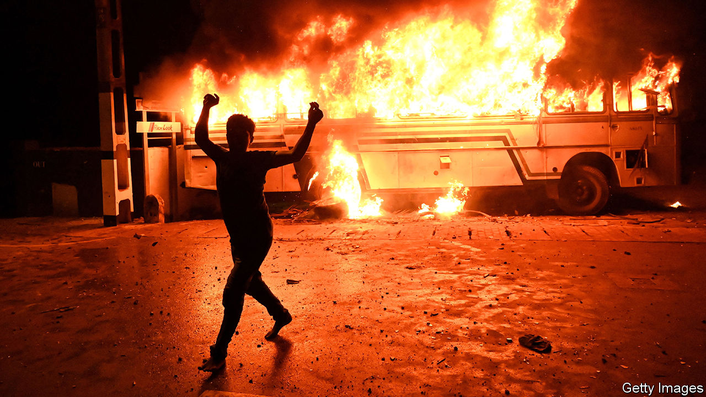

###### Sri Lankan fiction

# Shehan Karunatilaka returns with another thrilling satire 

##### The narrator of “The Seven Moons of Maali Almeida” is a ghost 

 

> Aug 18th 2022 

By Shehan Karunatilaka. 

Being a ghost, it turns out, much resembles being a war photographer: “Long periods of boredom interspersed with short bursts of terror”. Once a louche snapper with a taste for risky assignments and beautiful men, Malinda Almeida joins literature’s long roll call of deceased narrators. Over the seven days and nights that follow his demise, Maali (as he is known) must make sense of his own murder and of the civil conflicts that convulse Sri Lanka while he floats invisibly around Colombo, that “stinking city where deeds go unpunished and ghosts walk unseen”. 

The unhappy country produces illustrious writers but disordered politics. Many Sri Lankan authors flourish abroad, yet Shehan Karunatilaka has stayed to watch the serial calamities unfold. In 2010 his prize-winning debut, “Chinaman: The Legend of Pradeep Mathew”, used the search for a vanished cricketing icon as a vehicle for its scorchingly satirical journey. “The Seven Moons of Maali Almeida”, his second novel, returns to late 1989. 

A bloody four-way struggle—between brutal government forces, Tamil separatists, Marxist-chauvinist guerrillas and Indian “peacekeepers”—has proved that “the chances of violence ending violence are one in nothing.” Peace of a sort arrived in 2009, although the country’s current meltdown suggests that this novel’s tropical dystopia has not dated. “Follow any turd upstream and it leads to a member of parliament,” snarls the photographer from his disembodied position of authority.

Maali has combined war-zone photojournalism with fixing for the competing spies who buzz around the corpses on Sri Lanka’s jungle battlefields. Whose death squad has left him among the “long slabs of meat” that “garbage men” will dump in fetid Beira lake? And will his killer negatives—images that expose the hidden state actors behind massacres—ever come to light? Maali has a week to settle his fate before the fusspot celestial bureaucracy forces him to choose between an afterlife as a long-term phantom or passage through “The Light” into rebirth and oblivion. 

The quest that ensues is comic, macabre, angry and thumpingly alive. Maali’s sardonic, scurrilous monologue fills in his back story as a gambling-addicted lensman who loves the son of a Tamil politician; he hopes that his photo exposés will “do for Lanka’s civil war what naked napalm girl did for Vietnam”. It takes in the country’s manipulated ethnic strife and even the social geography of Maali’s quasi-Buddhist limbo. It has bite, brilliance and sparkle, though readers may sometimes wish for steady illumination rather than another pyrotechnic burst.

Maali’s posthumous pilgrimage shows him “how ugly this beautiful land is”. Still, the furious comedy in Mr Karunatilaka’s novel never courts despair. Acts of love and loyalty can count beyond the grave. The dead militants who pursue revenge, not karma, because “the world will not correct itself” don’t get the final word. That goes, more or less, to the sage spirit of a leopard who asks “why humans destroy when they can create”. Neither ghosts nor writers have the answer to that yet. ■

