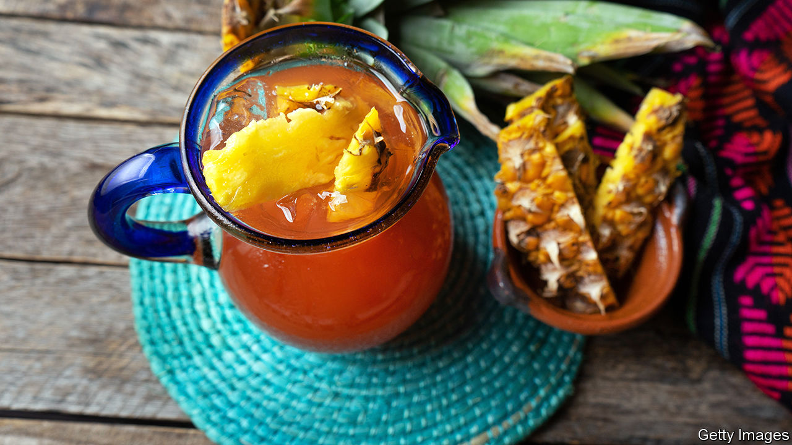

###### World in a dish

# The world’s best summertime drink relies on nature’s magic 

##### Making tepache, like any other fermentation project, is a lesson in co-operation 

 

> Aug 18th 2022 

The main ingredient in the best warm-weather drink ever invented is detritus. Usually the tough core and peel of a pineapple go on the compost heap while the flesh is eaten. But if they are submerged in sugared water, perhaps with a cinnamon stick and a few whole cloves, and left at room temperature, the result is , which has been made in Mexico for centuries. Like most wild ferments—meaning products that rely on naturally occurring rather than lab-created microbes—its creation is both simple and complex.

The simplicity lies first in the ingredients: just water, sugar, pineapple peels and optional spices. The requisite yeast and bacteria are both ambient and present on the peels. The sugar provides microbial nutrition. The process is also simple: just mix everything together and leave it. For the first couple of days it will taste like water with a slight pineapple-and-spice flavour. But at some point—probably around day three in a summertime kitchen—magic will happen. Neither as cloying as soda nor as sour as kombucha,  is delicious on its own, iced or with a glug of gin. 

Microbial processes are responsible for the complex part: some consume sugar and produce lactic acid and carbon dioxide, giving its effervescence and pleasant sourness. The fruit’s acidity encourages their growth, while protecting against undesirable bacteria that cause spoilage or a vomit-like taste. For home brewers, each batch will probably taste slightly different, because the microbial content of pineapples varies. 

The choice of ingredients requires consideration. Some advocate using only organic pineapples, but this is unnecessary: rinsing the peels before use would also wash away any pesticide residue. Using refined white sugar results in a straw-coloured drink with a monotone sweetness. Turbinado sugar is better but  or —dark brown, unrefined whole cane sugar—is best of all. It gives the beverage depth and a lovely amber colour.

Most municipal water is treated to remove microbes, which is sensible for public health but not ideal for fermentation: filter your tap water first to remove the chlorine. Some Mexican-American -makers add pineapple juice or grated pineapple, both of which provide extra sugar to encourage bacterial growth and acid to inhibit the undesirable microbes.

This tremendously satisfying process offers three lessons to the home cook. First, choose wisely. Precisely because -making requires so few choices, each one matters. Second, as with all fermented foods, timing is everything. Drink  too soon and it’s pineappley water; wait too long and it’s vinegar.

Finally, the microbes responsible for  are on hands, in mouths, on surfaces and in the air. As they perform their delicious work, they remind people how small a share of the world’s living creatures humans comprise, and how essential it is to understand the goals and habits of other living beings. Every successful fermentation project testifies to the life-giving importance of co-operation. ■

