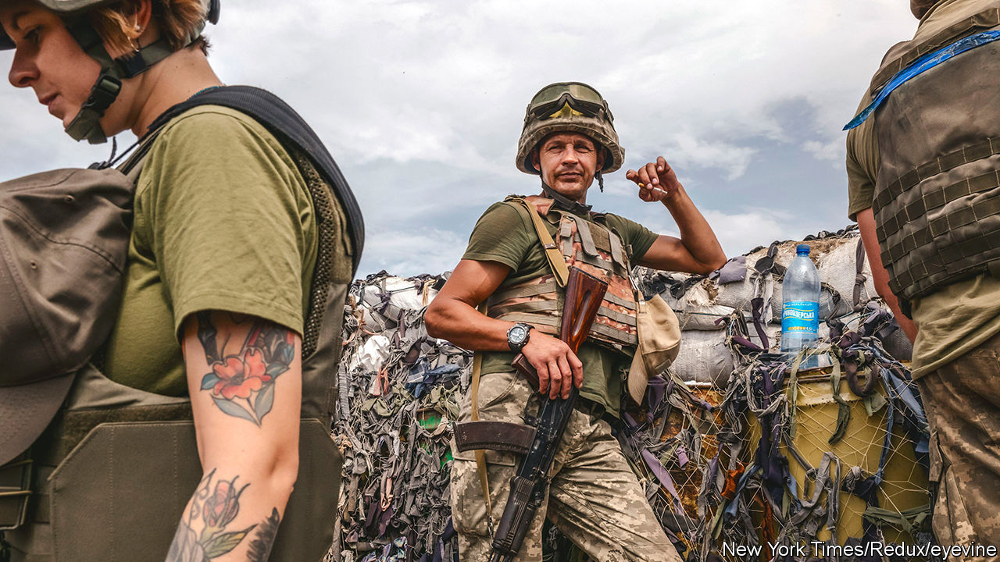
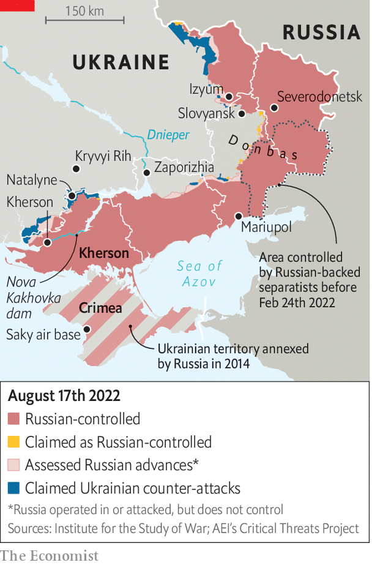

###### Stick or twist?

# A Ukrainian counter-offensive in Kherson faces steep odds 

##### Ukraine wants to show progress on the battlefield. But its army may not be ready 

 

> Aug 14th 2022 

The great wars of the 20th century pivoted on counter-offensives: the Allied landings at Normandy; Douglas MacArthur’s surprise attack on Inchon in the Korean war; Norman Schwarzkopf’s “left hook” to cut off Iraqi forces in Kuwait. Now Ukraine, with a fifth of its territory in Russian hands, hopes to join that list. But a much-vaunted operation in southern  seems to have been overhyped. That may be intentional.

For months Ukrainian officials have hinted that an attack in the south is imminent. In late July, American-supplied  rocket launchers began destroying bridges to Kherson city to isolate the Russian forces west of the Dnieper river. On August 9th, a  on Russia’s Saky air base in Crimea, beyond the range of Ukraine’s known weapons, was depicted by Ukrainian officials as the start of that offensive. Kherson would be liberated by the end of the year, boasted Dmytro Marchenko, a Ukrainian general.

The lofty expectations will be hard to meet. himars attacks have softened Russian defences, including by stopping artillery reaching the front lines. On August 13th Ukraine said it had destroyed a bridge over the Nova Kakhovka dam, tightening the noose around Kherson. But only infantry can seize territory. Conventional wisdom holds that attacking forces need three times as many troops as there are defenders to capture a well-defended position, and more in urban areas. If Ukraine ever had such an advantage, it no longer does.

 


In recent weeks Russia, anticipating a southern offensive, has withdrawn forces from Izyum on the eastern front and reinforced Kherson and its environs. Konrad Muzyka of Rochan Consulting, a firm which tracks the war, thinks there were 13 Russian battalion tactical groups (btgs) in the province in late July (a btg usually has several hundred troops). Now there may be 25 to 30. “We believe that this window of opportunity has passed,” says Mr Muzyka. “Ukrainians do not possess enough manpower to match Russian numbers.”

Though Ukraine does have a large pool of troops, most are conscripts with scant training. The most demanding fighting has been done by five brigades of Ukraine’s most skilled soldiers, notes  of the Royal United Services Institute. These units have taken heavy casualties. Training new brigades and equipping them for an offensive will take time.

Attacking usually requires more ammunition than defending. Attacking forces tend to take more casualties. “Since 1992, in our field exercises, we did not study offensive actions,” lamented Sergiy Grabskyi, a reserve colonel in Ukraine’s army, speaking on the “Geopolitics Decanted” podcast on August 3rd. “After eight years of war, Ukrainian forces are brilliant in defensive actions, but they have very limited or almost zero experience of conducting large-scale offensive actions.”

Russia’s army has had time to prepare. For months they have been digging trenches in Kherson. They may already have artillery trained on the roads that Ukraine would use to advance. “If the Ukrainian assault looks like Russia’s attack on Severodonetsk, it’s probably a dead end,” says Chris Dougherty, a former Pentagon planner, referring to a city that Russia captured in June using crude tactics. “It will cost Ukraine dearly in scarce manpower and materiel, and would likely be the last major Ukrainian operation of 2022.”

Mr Dougherty says Ukraine should take an indirect approach: isolating Kherson city. Using irregular forces and artillery to choke off Russian supply lines would “wither Russia’s defence”. A drumbeat of , as well as strikes on Russian depots and command posts—another ammunition dump in Crimea blew up on August 16th—suggests that this may be Ukraine’s true strategy. Some Ukrainian officials say they are content to wait, while steadily wearing down Russian forces with such attacks. “We want to avoid street warfare, because we don’t want to destroy the city,” says Major Roman Kovalyov, based north-east of Kherson province. “We want to surround them and force them to withdraw. We want to wring them out.”

But encouraging the idea that an offensive is imminent has advantages. It raises spirits among civilians in . It keeps Russian troops on edge. It forces Russia to divert forces from the eastern Donbas region, which weakens its attacks towards the city of Slovyansk. Swaggering talk of a counter-offensive could even be a feint, drawing Russians towards Kherson and opening gaps in the Russian line that might be exploited.

Ukraine’s political and military strategies are in tension. Volodymyr Zelensky, the president, is eager to show his Western backers that the arms they have poured into Ukraine are making a difference, and that the economic travails of the war, such as Europe’s energy crunch, are not in vain. Russia’s army is also  over time. That, and the muddier ground in autumn, could make an offensive more difficult in a few months. “Right now, we have a unique chance and window of opportunity”, said Colonel Grabskyi.

The risk is that hyping counter-offensives which fail to materialise will eventually harm morale. But if attacks take place and fizzle, the disillusionment would be worse. An offensive driven by political considerations, in defiance of military realities, would be “a really bad idea” says a military analyst, “but we may not be able to control what they do and where”. The analyst points to Severodonetsk, where Mr Zelensky, some sources say, overruled military advice and insisted his armed forces defended the city much longer than was prudent. “They barely got out of it alive.” ■


