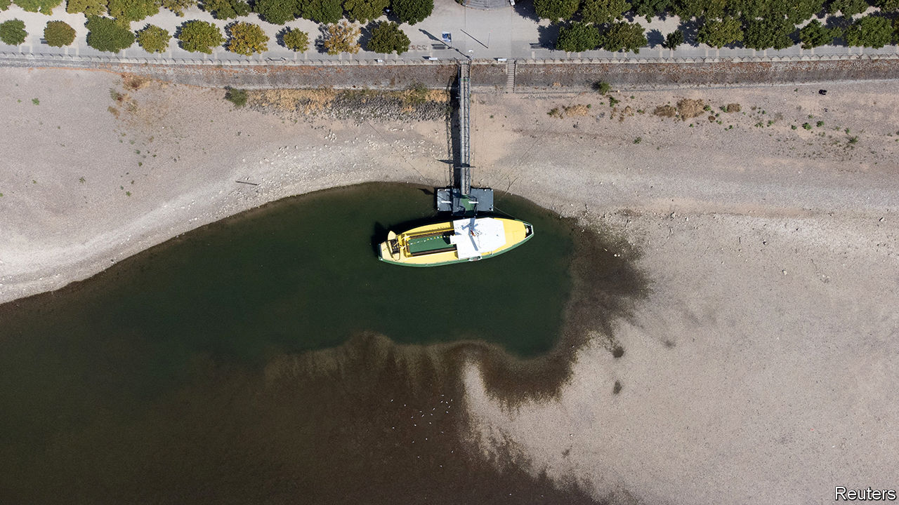
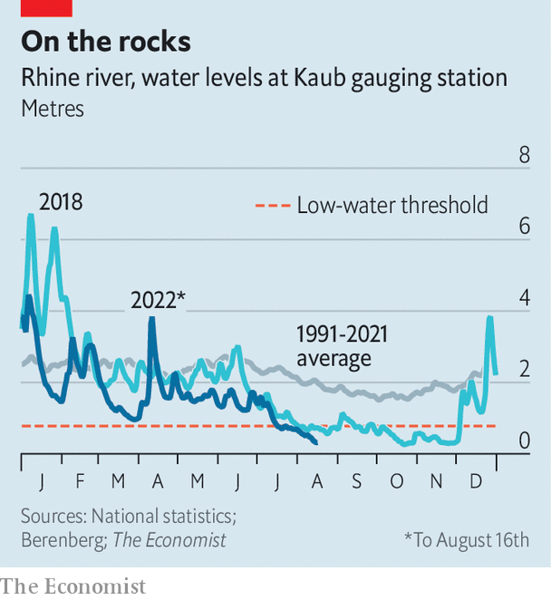

###### Bombs and balance sheets

# Germany’s waterways are unsung, but essential 

##### River freight is hard to beat 

 

> Aug 18th 2022 

Roughly a third of Germany’s coal, crude oil and natural gas—as well as a big chunk of its grains and chemicals—travel along inland waterways of one type or another. Traffic on the Rhine, which twists from the Swiss Alps to the North Sea, accounts for about 80% of that. Hence the continuing concern about the sizzling conditions which, over several weeks, have threatened to bring shipping on the river to a halt. The water level near Kaub, a town close to the Rhine’s shallowest section, has lately hovered at only about 30cm (see chart). It is going to take a lot of rain, falling in the right places, to push that up very much. To decrease their draughts, barges are carrying only 15-25% of their usual loads. Germany’s most important waterway could yet shut.

 


Businesses along the river are nervous. basf, a chemicals firm, uses barges to move 40% of the raw materials it needs for a gigantic factory in Ludwigshafen. A previous parched spell in 2018 cost it €250m ($295m); it has since been investing in new vessels that can cruise on when others run aground. Christine Launert of Thyssenkrupp, a company that needs to keep feeding a big steel plant in Duisburg with coal and iron ore delivered by river, says that for the moment her firm is still getting the goods. But she says there is no good plan b. Transporting raw materials by road or rail does not make sense for the environment or for the economy, she says. 

Businesspeople say politicians have neglected Germany’s inland waterways. Federal funding for them will shrink in 2023, compared with this year. When the German public pays any attention to freight it is usually to decry the chronic problems of db cargo, a train company operated by the state-owned railway. “But our industry transports around 200m tonnes for Germany industry every year, so we cannot be substituted,” insists Steffen Bauer, the boss of hgk Shipping, Germany’s biggest inland-waterway shipping company. A medium-sized lorry can move around 25 tonnes; a barge can easily haul 3,000 tonnes. Delivering stuff by river is usually cheaper than using road or rail, and can be the only option for massive or oddly shaped consignments. 

How far the Rhine’s woes will dent Germany’s economy remains a lively debate. The crisis in 2018 shaved 0.4% from Germany’s gdp, reckons the Kiel Institute for the World Economy, a think-tank. This year’s water levels have been lower, so in theory the damage could be worse. Conversely, though, Germany’s economy is limper than it was a few years ago, says Salomon Fiedler of Berenberg, a bank. That means industrial production—and thus the demand for stuff that comes on ships—was probably lower when this year’s water shortage began.

Mr Bauer hopes that startling pictures of the Rhine’s parched river bed will rouse politicians to action. Receding waters have revealed heaps of rusty ordnance, among other curious stuff; police have identified some 400kg of decaying explosives around just one harbour in Mainz. Volker Wissing, the minister of traffic, recently called for dredging of the Rhine to eliminate shallow spots. But he said it would take around ten years for the “giant project” to be completed. Until then, the companies that rely on the river must hope that the low water does not expose explosive flaws in their contingency planning. ■


