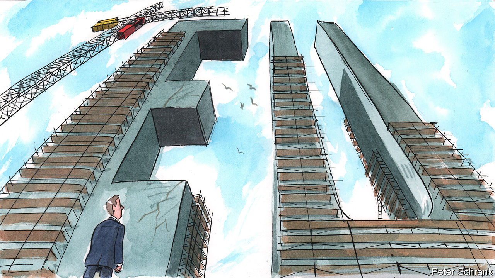

###### Charlemagne

# How the EU looks after a decade of horrors 

##### Our Europe columnist returns to Brussels after ten years away 

 

> Aug 18th 2022 

Few buildings can match the absurd majesty of the Palais de Justice in Brussels. The courthouse complex was Europe’s biggest structure upon completion in 1883. Its seemingly random jumble of classical columns, piled haphazardly on top of each other, dwarf even St Peter’s Basilica in Rome. One atrium has a ceiling height of over 80 metres. unesco politely describes this architectural confection as “unique”. Thus it was with pangs of regret that your newish columnist left the Belgian capital in 2012 after a three-year stint: much of the Palais had been wrapped in scaffolding the entire time. How exciting, as he returned this month after a decade away, to see the edifice in all its glory at last. Alas, the Palais is as concealed as ever. Political squabbling and dodgy brickwork mean the overhaul is now expected to take several more years to complete. The scaffolding has been up so long, it is itself in the process of being renovated.

Across town from the Palais, another mastodon has been under perpetual maintenance since 2012. The eu, whose main institutions are based in Brussels, is itself something of a fixer-upper. When your columnist left, in the depths of the euro-zone crisis, doom-mongers wondered whether the edifice might be brought low by structural flaws at the heart of the single currency, its signature project. The grim mood was all-pervasive, and in contrast with Europe’s comfortable position in the wider world. Upon his return Charlemagne finds the opposite is true. Brussels is brimming with confidence, even as Europe’s prospects look more tenuous. What happened?

Much of the buoyant mood in Brussels is the collective satisfaction of having come through a  in one piece (minus Britain). Barely had the strife around the euro been settled than a spat erupted over how to treat more than a million migrants demanding asylum in Europe. The Brexit vote of 2016 led to the bloc shrinking for the first time in its six-decade history. Then the pandemic struck, followed by war in Ukraine. Many Eurocrats feel there is nothing more the world can throw at them. The repeated heating and quenching of this permacrisis has strengthened the machinery of Brussels—and given it more influence. The pandemic, for example, resulted in a €750bn ($762bn) recovery fund overseen by the European Commission, the bloc’s executive arm. 

The eu’s mission has evolved as it has batted away these various catastrophes. A decade ago the mantra in Brussels was “more Europe”: every problem had a solution that required power to be handed to the eu. An ever-closer union was its own reward, never mind the reservations in the mind of the public, which (then as now) keeps only a distant eye on what Brussels is up to. These days national leaders kick things up to the European level because they realise there is no way any single government can tackle them alone. Thus solutions to the problems faced the world over—climate change, the rise of authoritarian China, pandemic vaccination—are understood to be best crafted collectively. No national watchdog in Europe could boss around an Amazon or Google. The eu’s regulation of such tech giants, in contrast, has given the concerns of Europeans, whether on privacy or rapacious business models, real heft.

Not all the mood-souring problems of yesteryear have disappeared. There is justified fretting about the war in Ukraine and the protracted energy crisis it has brought about. But these are troubles the eu is helping to fix, not ones that it has caused. (Much the same was true of Brexit, an act of self-harm crafted in Britain, not Brussels.) The threat of populism is as present today as it ever was: Giorgia Meloni of the hard-right could well win the Italian election next month, with unpredictable consequences. The bloc still has no way of handling national politicians who flout its rules. A decade ago Viktor Orban, Hungary’s prime minister, was a budding autocrat brazenly defying eu norms on how a member-state should be run. These days he is a long-standing autocrat brazenly defying eu norms on how a member-state should be run. 

Some changes were expected to materialise after 2012, but never happened. Attempts to turn the European Parliament and the commission into the political expression of a European  were all the rage back then, following the adoption of a new constitutional treaty in 2009. Events pushed the eu in another direction: during the euro crisis Brussels became a venue for national leaders to broker late-night deals rather than the home of institutions which themselves made decisions. That model largely endures to this day. This is a disappointment to purists of European integration, for whom the project should aim to mitigate the power of selfish national governments, not enhance it. 

Another brick in the wall

Finding imperfect solutions to challenges that national governments cannot face alone is a fine calling for the eu. Trouble is, the challenges seem ever more daunting. The mantra these days in Brussels is to provide “a Europe that protects”, whether from the vagaries of globalisation, a changing climate or foreign tyrants. Fabian Zuleeg of the European Policy Centre, a think-tank, speaks of the risk of Europe feeling that “we will live in a world determined by others, with stifling constraints on our ability to shape our future”. Some ways to counter that dread are sensible: cutting carbon emissions, say, or investing in defence, where the eu is still a weakling. Others, such as reshoring supply chains to bolster European industry, smack of desperation.

Facing up to these challenges leaves much for the denizens of Brussels to plot, plan and ponder. They do so in a city that seems to have fared well: once down-at-heel, the Belgian capital has been made more liveable by lots of new cycle lanes, more varied restaurants and even a smattering of shops that open on a Sunday. Perhaps that will induce Charlemagne to stick around until he can observe the Palais de Justice in all its glory. ■


 


