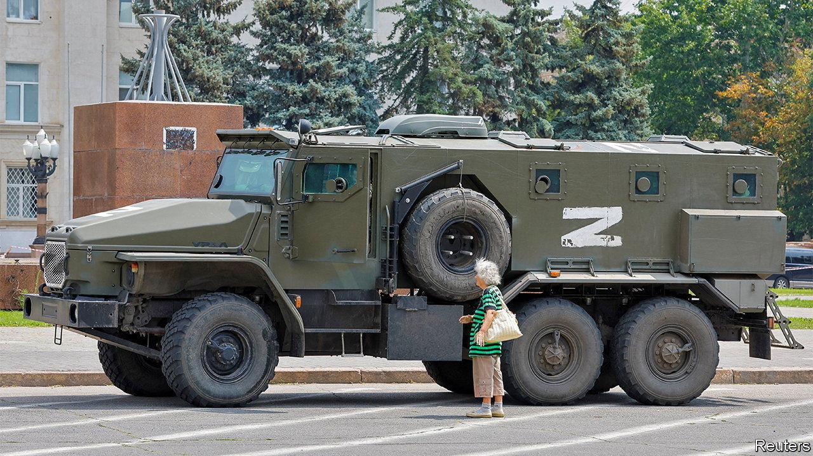

###### The sharp end

# Life in occupied Kherson is grim 

##### Refugees from the region tell appalling stories 

 

> Aug 18th 2022 

Leaflets bearing the names of people who have gone missing hang from trees in Kherson, a city in southern Ukraine that Russia has occupied since March. The city’s biggest shopping centre lies in ruins. Local banks have closed, and companies have started paying salaries in Russian roubles. Ukrainians can open accounts at one of two new Russian banks, but only if they get a Russian passport.

Ukrainian mobile numbers no longer work. Instead people with internet at home sometimes place their routers close to their windows, so that passers-by can connect. Schools are preparing to start teaching the Russian curriculum; staff who oppose the occupation have been sacked. “Russia is here for ever,” proclaims a billboard. Yulia Gladkaya, a local blogger, says, “We’ve gone back in time 30 years.”

These snapshots of life in Kherson are provided by residents who have left the city, and some who remain there. In September Russian officials plan to hold sham referendums that they hope will cement their rule over Kherson province and other parts of southern Ukraine. But Ukraine is pummelling Russian bases and supply routes with artillery, in the hope of forcing a withdrawal. Meanwhile civilians are streaming out of the area. Tens of thousands have left since the start of the war. 

 


At a supermarket outside Zaporizhia, a city about 300km northeast of Kherson, refugees who have spent as long as four days on the road catch their breath. Volunteers are caring for an elderly woman who has fainted from exhaustion. Aleksandra—a woman travelling with her husband, daughter, and grandchildren—says Russians began shelling Ukrainian positions just as their convoy began crossing into Ukrainian-controlled territory. Back home in Kherson, Russians are said to be moving into apartments vacated by Ukrainians who have escaped.

Locals say that Russian soldiers, secret service agents and police officers loyal to the invaders have been rounding up former Ukrainian soldiers and suspected saboteurs in Kherson. Some are herded in front of television cameras and forced to admit to outlandish crimes. Ms Gladkaya says she saw one of her neighbours on a Russian news channel. He was saying that nato forces and the Ukrainian government had trained him to “eliminate” peace-loving citizens. 

Things can be even worse in the countryside. Vera, from a village in Kherson province, says troops raided her house in search of her husband, a former soldier. They threatened to kill her and her children if she did not say where he was. She told them she did not know, and they believed her. In early August, when Ukrainian shells began falling near the village, she decided to flee with her elderly mother and two children. “There’s bombing every day,” she says, “and it’s going to get worse.”

Memories of occupation are fresh in northern parts of Kherson province that have been recaptured by Ukraine. In Natalyne, a village reached by muddy roads lined with sunflower fields, Russian troops rounded up some local men and subjected them to mock executions. “They asked whether they had served in the Ukrainian army, and fired rounds over their heads,” says Alina (not her real name). Nearby sits a green minivan Russian troops stole from Alina’s neighbour, still daubed with z symbols. Shells land somewhere nearby. 

Hanna Shostak-Kuchmiak, who heads a commune comprising several villages in the area, says at least 20 locals were taken away by Russians during the occupation and have not been heard from since. At least 600 people from Kherson province seem to have disappeared in this way, according to a report by Human Rights Watch, an ngo. Others have suffered torture. “Everyone knows what happened in Bucha,” says Oleksandr Vilkul, an official in Kryvyi Rih, a southern city under Ukrainian control (he is referring to the suburb of Kyiv where Russian forces executed hundreds of people). “I think when we liberate Kherson, we will hear many stories like Bucha, or even worse.”

It could be a while before Ukrainian forces are in a position to retake Kherson. In the meantime partisan attacks are ticking up. Since late July rockets have blown up a train delivering Russian weapons and troops from Crimea; a roadside bomb has killed two police officials loyal to the invaders; the head of the puppet administration in Kherson province is said to have fallen into a coma after being poisoned; and an official in Nova Kakhovka, another city in the province, has been shot dead. Ukrainian officials say resistance fighters had a hand in each incident.

Locals are helping Ukraine’s army in many other ways—sometimes at great cost. “Mast”, a Ukrainian soldier fighting near Kherson, says people living behind enemy lines frequently send his men information about Russian positions, using their mobile phones. Occasionally these spotters are arrested by Russian troops, says “Mast”. He thinks at least one of them has been killed. ■


