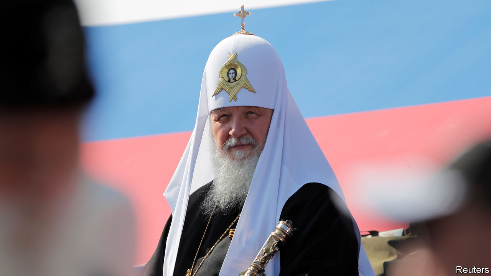

###### No room for doubt

# Russia compels religious leaders to show rapturous support for war 

##### Should the pope meet Russia’s patriarch? 

 

> Aug 18th 2022 

During his three decades as chief rabbi of Moscow, Pinchas Goldschmidt presided over a spectacular revival of Jewish worship, education and culture in a land where prejudice against his community has deep roots. Now the Swiss-born rabbi, who has just stepped down and left the country, says, “There is fear in the hearts of the Jews of Russia.” This is not just the anxiety many Russians share about the war in Ukraine. It is the fear that the authorities, having hitherto kept the lid on anti-Semitism, could unleash it—especially if Jewish leaders resist pressure to act as cheerleaders for the Russian army.

The rabbi recalls that before the war it was just possible for a religious group in Russia to maintain “correct but distant” relations with the authorities. But now clerics of all stripes are being told they have to support the invasion. In a carefully worded statement explaining his departure that was published last month, the rabbi said, “I could not remain silent, viewing so much human suffering.” However, he continued, “It became clear that the Jewish community in Moscow would be endangered by me remaining in my position.”

Every religious group in Russia is feeling the Kremlin’s newly Manichean line towards faith. Patriarch Kirill (pictured), the head of the Russian Orthodox Church, echoes official justifications for the war and has come up with some of his own. Lately he has followed Vladimir Putin in deploring the federal structure of the Soviet Union (which they say led to its break-up) and suggesting that any future Russian empire must be unitary, like that of the tsars. Hilarion Alfeyev, his Western-educated external affairs chief, who had held off from actively supporting the war, was abruptly demoted in June and dispatched to a job as a bishop in Budapest.

Far worse punishments await ordinary clerics who speak out against the war—or simply decline to call it a “special military operation”, as the government demands. Two Russian Orthodox clerics face criminal charges for using religious arguments to denounce the war. One of them, Ioann Kurmoyarov, has been jailed in St Petersburg since June after posting a video in which he said that anyone “not disturbed by what is happening in Ukraine” could hardly be called Christian. 

The loyal segment of Russia’s Muslim leadership has perhaps outdone the Orthodox church in the zeal of its pro-war pronouncements. Talgat Tadzhuddin, a senior figure in Russian Islam whose rhetoric has always been fiercely anti-American, last month backed the Kremlin’s surreal claim to be engaging in the “denazification” of Ukraine. He said that the government should keep pursuing its war aims “so as to leave no fascists or parasites anywhere near us, because in future there may not be enough pesticide”. 

He and other state-backed Muslim leaders have presented the battle against Ukraine as a holy war, implying that soldiers who are slain on the battlefield will go to paradise. This matters because soldiers from Russia’s ethnic minorities, including many Muslims, are playing an outsize role in the campaign.

With big local congregations apparently toeing its line, Russia’s government is probably now hoping that their links with co-religionists can help it promote its propaganda abroad. In May it succeeded in drawing Islamic entrepreneurs and officials to an annual meeting in the city of Kazan in Tatarstan, a Russian republic where a majority of the population is Muslim. Participants came from more than 70 countries, despite the war. Many governments sent greetings. These included Turkey’s, which is run by Recep Tayyip Erdogan, a strongman in Mr Putin’s mould.

Maintaining diplomacy with Christians has proved somewhat more complex. Since the days of the cold war the Russian Orthodox Church has used the World Council of Churches (wcc), a forum based in Geneva, as a venue to offer the Kremlin’s view of the world. But the war in Ukraine has horrified Western churches. Rowan Williams, former leader of the world’s Anglicans, has called for the wcc to kick out the Moscow Patriarchate.

Next month Patriarch Kirill may meet Pope Francis on the sidelines of an interfaith gathering in Kazakhstan. The Holy See has strongly defended its determination to keep communicating with Russia’s spiritual leaders—a position that some Catholic and Orthodox prelates in Ukraine and other post-Soviet countries lambast as hopelessly naive. 

The Vatican’s ideal scenario is for the spiritual masters of western Christendom and Russian Orthodoxy to jointly press secular leaders to make peace. But according to Tamara Grdzelidze, a theologian from Georgia who used to represent her country at the Holy See, the Vatican may well be overestimating Patriarch Kirill’s influence. If he were to soften his line on Ukraine, he would probably not stay patriarch for very long. ■

