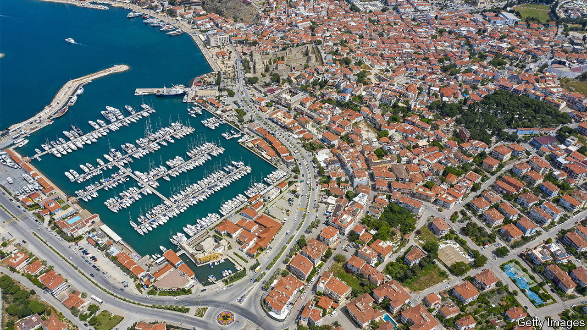

###### Rich pickings

# Turkey plans to pave more of its coastline 

##### New resorts target ultra-rich Arabs and Russians 

 

> Aug 18th 2022 

When omer onal was a child the Cesme peninsula was a beautiful backwater. It was in the 1990s that developers began throwing up the hotels that have since made this spot on Turkey’s Aegean coast famous among middle-class tourists. Now Turkey’s government has set aside another sixth of the peninsula for the sorts of projects that developers hope will draw in the very rich. Golf courses, marinas, hotels and residences could replace more than 5,000 hectares of forest. Wetlands hosting more than a hundred types of bird are also to be filled in. “Everything is about making money,” sighs Mr Onal, a local historian.

Similar transformations are under way all along Turkey’s coastline. Since the 1980s countless fishing villages have given way to sprawling, mostly low-cost resorts. These days tourism—and giant construction projects—are vital to the economy. And the growing trend is towards building posh resorts that attract ultra-rich visitors from the Arab Gulf and (this year) Russia. Several oligarchs are said to have moved their superyachts to Turkey’s marinas after European countries imposed sanctions on their assets and began seizing boats.

Permission to develop the Cesme peninsula was granted by a decree issued by Turkey’s president, Recep Tayyip Erdogan, in 2019. In a flash that edict also expanded the borders of dozens of other areas in Turkey that have been earmarked for the tourist industry. Watchdogs say the sweeping order is yet another illustration of the autocratic means by which Mr Erdogan rules. Environmentalists warn that the creep of concrete along coastline will probably raise temperatures in fragile regions that are already seeing worsening wildfires. Flames flashed across parts of Cesme in July, including some of the areas that are supposed to host the new developments.

Some on the peninsula are enthusiastic, nonetheless. They say the region sorely needs better accommodation and could also use more jobs. But opponents are challenging the project in court. The kind of people who stay at swanky hotels and in posh residences will not give very much of their money to local businesses, reckons Mujdat Timucin, a café owner. “They will fly in by helicopter,” he sniffs. 

