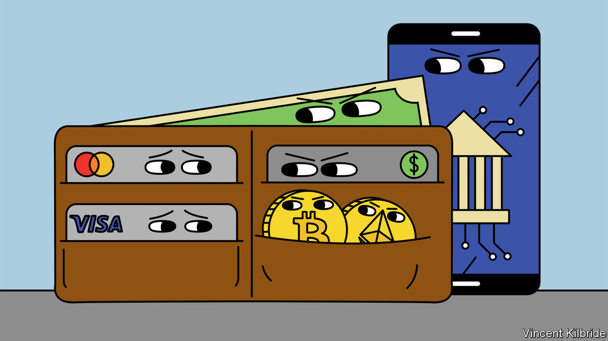
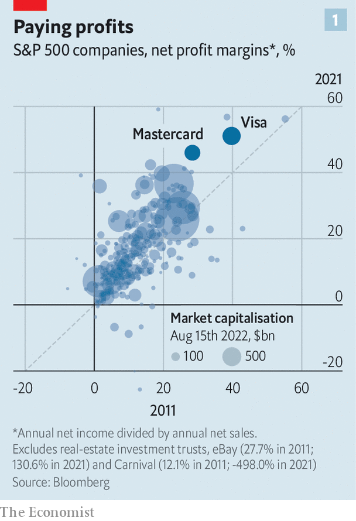
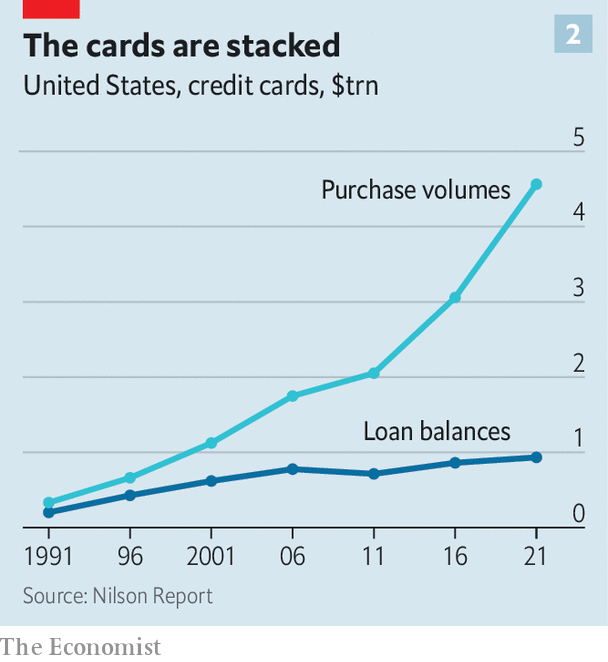

###### American payments

# Can the Visa-Mastercard duopoly be broken? 

##### It is bad for American consumers and retailers—and it is under threat 

 

> Aug 17th 2022 

“It’s like vegas,” says Matt Moore, the owner of a small bike shop in Georgetown, a neighbourhood in Washington. “You know you’re going to get screwed, the only question is how to get screwed the least.” The system of interchange—whereby banks and credit-card issuers charge merchants for collecting payments—is loathed by many retailers. Merchants hand over $138bn in fees each year; according to the National Retail Federation, a lobby group, it is their second-biggest cost after wages. And while shoppers are less likely to have strong feelings about the system, being mostly unaware of it, they also suffer as a result of higher sticker prices. 

America is home to the heftiest interchange fees of any major economy—costs are an order of magnitude greater than in Europe and China. That largely benefits two firms: Visa and Mastercard, which facilitate more than three-quarters of the country’s credit-card transactions. Doing so has made them two of the most profitable companies in the world, with net margins last year of 51% and 46% respectively. Rank every firm (excluding real-estate-investment trusts) in the s&amp;p 500 index by their average net-profit margins last year, five years ago and a decade ago, and only four appear in the top 20 every time. Two are financial-information firms, Intercontinental Exchange and the cme Group. The others are Mastercard and Visa. 

At first glance their position appears insurmountable. Already dominant, in recent years the firms have been boosted by a covid-induced rise in online shopping. American consumers used credit or debit cards for 45% of their transactions in 2016; by 2021, that had reached 57%. The migration from cash is “a significant and long-running tailwind,” says Craig Vosburg of Mastercard. Yet two threats loom. The first comes from Washington, where legislators hope to smash the duo’s grip on payments. The second is virtual. Payments have been transformed in Brazil, China and Indonesia by cheap, convenient app-based options from tech giants like Mercado Pago, Ant Group, Tencent and Grab. After a long wait, new entrants now look like they could shake up America’s market.

That would be good news for consumers and retailers. Much of Visa and Mastercard’s profits are ultimately driven by the fees that are charged when a shopper uses a credit or debit card to make a purchase. The eu has capped such fees for credit cards at 0.3% of the transaction value; intense competition in China means that WeChat and Alipay collect charges of just 0.1%. In America, debit cards are regulated by the “Durbin amendment”, which gives the Federal Reserve the authority to enforce a cap. But credit-card fees are unregulated and meatier, usually sitting at about 2% of the transaction and rising to 3.5% for some premium-reward cards. 

These fees are set by Mastercard and Visa, but collected by banks, which take a slice and use them to fund perks, such as insurance and air miles, to entice customers. For the right to use the card networks’ transaction-processing services, banks hand over enormous fees. The result is that consumers pay through the nose for their perks while remaining largely oblivious. According to a paper published last year by Joanna Stavins of the Federal Reserve Bank of Boston and colleagues, retailers raise prices at the tills by 1.4%, passing interchange costs on to households. 

 


Poor Americans fare the worst. High fees are built into the price of goods, and prices are typically the same whether you pay with card or cash, which the poor are more likely to use. “The way to think about it is if you are not getting your points you are essentially funding everyone else’s,” says Brian Kelly, more commonly known as “the points guy”, who has forged an entire business out of encouraging people to use perks. Households with an annual income of less than $25,000 (roughly a quarter of the total number) on average get no net rewards, since any they do receive are entirely offset by fees. Households that bring in more than $135,000 a year recoup in points or perks around 0.6 percentage points of the interchange fees they pay. 

These fees do fund some benefits, not least the sort of consumer protection that is provided by regulators or legislators elsewhere. In Europe, for instance, regulation ensures that customers can return goods, especially faulty ones, or that airlines compensate delayed passengers. In America card networks have stepped into the breach. They offer consumers the ability to “charge-back”—reverse their approval for a settled transaction—if something is not delivered as described. Card networks also use the fees to keep payment systems secure and free from fraud. In short, Americans rely more on capitalism and competition to protect consumers, rather than legislation and regulation.

“I certainly would not eliminate credit cards because they work great, they are convenient and people love them,” says Ms Stavins. Instead, she would like costs to be passed on: “If you come to the checkout, and you want to use a credit card, you would pay $103 for a $100 item.” That way consumers would pay for the benefits, but only if they truly value them. Such a solution used to be impossible: in their agreements with merchants, the card networks explicitly banned the addition of such surcharges. But a class-action lawsuit that was first settled in 2013 forced Visa and Mastercard to permit merchants to impose a surcharge. Subsequent lawsuits have overturned state laws banning surcharges. 

Even though adding surcharges is now permitted and legal, it is still difficult. “When we talk to merchants, a lot of them do not even know whether it is a plain card or a reward card, so they do not know what their processing cost is until they get their monthly bill,” says Ms Stavins. It would be a technological nightmare to implement a system that accounted for all the different interchange rates. It would also be off-putting for customers. Typically businesses that do surcharge are those, such as petrol stations or government enterprises, where consumers struggle to go elsewhere.

That might explain why legislators are eyeing up credit cards. On July 28th Richard Durbin, the same Democratic senator who regulated debit interchange a decade ago, introduced the Credit Card Competition Act (ccc). It does not propose a cap on interchange, as the debit rule does, since costs for credit cards are more variable than for debit cards, making it harder to find the right level. 

 


Instead, the ccc would attempt to spur competition by breaking the links between card networks and banks. At present, when a bank issues a credit card every transaction on it is processed by the card network the bank stipulates, meaning the bank is guaranteed the interchange fee the network sets. If the ccc becomes law it will force banks to offer merchants the choice of at least two different card networks. Crucially, these choices could not be the two biggest—at least one smaller network would have to be offered. They could compete for business by offering lower interchange rates, and merchants would presumably jump at the offer. 

The credit-card firms defend the existing system, arguing that consumers and merchants derive value from it, because it helps guarantee payments for merchants and protect consumers against fraud. Thus shoppers have more purchasing power than would otherwise have been the case. 

Two factors help the bill’s chances. It is sponsored by Mr Durbin, the second-most senior Democrat in the Senate, and it is bipartisan, co-sponsored by Roger Marshall, a Republican from Kansas. The ccc’s best chance is probably as an amendment to another bigger piece of legislation, which is how debit-card regulation passed in 2010. 

Even if the effort fails, or fails to work as intended, a potentially bigger threat to the giants looms. So far new entrants to the payments market have benefited Visa and Mastercard, by making it easier for consumers to use their cards online. But as the new fintechs have gained clout, their decisions about the sorts of payments they offer could influence how much money travels along the card networks. 

Stripe, a large payments-infrastructure firm, says it is working to provide merchants with payment methods that will lower their costs. Current options include a box for customers to enter card details, but also Klarna, a “buy-now-pay-later” provider through which customers can pay for purchases using bank transfers, thus avoiding the card networks. It could soon include things like FedNow, a real-time bank-transfer system being built by the Fed, which is due to be launched next year. In time, it could even include central-bank digital currencies or cryptocurrencies. 

Competitors might make little headway if the perks for sticking with credit cards are sufficiently juicy. But merchants can offer their own incentives. When your correspondent recently went to purchase a pair of linen trousers from Everlane, an online retailer, she was encouraged to pay using Catch, a fintech app. The app linked to her bank account via another payment startup called Plaid. As a thank you for avoiding the card networks, Everlane offered a shop credit worth 5% of the transaction value. Catch has signed up a handful of fashionable, millennial brands including Pacsun, another clothing retailer, and Farmacy, a skincare firm. 

For evidence that this poses a threat, look no further than Visa’s attempted purchase of Plaid. In 2020 the firm tried to buy the upstart for $5.3bn, only for the deal to be scuppered by antitrust regulators on the grounds that the transaction would have allowed Visa to eliminate a competitive threat. Ultimately, Visa gave up, but the attempt was nonetheless telling. The house of cards carefully constructed by the two payment giants is formidable and long-standing. But it is not indestructible. ■


