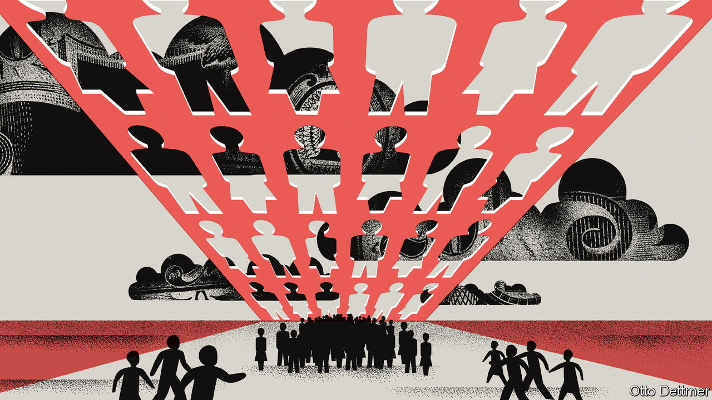

###### Free exchange

# Does unemployment really have to rise to bring down inflation? 

##### The search for labour-market slack 

 

> Aug 18th 2022 

Rarely in america’s past has an inflation rate of 8.5% felt so good. In July, for the first time since May 2020, consumer prices did not rise from one month to the next—though the year-on-year rate of increase remained high—thanks to a sharp drop in energy prices. But officials at the Federal Reserve are not celebrating. From their perspective the inflation problem remains unresolved as long as rapid growth in workers’ wages continues to power a spending boom. While that remains the case, a drop in the price of any one thing, such as oil, only leaves more room for spending on another. The Fed thus needs to weaken workers’ bargaining positions by introducing a bit of slack into the labour market. 

Yet what counts as slack is very much up for debate. In its broad outlines, the concept is clear enough. It represents a supply of workers in excess of labour demand: too many people chasing too little employment. Under such conditions, firms do not need to work very hard to lure or retain workers, and pay packets thus grow slowly, if at all. At present, there does not seem to be much slack about. In the three months to July the hourly wage of the typical American worker rose at an annual rate of almost 7%—nearly double the fastest pace reached in the 2010s. This, rather than dear oil or soaring rents, is what most troubles the Fed, and what it seeks to address through higher interest rates.

Economists disagree, however, about how much give must be introduced into labour markets, and where. Much of the recent argument has focused on the level of job openings relative to the number of unemployed workers, a ratio that has been near its record high for most of the past year. Given that many firms are scrapping to hire from a tiny pool of available workers, it comes as little surprise that wage offers are rocketing. 

Yet some Fed officials argue that precisely because the number of job vacancies is so high, it may be possible to introduce slack into the labour market through reductions in the number of posted openings—without having to push millions of people out of work. In July Chris Waller, a Federal Reserve governor, and Andrew Figura, also of the Fed, published a paper making this case, noting that the relationship between vacancies and unemployment may at current levels be a very steep one, such that tapping the monetary brakes yields a little extra unemployment but a big drop in openings, which hampers workers’ ability to move to higher-paying jobs. Jerome Powell, the Fed’s chairman, has also expressed similar views.

Other economists are unconvinced. A recent analysis published by Alex Domash and Larry Summers of Harvard University and Olivier Blanchard of the Peterson Institute for International Economics, a think-tank, noted that there has never before been a large drop in the number of job openings that has not coincided with a meaningful rise in unemployment. This makes sense: conditions that deter some firms from advertising for new workers may well lead other employers to lay off staff. But given that vacancies are in uncharted territory, it is hard to know whether such historical rules of thumb apply. And since March, at least, the number of job openings in America has fallen by nearly 10%, even as the unemployment rate dropped.

There are other places, apart from the balance between job openings and unemployment, to look for more slack. An increase in labour supply, either through increases in average hours worked, or through the entrance of more people into the workforce, could have the effect of bringing down wage growth without unemployment having to go up. In a new paper David Blanchflower and Jackson Spurling of Dartmouth College and Alex Bryson of University College London suggest that, in the years since the global financial crisis of 2007-09, these potential sources of labour supply have been more important in shaping wage growth than either the level of unemployment or the number of job vacancies. 

At present, American data for both hours worked and labour-force participation seem to show room for improvement. The number of average hours worked per employee is at roughly the level of the mid-2010s, and has actually fallen since the beginning of this year; it could easily go higher. Perhaps more important, rates of labour-force participation remain subdued. Indeed, among “prime-age” adults, those 25-54-years-old, the share of the population now working is currently a little lower than it was immediately before the covid-19 pandemic, and nearly two percentage points lower than the peak reached in 2000. There are, seemingly, more hours that could be worked by more people—a situation that certainly seems to meet the definition of slack.

Droops to conquer

Yet a lot hangs on whether those who left the workforce during the worst of the pandemic decide to return. Some people, for instance, may have retired permanently. Others might be enticed back in by heady wage growth, and could eventually add to slack. Research published last year by Bart Hobijn of Arizona State University and Aysegul Sahin of the University of Texas finds that participation tends to keep rising several months after the unemployment rate hits a bottom, which it is yet to do. If such a rise were to coincide with falling vacancies, wage growth could be checked without unemployment going up. Indeed, in the late 2010s pay stagnated amid an improving economy and falling unemployment, thanks to precisely this confluence of events. Yet a pessimist might point out that, if anything, America’s labour-force participation has been falling in recent months, rather than rising. So far at least, rapid wage growth has not proved to be very tempting. 

Moreover, having allowed inflation to get so far out of hand, the Fed may now feel bound to push unemployment up, rather than hoping for the emergence of less certain forms of slack. It may, in other words, be unwilling to cut optimistic interpretations any slack. ■


