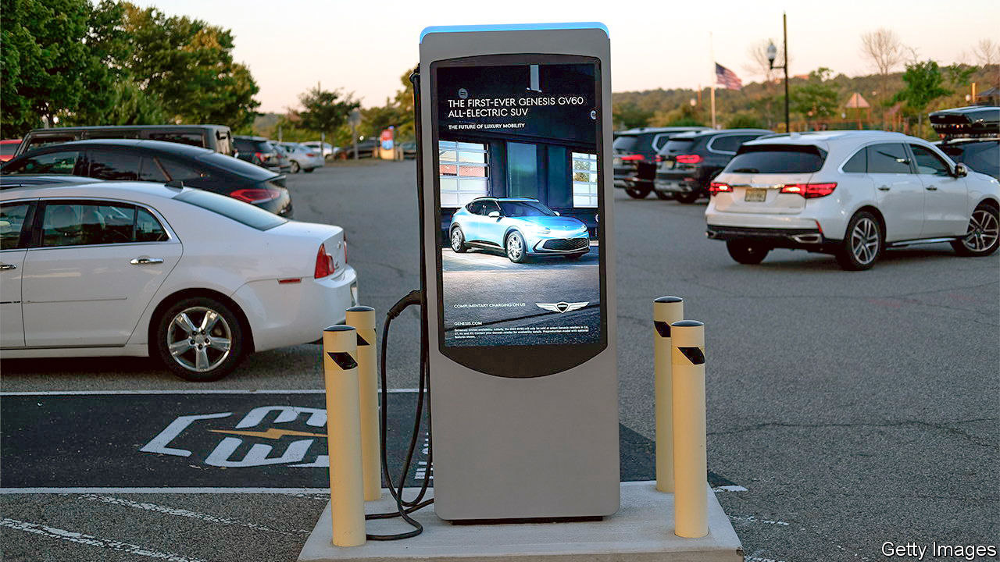

###### Cash guzzlers

# How to encourage electric-car use 

##### America has increased subsidies, just as other countries are cutting theirs 

 

> Aug 18th 2022 

“We’re coming to Norway,” begins an advertisement for General Motors, an American carmaker. Supposedly enraged by the Nordic nation easily surpassing America in electric vehicles (evs) per person, Will Ferrell, a comedian, sets off over land and sea to deliver the challenge to Norwegians, only to be told, after several mishaps along the way, that he has in fact arrived in Sweden. 

American ev policy is similarly lost. As part of President Joe Biden’s bid to decarbonise the economy, the Inflation Reduction Act (ira), a recently passed infrastructure bill, offers incentives for people to purchase evs. It comes just when other rich countries, including Britain and Germany, are about to reduce theirs, having reconsidered how best to encourage people to use green transport. The evidence suggests they are right to do so—and that Mr Biden is heading down the wrong road.

America’s first problem is protectionism. The ira offers subsidies to ev buyers, including rebates of up to $7,500 for new cars and $4,000 for used ones. For a new car to qualify, though, it must meet strict requirements. Half of the components in its battery must come from America, Canada or Mexico; by 2030, all of them will have to. At present, China controls most of the .

As well as irritating America’s friends—the eu and South Korea have indicated they may challenge these restrictions at the World Trade Organisation—such protectionism runs counter to the bill’s green goals. The Congressional Budget Office, which assesses the tax-and-spending implications of legislation, estimates a total outlay over the next five years of $1.8bn, or 237,000 evs if all get the full subsidy—a paltry proportion of the 15m cars that were sold in America in 2021.

Although prices are falling, evs are still dearer than vehicles with internal-combustion engines. That is true even after running costs are included. According to researchers at the Dallas branch of the Federal Reserve, at the start of 2021 the median cost per mile of range was $214 for an ev, compared with $104 for a regular car.

Encouraging ev purchases does not necessarily take older vehicles off the road, points out David Rapson of the University of California, Davis. Families may, for instance, buy a subsidised ev to complement another vehicle. Norway does not use subsidies; instead, it gives ev owners an exemption from the heavy taxes the country levies on internal-combustion cars. As a bonus, such taxes encourage drivers to spend less on petrol and shy away from thirstier vehicles when buying a new car.

Retail-price subsidies also come with a high “deadweight” loss as many ev purchasers would have bought the car even without the discount. That is why countries with a higher proportion of ev sales than America are starting to bring their subsidy schemes to an end. Germany will start winding down its scheme from next year, before ending it altogether in 2024; Britain abolished many of its bungs earlier this year and plans to use the money to build charging infrastructure instead. 

Research from the World Bank suggests that Britain’s move is sensible. It calculates that on average $10,000 or so is required to encourage the purchase of an electric car. The same result could be achieved by just under $1,600 of spending on charging infrastructure. The most cost-effective means of promoting electric cars, however, come with a near-zero cost: China awards the country’s ev owners special “green” licence plates, allowing local governments to offer privileged access to parking or exemptions from congestion charges. America may want to keep foreign batteries out, but it could still welcome other countries’ ideas. ■


