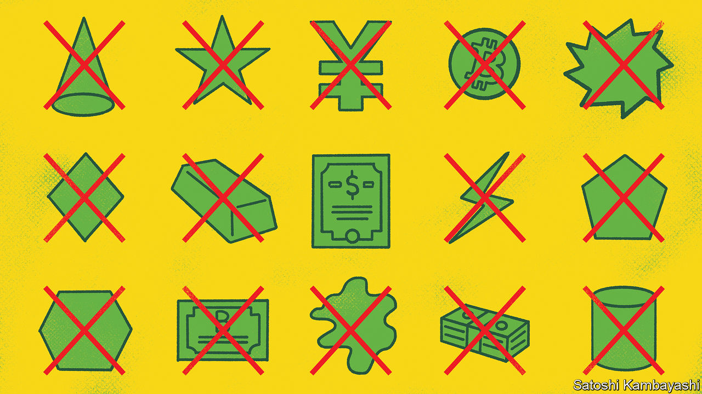

###### Buttonwood

# Investors are optimistic about equities. They have no alternative 

##### Traditional havens offer little safety 

 

> Aug 18th 2022 

“Allow me to explain about the theatre business,” says Philip Henslowe, the owner of the Rose theatre in “Shakespeare in Love”, a romantic comedy from 1998. “The natural condition is one of insurmountable obstacles on the road to imminent disaster.” “So what do we do?” asks his companion. “Nothing,” Henslowe replies, “strangely enough, it all turns out well.” “How?” “I don’t know. It’s a mystery.”

For a similar worldview, look at your average equity investor. America’s stockmarket has spent a decade and more climbing a wall of worry. It has shrugged off the aftermath of a financial crisis, geopolitical tensions and a pandemic that shut down industries. After slumping earlier this year, of late it has been on a tear, war and inflation notwithstanding. Like Henslowe, investors seem preternaturally keen to believe that, despite everything, it will be all right on the night. Again like Henslowe, who must sell a threatreful of tickets to appease the debt collectors at the door, that may be because they have no choice. Stocks look risky. But the frantic sell-off in the first half of this year showed how little safety the alternatives offer.

“Safe-haven” assets are what investors dive for when share prices plunge and economies founder. During a market rout, they should preserve their owners’ capital. If inflation debases an investors’ currency, havens should hold their value. They typically fall into two categories. There are physical things with limited supply, guaranteed demand or both: think of gold, or other precious metals. And then there are promises of value that investors trust to be kept come hell or high water, such as American Treasuries or inflation-proof currencies like the Japanese yen.

Gold has been prized as a store of value for millennia; today its enthusiasts tout it as a hedge against geopolitical risk and the devaluation of state-administered currencies. Yet since the start of this year, war has broken out in Europe, inflation has surged—and the dollar price of gold has dropped by 3%. Lacking an income stream of its own, gold loses its lustre as real interest rates rise. Rise they have: the yield on ten-year inflation-protected Treasuries started the year at -1% and has since risen to 0.4%. Disappointed gold bugs must console themselves with the knowledge that bitcoin, a faddier supposed hedge against fiat-currency mismanagement, has halved in price over the same period.

If gold can’t be trusted, how about the full faith and credit of America’s Treasury Department? In one sense, debt owed by the world’s biggest economy and the issuer of its reserve currency is a safe bet: the risk of default is extremely close to zero. But just as rising Treasury yields hit the value of other assets, so they hit the Treasuries themselves. (A fixed-coupon bond becomes worth less as the market yield goes up.) So far this year, the us Treasury Total Return index constructed by Bloomberg has fallen by 9%. Go global and the picture is similar: the ftse World Government Bond Index has shed 8%. In any case, the vast majority of bonds offer no defence against inflation, which erodes the value of their principal when it is eventually returned (inflation-protected Treasuries constitute just 8% of the market).

That might lead you to a currency that has proved stubbornly resistant to inflation, and has long offered a sanctuary from turbulent markets. For years, the Japanese yen rose whenever there was a blow-up, be it the fall of Lehman Brothers or Europe’s sovereign-debt crisis. Today, Japan’s inflation rate—2.4% in the year to June, compared with 8.5% in America in July—is the stuff of other central bankers’ dreams. Yet the sanctuary doors have been blasted open. The Bank of Japan has spent the past decade purchasing huge quantities of bonds and equities in an attempt to ward off deflation. The result has been a weaker yen, and an end to its haven status. At the start of the year, a dollar would have bought you 115 yen; it now buys 135.

For those who count their returns in anything other than dollars, this hints at the ultimate haven. The greenback has risen relative to almost any currency or asset you care to mention. But for dollar investors, stashing capital in cash that is being eaten away by inflation doesn’t feel like much of a strategy. Small wonder that they have turned back to the stockmarket instead. Henslowe’s blind faith is rewarded in the end: the insurmountable obstacles are overcome and his opening night ends in rapturous applause. Equity investors are hoping for the same, because they must. Break a leg.


