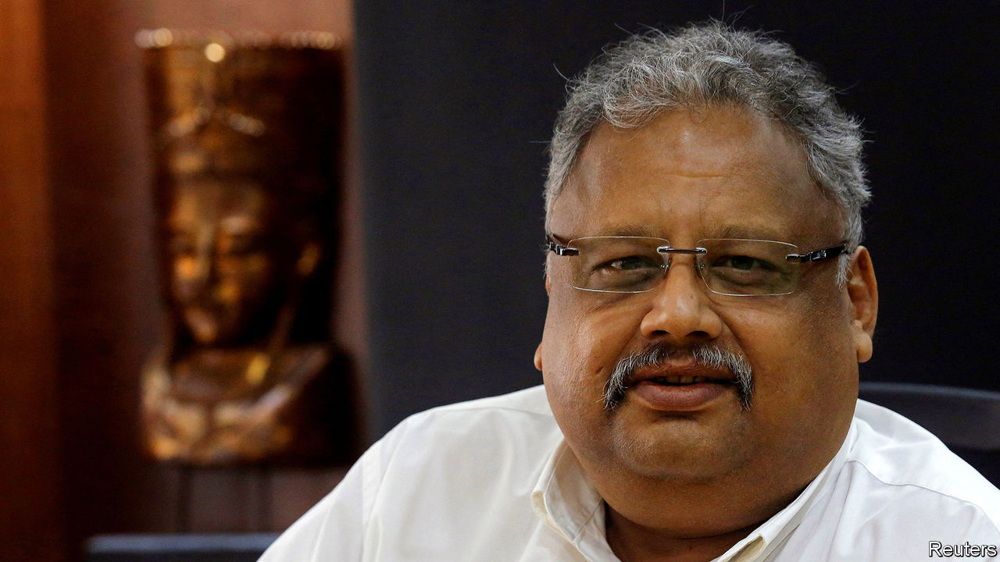

###### Death of the big bull

# The investor whose ascent mirrored India’s 

##### Rakesh Jhunjhunwala died on August 14th, aged 62 

 

> Aug 18th 2022 

Financial big shots die all the time without making a stir. Occasionally, though, the death creates ripples because their approach to life mattered as much as their returns. So it was for Rakesh Jhunjhunwala, an investor and bull of a man, who inspired generations of Indian investors. On August 16th, in an unprecedented move, the Bombay Stock Exchange transformed its old trading floor into a prayer hall for Mr Jhunjhunwala, who died two days earlier, aged 62.

For hours, thousands of mourners shuffled through the once raucous room. Music played softly while a large screen mixed praise from India’s political and business grandees with the snippets of advice Mr Jhunjhunwala used to dispense on tv, to crowds at his favourite bar and to the legions who sought him out: “Always aspire, never envy”; “Growth comes with chaos, not order.”

Mr Jhunjhunwala was known as India’s Warren Buffett. He began investing with just 5,000 rupees ($400) in 1985; by his death, his net worth was just shy of $6bn. His ascent mirrored India’s—he benefited both from the economic liberalisation of the 1990s and an eclectic investment style. Some of his best-known positions were held for decades and earned vast returns, notably stakes in Titan, a jewellery chain, and Lupin, a generic-drug manufacturer. He traded furiously, had a Bloomberg terminal installed in his hospital room, and would entertain visitors while at a screen and taking calls, in sharp contrast to the secrecy typical of Indian business. 

His biggest bet was easy for his followers to replicate: it was on India itself. He bought in when the country was in the doldrums and held on. When other successful investors moved themselves and their money to Singapore or London, he merely shifted from battered old offices spattered with betel spit a block from the exchange to nicer ones in nearby Nariman Point, where he could still stop on the way home for several pegs of whisky with friends. In his last public appearance he rolled his wheelchair up to the maiden flight of Akasa Air, an airline he founded last year because he believed India was truly taking off. 

In 2003 Mr Jhunjhunwala recruited Priya Singh, then a young business-school graduate, to run a startup. He offered money and advice: sell all your possessions and invest the proceeds in Indian stocks. In the days before his death, he repeated the advice with added urgency. India’s golden decade, he insisted, was just beginning. 


