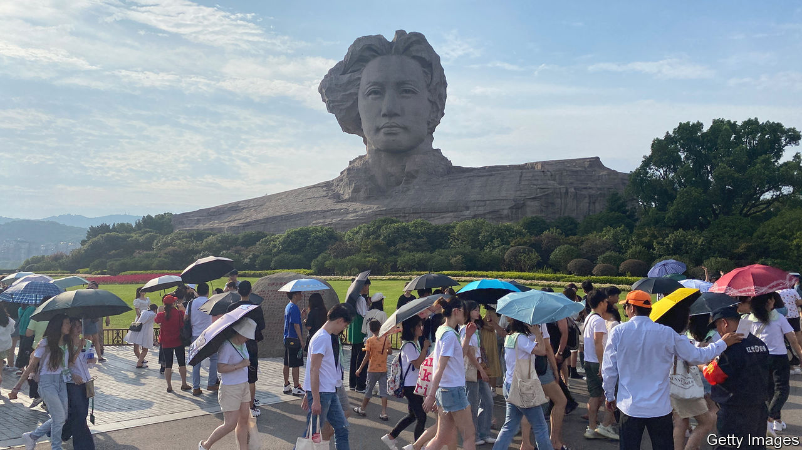
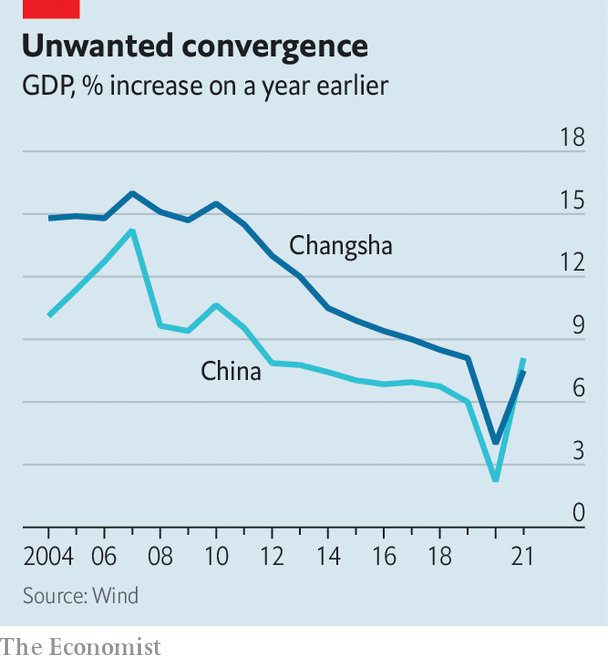

###### Of industrial hubs and spicy crayfish

# Xi Jinping’s economic revolution aims to spread growth 

##### An inland city, Changsha, highlights potential limits 

 

> Aug 16th 2022 

To get a cup of milk tea from Chayan Yuese in the central Chinese city of Changsha, you may have to queue for an hour in the sweltering heat. The local company, known in English as “Sexy Tea”, has become a national sensation. Patrons insist that its method of steeping tea leaves and its ratio of water to milk produce a mellow brew that helps wash down fiery, pepper-laden local dishes. 

It is part of what has made Changsha a  hotspot, or a place where young people come to shoot videos for social media. Street vendors serving up spicy crayfish have become internet celebrities. Crowds throng the city’s central shopping districts and eateries into the early hours of the morning, despite worries about covid-19. The local television station has become something akin to the Netflix of China. Chinese social media teems with photographs of young women, dressed in swanky outfits, posing in front of the city’s 32-metre-high granite bust of Mao Zedong, the country’s revolutionary leader who came from a nearby town.

China’s recent development has concentrated wealth in eastern cities. Now President Xi Jinping wants to spread it inland to places like Changsha, and wants the process to be driven by innovation in emerging technologies such as artificial intelligence (ai), cloud computing and smart manufacturing—“industrialisation 4.0”, in his words. Central-government directives often seem far removed from real business activity. They are filled with lofty slogans and long-winded references to the importance of “Xi Jinping Thought”. Changsha offers a snapshot of how Mr Xi’s revolution is actually playing out.

The city is one of 15 urban centres that is trying to make the leap into the country’s elite. Together they are known as “new first-tier” cities, and already account for about a fifth of China’s gdp. In Changsha, the local government is happy to have a  economy: planners want to make the city a centre for culture and tourism that brings in 500bn yuan ($74bn) in revenues a year, up from less than 200bn in 2021. They hope fashionable tea shops will also help with a much bigger challenge, and the main focus of their growth strategy: upgrading the city’s industrial base. That will mean attracting a horde of new companies and talented people to a region hundreds of kilometres from wealthy coastal areas. 

 


Changsha’s strong but old-fashioned industrial base makes it typical of the new first tier: industry drove rapid growth in the early 2000s, but in the years since Changsha’s performance has converged with the Chinese average (see chart). The city is home to China’s two largest construction-machinery firms, Sany and Zoomlion. Another firm, bsb, is one of the country’s biggest specialists in prefabricated construction. In a city just south of Changsha is one of the main manufacturing hubs of crrc, China’s state-owned rail outfit. These distinct specialties mean it should not have to compete head-on with neighbouring cities such as Chengdu, which has a big aircraft-manufacturing base, says Wang Tao of ubs, a bank, and a native of Changsha.

The first challenge planners face is upgrading the city’s existing industry through digitisation and automation. The government has handed out large subsidies to encourage internet-technology companies to cluster around existing machinery, building and transport firms. Thousands of automation-related firms have been set up as a result. Officials are monitoring what happens next. One recent reform in industrial parks measures the amount of tax companies pay per mu (0.06 hectares) of land they occupy, and will eventually push out low payers.

Industrial upgrades often involve integrating brand-new systems—5g internet or ai-powered logistics—into legacy firms in order to help boost efficiency, note analysts at Jefferies, an investment bank. Baosight, a state-owned industrial-digitisation giant, has helped do this at many steel plants. These sorts of changes can take years and require large, experienced technology providers. But most of the companies working in Changsha are small. The city is not home to any large tech firms, which are mainly based in China’s eastern cities. Even some neighbouring industrial hubs such as Chongqing and Chengdu score better on this front. This ultimately means the pace of industrial digitisation will be slower in Changsha, says Xu Dihong, the founder of Cadstar, a local industrial-software company.

The second challenge is to hasten a boom in new tech companies. Like several neighbouring cities, Changsha is hurrying to build ai and smart-manufacturing parks; last year the Ministry of Science and Technology announced that it would build a national ai innovation zone in the city. Some 5,180 firms claiming to offer ai-related services were set up in Changsha in the first seven months of 2022, up from about 3,000 in all of 2021, according to Qichacha, a corporate-intelligence firm. The trend has been mirrored across inland Chinese cities. Whether this reflects genuine tech entrepreneurialism is doubtful; experts believe many of the new ai firms do little in the way of real innovation.

A burgeoning tech hub also needs a steady supply of talent. In April the local government announced a list of 45 measures aimed at coaxing young professionals to the city, including grants of up to 100m yuan for top scientists and tech organisations. The cheapness of the city’s  lifestyle is another draw. Changsha has some of the lowest house prices of any large city in the country, making it especially attractive to young entrepreneurs. “A family can get twice the space in a flat here compared with a coastal city,” says Mr Xu. The milk tea and late-night dining on crayfish do not hurt, either. 

Yet they may not be enough. Wang Peng of Huijiang Automation Technology, a tech firm that set up an office in Changsha last year, says that despite the generous incentives it is still hard to hire the right people. Even established tech hubs such as Suzhou and Shenzhen face shortages of talented staff. The city also has few international links. Its location deep in China’s interior has made it difficult to bring in the highest level of talent, especially Chinese people returning from university or work abroad, says a professor at a local university. It is a problem that could prevent many of the new first-tier cities making the leap to the very top. ■


