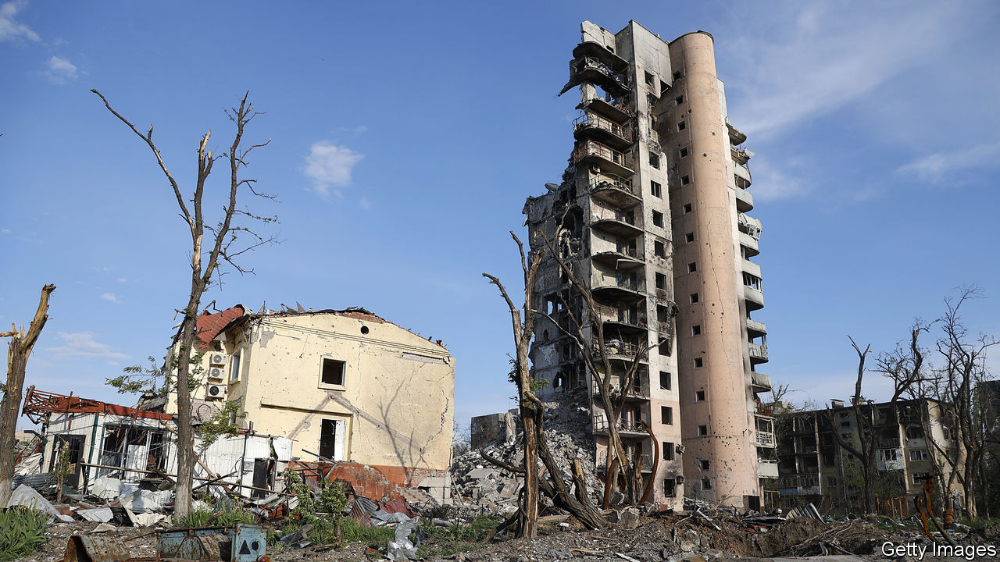

###### Mean streets

# Armies are re-learning how to fight in cities 

##### Urban combat has a brutal, destructive reputation. It will become more common 

 

> Aug 17th 2022 

“The city doesn’t exist any more,” said Dmytro Kuleba, Ukraine’s foreign minister, in April. By then Mariupol, on the Sea of Azov, had been  for seven weeks—bombed, shelled and struck by rockets. The city fell the next month. Its mayor said that 1,300 high-rise buildings had been destroyed. Satellite images suggested almost half its built-up areas were  (see map). A pre-war population of over 400,000 had shrunk by more than 75%.

Mariupol’s  holds useful lessons for armies around the world. “For practically all of history, generals have loathed the prospect of fighting in cities and have sought to avoid it,” write David Betz of King’s College London and Lieutenant-Colonel Hugo Stanford-Tuck, a British officer, in the , a military and security journal. But whether they like it or not, modern armies are increasingly forced to do so. They are looking to the past for guidance, and pondering how urban battles might best be fought with modern weapons.

 


In July Britain’s chief of general staff announced that the British army, which has spent the past two decades mostly fighting low-tech insurgents, would, in future, “major on urban combat”. In a speech to the United States Military Academy in May, General Mark Milley, America’s most senior soldier, told graduating cadets that they would have to retool for cities. That would transform armies, he warned, with “huge implications” for everything from camouflage patterns and weapons to vehicle design and logistics.

This growing interest has several causes. In one sense, armies are simply responding to recent history. Battles over cities have been central to many modern wars. The fight for Shusha, a town in the disputed territory of Nagorno-Karabakh, was the decisive engagement of the war between Armenia and Azerbaijan in 2020. The conquests of Mosul in Iraq and Raqqa in Syria marked the triumph of Islamic State (is) in 2014; its expulsion from those cities by an American-led coalition two years later signalled the jihadists’ fall. In Ukraine, Russia has fought street-to-street to capture not just Mariupol, but also Severodonetsk and Lysychansk in the Donbas region. Ukraine hopes to retake , a city in the south. 

Deeper trends contribute, too. Until the start of the 21st century more people lived in rural areas than urban ones. Now over half the world’s inhabitants live in towns and cities, a figure that is expected to rise to two-thirds by 2050. In some places the figure is higher still. A Chinese invasion of Taiwan, should it occur, would require the People’s Liberation Army to slog through the island’s towns and cities, where 80% of its population live.

That same historical trend means cities are becoming bigger. In 1950 only New York and Tokyo qualified as “megacities”—those with over 10m inhabitants. Today, the United Nations reckons 33 do. Though wars have been fought in and around cities since antiquity, few have been waged inside ones so big and complex. 

And even as cities have swollen, armies have shrunk. In the past “mass armies swamped cities, forming large fronts around and through them”, notes Anthony King of Warwick University, the author of “Urban Warfare in the Twenty-First Century”. Eighty years ago almost half a million men fought over Stalingrad, which had a pre-war population of around 400,000. Today “cities envelop the armed forces.” Barely 100,000 troops assaulted Mosul, a city of 1.7m, to rid it of is in 2016. 

Urban warfare has a reputation for destructiveness and brutality. Built-up areas offer plenty of places to hide, so firefights occur suddenly and at close range. Buildings can be laced with mines and booby-traps. The need to be constantly alert frays soldiers’ nerves. Fighting in jungles or woodland presents similar difficulties, but in cities the presence of civilians makes everything harder. “I can destroy a forest,” says one European army officer, asked where he would prefer to fight. “I will not have permission to destroy a city.” 

The concrete jungle

One consequence of shrunken armies fighting in bigger cities is that urban warfare often ends up as a series of “localised micro-sieges”, says Mr King, sometimes over individual structures. “A single building can consume an entire battalion [up to 1,000 troops] in a day’s fighting,” says Peter Mansoor, a retired colonel who commanded the 1st Brigade of America’s 1st Armoured Division in Baghdad in 2003. 

Modern explosive weapons were largely designed for cold-war battles on the plains of Europe. When they are used in populated areas, at least nine in every ten casualties are likely to be civilians, notes a report by Action on Armed Violence, an ngo which tracks such things. Indiscriminate Russian barrages have destroyed not only Mariupol, Severodonetsk and many smaller towns in Ukraine, but also Grozny in Chechnya and Aleppo in Syria. 

Even smart bombs can level a city. In Mosul, American air strikes hit buildings with extraordinary precision, but insurgents simply fled to others—which would be hit in turn. The result, notes Amos Fox, a major in the American army, was that bombs simply followed the enemy from house to house. Over 10,000 civilians were killed in Mosul, about a third of them by the American-led coalition.

And a city’s inhabitants are not always passive bystanders. John Spencer, a retired major and the chair of urban warfare studies at the Madison Policy Forum, an American think-tank, began publishing military advice for Ukrainian city-dwellers within days of the Russian invasion on February 24th. In June he visited Kyiv and learnt how it was defended by a lone Ukrainian brigade, supported by civilian volunteers who were handed tens of thousands of ak-47 rifles at the outset of war. Residents became an informal network of spotters, calling in the location of Russian units moving through their neighbourhoods. 

Another feature of cities is that they tend to extend underground. Marko Bulmer, a scientist and reservist in Britain’s army, describes how is exploited sinkholes and caves around Mosul, and built new tunnels, some large enough for vehicles, using everything from hand tools to improvised boring machines. The most sophisticated were equipped with dormitories, hospitals and ventilation systems. Israel’s armed forces claim to have destroyed 100km of tunnels under Gaza during a war with Hamas last year. And in Mariupol, Ukrainian defenders in the subterranean networks of the Azovstal steelworks kept a superior Russian force at bay for months. 

Many of the newer technologies on which Western forces have come to depend simply do not function below the surface, including satellite navigation and surveillance with drones. They can be iffy on the surface, too. “Urban canyons” between tall buildings can interfere with radio signals. Civilian television and radio crowd the airwaves. “The main problem is that in such a crowded, populated and intricate area, we only see what we can see,” says Gal Hirsch, a retired Israeli brigadier-general who commanded units in the West Bank and Lebanon. “We simply cannot see most of the threats, as large segments of the enemy are concealed from us.”

Such difficulties partly explain why America’s army has, until recently, shied away from thinking too much about city fighting, argues Liam Collins, a retired colonel and co-author, with Major Spencer, of “Understanding Urban Warfare”, a forthcoming book. “It doesn’t fit the model of war that we want to fight. We want to fight the Gulf war [much of which took place in open desert] again.” Now that armed forces have concluded that urban combat is likely to become more common, they are wondering how some of its features might be turned to their advantage.

The British army has been analysing what the opening battles of a European war between nato and Russia would look like and how they might be won. Major-General James Bowder, in charge of that effort, described the army’s working hypotheses at a conference at the Royal United Services Institute, a think-tank in London, in June. Armies will struggle to manoeuvre over open ground, he warned, as “multispectral” sensors—satellites that can see through clouds, or drones that see in infrared—become more common, and the firepower they direct becomes more lethal. 

Moving between towns and cities would therefore entail “unprecedented jeopardy”, said General Bowder. The flipside was that urban areas would become the “principal prize”, not only for their political and economic value but, no less important, as sanctuaries from the enemy’s ability to find units and strike at them. The implication is that places like Tallinn, Riga and Vilnius, though relatively small cities, would become citadels, offering shelter to nato armies as they raided Russian supply lines and prepared counter-attacks. 

 


Besides high-level discussions of strategy, armies are also thinking about tactics. One option is to learn from those with more experience of fighting in urban areas. Eyal Weizman, a British-Israeli architect, has described how Israeli soldiers fighting in the Palestinian town of Nablus in 2002 employed a strategy of “walking through walls”. That involves blasting a route through buildings rather than using doors and roads, a technique first noted by French military theorists writing about 19th-century battles over Paris.

“Do you interpret the alley as a place, like every architect and every town planner does, to walk through, or do you interpret the alley as a place forbidden to walk through?” asks Aviv Koshavi, an Israeli general. “The enemy interprets space in a traditional, classical manner, and I do not want to obey this interpretation and fall into his traps.” The result, says Mr Weizman, is almost a post-modern form of warfare: “a conception of the city as not just the site, but the very medium of warfare—a flexible, almost liquid medium.” 

The lessons of the past

Western armies are ramping up training, too. A recent exercise in Leeds, in northern England, saw troops from Britain’s 21 Engineer Regiment navigating urban tunnels in sweltering conditions, low light and knee-deep water. The last time British military engineers conducted this sort of underground movement at scale was in the Korean war, says Sergeant Dale Mottley, who took part in the exercise. 

The drill furnished a series of lessons. The total darkness made night-vision goggles all but useless, since they rely on amplifying the faint ambient light that is present above ground even at night. Disturbing stagnant water can release toxic gases into the air, and soldiers can quickly use up all the available oxygen. It is also colder, by as much as ten degrees Celsius. “You realise that unless you are properly drilled, and have spent a long time down there, you’re not moving fast,” says Sergeant Mottley. 

The old ways are often best. Sergeant Mottley says that mining equipment in service since the 1960s, passed on to the army from the fire brigade, was more useful than some newer, fancier kit. But some of the old ways are now off-limits. The techniques once used to clear tunnels—America used tear gas in Vietnam; the Soviets a variety of chemical agents in Afghanistan—“would likely be regarded as unlawful today”, says Daphné Richemond-Barak, the author of “Underground Warfare”. (Despite its frequent use against domestic protesters, tear gas is largely illegal in war.) 

The biggest question is whether a lack of familiarity with city fighting has over-amplified its grim reputation. A study by Christopher Lawrence of the Dupuy Institute, which collects historical data on warfare, analysed urban operations towards the end of the second world war, including three battles over Kharkiv, a Ukrainian city which has been battered in the current conflict. It found, perhaps unsurprisingly, that cities slowed down armies: rates of advance were one-third to one-half what they were in non-urban combat. 

But cities were not necessarily deadlier than other battlefields. The attacker’s casualties were no higher in urban operations than non-urban ones, and losses of vehicles were the same or lower. In more recent urban battles—those for Fallujah in Iraq in 2004 or Marawi in the Philippines in 2017—the attackers’ casualties were low, just over one death a day, and far lower than those of defenders. In fact the highest casualties in urban offensives have been borne by Soviet or Russian armies—a fact which says as much about Russian tactical prowess as it does about urban warfare. 

Nor does this sort of fighting seem to be uniquely traumatic (at least for those carrying guns). A report by the rand Corporation, an American think-tank, concludes that rates of combat stress—what was once called shell shock—were no higher than usual in the battles for Brest in Brittany in 1944, Manila in the Philippines in 1945 or Hue in Vietnam in 1968 (though most civilians had, wisely, left before the fighting started). The report suggests that the intensity of urban combat paradoxically gave soldiers a greater sense of initiative, control and purpose than those fighting in open terrain. Anecdotally, Ukrainian forces facing distant and relentless shellfire in Donbas say that the inability to see the enemy is as demoralising and disempowering as anything else. 

If urban war is not necessarily bloodier, then it is at least more onerous? The conventional military wisdom is that armies on the offensive must outnumber their opponents three to one to overrun a defended position. A manual published by America’s army and marines in July notes that in urban areas, this can rise as high as 15:1. 

In theory, these ratios should mean that smaller forces have a better chance of holding off numerous attackers—as the Ukrainians managed to do in Kyiv. But it does not always work that way. After all, urban defenders face dilemmas of their own. A single battalion might defend a handful of buildings, but each unit will struggle to see beyond its surroundings, offer support to the others or replenish supplies and evacuate casualties. Large numbers of defenders can thus be pinned down in a small number of places—“fixed”, in military parlance—and either picked off or bypassed. 

“In the majority of urban battles that we examined,” says Stuart Lyle, an urban expert at Britain’s Defence Science and Technology Laboratory, “the attacker wins.” Mr Betz and Colonel Stanford-Tuck point to battles for Aachen, Groningen and Medicina in 1944-45, where smaller attacking forces defeated larger defenders, often with very low casualties and, in the latter case, in a few hours.

In all these cases, things turned less on the urban terrain than on sound tactics that apply as much outside cities as in them. Fast, powerful and multi-pronged advances can paralyse the enemy’s decision-making. Combined-arms warfare, with infantry, armour, artillery and aircraft working closely together, is vital. 

Tanks, frequently thought to be ill-suited for narrow, debris-choked city streets, are often essential. Colonel Mansoor recalls that in the fight for Sadr City in Baghdad, Shia militants destroyed six lightweight Stryker armoured vehicles with rocket-propelled grenades within a week. American commanders were forced to send in much bigger Abrams tanks “which provided the overmatch that us troops needed to remain in the area”. And surprise is as important as ever: American doctrine points, with grudging respect, to the Viet Cong’s infiltration of Hue in 1968 ahead of the Tet Offensive. 

In the end, those who see cities as the decisive battlegrounds of the next big war and those who view them as ruinous sideshows to be avoided at all costs tend to agree on one thing: that although much has been forgotten in the past two decades, the basics of urban warfare are not new. Cities have been razed, tunnelled and contested since antiquity. Soviet and Western armies alike thought deeply about a potential battle over Berlin, in case the cold war turned hot. “It’s all been learned before,” says Colonel Collins. “But we just don’t teach it and study it, and that’s probably the biggest disappointment.” ■


