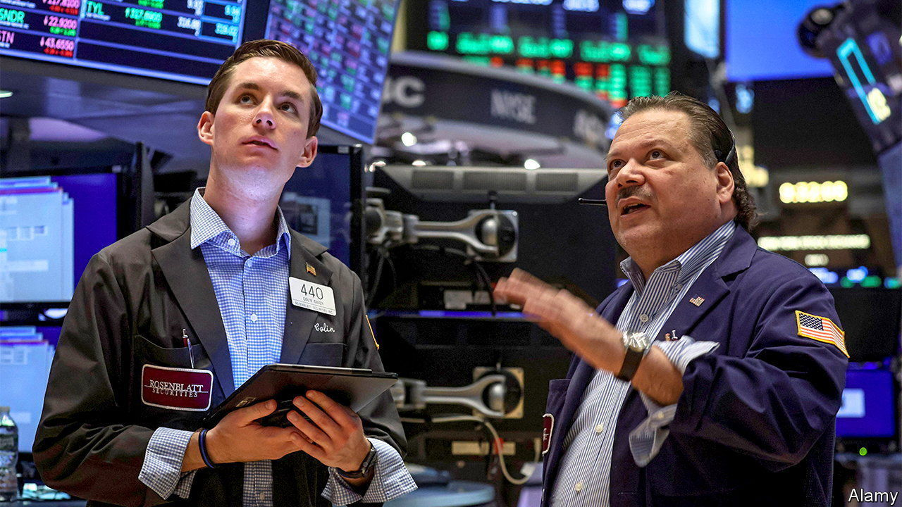

###### Beware bear traps

# A fresh American bull market is under way. Can it last? 

##### Investors have been cheered by rosy economic news 

 

> Aug 18th 2022 

How sweet it is to forget. Just months ago financial markets were being pummelled by war, inflation and the prospect of rapidly rising interest rates. January to June this year were the worst first half for American shares in more than five decades. The s&amp;p 500, America’s leading index of stocks, slumped by 21%; the tech-heavy nasdaq shed 32%. Yet since the middle of June the market has staged a remarkable comeback. The nasdaq has climbed by more than 20% from its low, officially entering a bull market; the s&amp;p 500, up by 17%, is verging on bull territory of its own. Apple is now just 7% shy of being valued at $3trn, as it was, briefly, on January 3rd. Can the turnaround continue? 

The good news is that the rally is underpinned by, well, good news. As companies’ earnings releases over recent weeks have shown, American consumers still went shopping in the second quarter. On August 16th Walmart reported that households’ spending grew strongly, helping its revenue climb by 8.4% on the year. Gauges of consumer sentiment are picking up. America added a whopping 530,000 jobs in July and, more hearteningly still, consumer prices did not rise compared with a month earlier. The market rout of the first half of 2022 has also yet to expose lurking dangers in the financial system. Aside from blow-ups in dodgier corners of the crypto-sphere, American finance has so far proved resilient. 

 


The bullish interpretation is to assume that a soft landing is under way. In this world inflation will drift down without derailing economic growth, and the Federal Reserve may not even need to raise interest rates quite so quickly. Consumers’ expectations of inflation, even for the year ahead, have fallen sharply. Market pricing suggests that the Fed will probably increase rates at a gentler pace than had been expected earlier in the summer, before it begins cutting them as soon as May. Investment bankers on Wall Street expect companies to escape relatively unscathed, without a meaningful slowdown in earnings this year.

Yet it is too soon to breathe a sigh of relief. For a start,  is far from being vanquished. The monthly rate did not rise in July mainly because of a fall in energy costs, including for petrol. That in turn offset stickier inflation in other components, like rents. Core inflation, excluding food and energy, was an annualised 3.7% in July—far above the Fed’s target range. Moreover, the impressive jobs numbers were accompanied by rapid wage growth, indicating that underlying price pressures may not abate so easily. Having been late to react to the inflation surge, the Fed is unlikely to turn on a dime. 

Companies’ earnings, meanwhile, have not all been rosy. Although investors embraced news of strong earnings from lots of firms, they have also overlooked mediocrity. Alphabet, for instance, reported revenues and earnings that were a little lower than analysts’ expectations. Its share price nonetheless jumped by nearly 8% on the news. And threats to earnings loom ahead. The Fed’s interest-rate rises are yet to have their full effect. Even as American shoppers have so far been unfazed, the rest of the world has faltered. China’s recovery from its covid-19 lockdowns has been lacklustre; growth in both retail sales and industrial production fell short of economists’ forecasts in July. Europe remains in the throes of an energy crisis. 

Sauter pour mieux reculer

History offers a final note of caution. As battle-weary short investors on Wall Street are quick to point out, most past  downturns included plenty of breathtaking “bear market” rallies before stock prices resumed their downwards march. In the dotcom bust, the nasdaq shed a third of its value between March and April 2000 before surging by more than 20%, entering a fresh bull market. The index did not reach its bottom for another two years. This time could, of course, be different. But for that to happen, the good news must keep rolling in. ■


