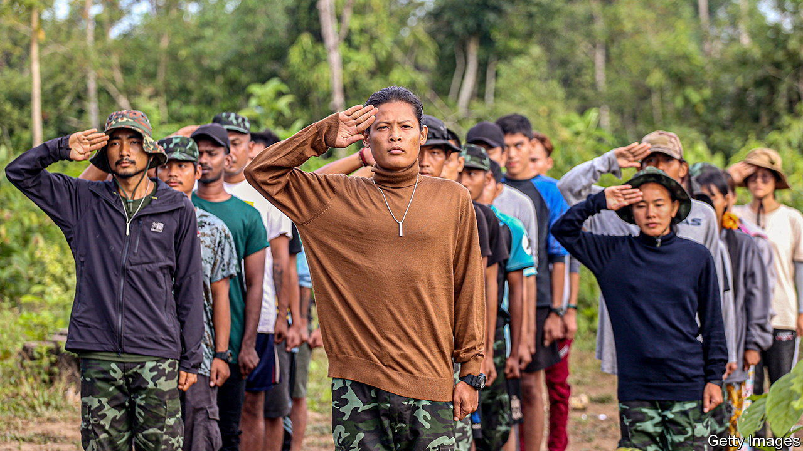

###### The penniless v the merciless

# Myanmar’s government-in-exile deserves more help 

##### International recognition—and the money it would bring—would be a good first step 

 

> Aug 18th 2022 

Five years ago this month, Myanmar’s army launched a pogrom against Rohingyas, a Muslim minority, that ended up pushing 750,000 of them out of the country. The unlucky refugees are still rotting in camps in Bangladesh. The Rohingyas that remain in , meanwhile, suffer systematic segregation and discrimination (). Not content with persecuting a minority of its citizens, however, the army has since overthrown the civilian government and brutally suppressed nationwide protests against the usurpation of democracy. That has spawned violent resistance, which the army is attempting, without success, to crush.

Few regimes around the world are more blood-stained and repugnant. Yet few regimes are also harder to influence. Western countries have suspended aid and Western businesses have divested, for the most part. The economy shrank by 18% last year, by the World Bank’s estimate. But the army does not care about the immiseration of its citizens. In fact, it does not care about them full-stop: its scorched-earth campaign against the rebels fighting for democracy has killed thousands of innocent bystanders and displaced about 1m people. 

The ferocious response to the insurgency gives an inkling not just of the army’s brutality, but also of how determined and resilient ’s democrats are. Ordinary villagers, with scant weapons or training, have formed militias in many places. Fighters from the ethnic majority, the Bamar, have joined forces with ethnically based insurgencies around the country’s fringes. Although few of these groups have the strength to battle the army head-on, they are carrying out raids and ambushes all over the country. The army controls barely half of Myanmar’s territory and is slowly losing ground. And all this has been achieved with almost no outside help. A bit more cash and encouragement would provide the opposition with a huge boost.

The lack of help is partly because Myanmar does not seem like a priority, amid the war in Ukraine, the ailing state of the world economy and umpteen other crises. But mainly it reflects how little hope there initially seemed of dislodging the army. The near-universal assumption was that all dissent would be easily crushed. Western governments discouraged violent resistance to the coup, on the ground that such bloodshed would be futile. They also doubted the opposition’s ability to unite.

That view turns out to have been flat wrong. mps from the former ruling party quickly formed a shadow government. Despite their reputation for Bamar chauvinism, they included representatives from ethnic-minority parties. They even promised to treat Rohingyas better. The National Unity Government (nug) commands the loyalty of the vast majority of Burmese, including most of the resistance forces. In some areas, it has managed to form local administrative bodies and runs schools and clinics. The army, meanwhile, has proved itself incapable of defeating the insurgency.

But the nug is desperately short of cash. It needs support—and especially money—from the West. If America recognised it as the legitimate government, the nug could claim the $1bn in Burmese assets that America froze after the coup. Such a gesture would have the added benefit of showing that the outside world is not willing to acquiesce by default to the army’s atrocities.

None of this guarantees the military regime’s demise, of course. It retains the overwhelming advantage in money and firepower. It still has a powerful ally in China. But the resistance has defied the odds for 18 months. It would not take much to shift the odds in its favour. ■

