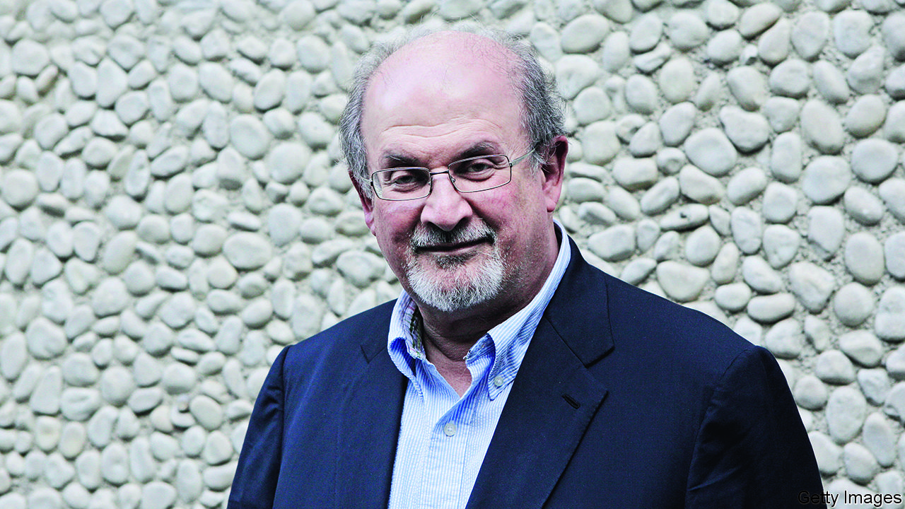

###### Never-ending story

# Salman Rushdie and the struggle for free speech 

##### A horrific attack shows the old battles still rage 

 

> Aug 18th 2022 

The longer  remained alive, he wrote in “Joseph Anton”, “the longer he went without being killed, the easier it was for people to believe that nobody was trying to kill him.” The book is a memoir of the years the author spent in hiding after Ayatollah Ruhollah Khomeini, then Iran’s supreme leader, issued a  urging Muslims to murder him and his publishers because of the alleged blasphemy of his novel, “The Satanic Verses”. That was in 1989; on  Sir Salman (as he became in 2007) was stabbed as he was about to give a lecture in upstate New York. 

The past is never past—and history’s great, tectonic clashes are rarely over. That may be the main lesson from this dreadful episode. In the days before the  and the years after it, the furore around Sir Salman’s book took the lives of demonstrators in India and Pakistan and of its Japanese translator. It set off one of the modern era’s great debates over free speech and the place and claims of religion in democracies. In the decades since, though, the threat to Sir Salman’s life seemed to fade. In recent years other worries, from the pandemic to Vladimir Putin’s bloody revanchism, have come to seem more urgent than that of Islamist violence, whether state-sponsored or otherwise. 

But in the world of fundamentalism, nothing ever dies. Its acolytes operate in deep time, nurturing ancient grievances and waiting years to avenge them. The man in custody in America for the attack on Sir Salman was born almost a decade after “The Satanic Verses” was published. Modern technology is an ally of this long perspective. For all its ephemerality, the internet is a reservoir of deathless resentment and grudges, in which loners and fanatics find solace or a mirror for their yearnings. Calumnies and conspiracies of all kinds now live on for ever.

Meanwhile, the struggle for free speech, of which Sir Salman became an accidental champion—deciding it was a cause worth dying for, if he had to—is as fierce and pressing as ever, if also more complex, waged on new fronts and against suave foes as well as the murderous sort. Now, as in the aftermath of the, the battle lines are wavier than they ought to be. Then, some politicians and thinkers were forced to choose between principles: a non-judgmental multiculturalism and what ought to have been an inviolable commitment to free expression, even or especially when it causes offence. Some got the hierarchy wrong, tolerating intolerance and criticising an author they should have shielded. “Good men would give in to fear and call it respect,” Sir Salman wrote. Some still do. 

But if the timidity of that period is familiar, so is the courage. While some public figures equivocated after the , many others stood up for both Sir Salman and free speech. Other writers read from his novel in public; bookshops faced down bomb threats to stock it. People bought his work in solidarity. They have done so again this week. “The Satanic Verses” is still being read—albeit not by many of those who purport to be offended by it. Though grievously wounded, Sir Salman himself is mercifully said to be on the road to recovery. 

In “Joseph Anton” he describes how a frog-shaped phone he once saw on the desk of a Hindu nationalist politician in India found its way, indirectly, into “The Moor’s Last Sigh”, one of the books he wrote while he was under police protection. “Nothing”, he observed, “is ever lost.” He was right about that, too. Controversies may fade but great literature lasts. And though the hatred and irrationality that made him their target endure, so does the determination to resist them—which Sir Salman himself heroically embodies. ■

