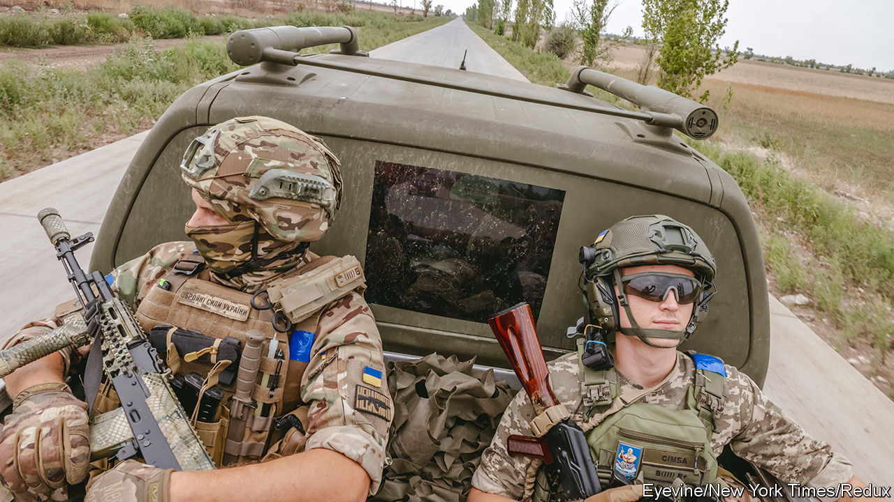

###### The war in Ukraine

# Stay cool on Kherson 

##### Why Ukraine’s army should not rush to recapture the whole province 

 

> Aug 17th 2022 

In the years to come, nato armed forces will queue at the door of Ukraine’s general staff to learn from the commanders who halted the Russian army’s march on Kyiv and Odessa and inflicted more than  in six months of war. Yet a huge test still lies ahead: Ukraine wants its territory back. 

There is growing chatter that the Ukrainian army is preparing a  in the south. It has damaged or severed most of the bridges that connect the city to other Russian-held territory, isolating Russian forces on the western side of the Dnieper river. It is pounding Russian ammunition dumps and command posts with rockets. Ukrainian generals are buoyant; one says the city could be liberated by the end of the year. 

Such triumphal talk masks a more complex reality. Russia has been pouring troops into Kherson and digging in.  is slow and costly for the troops waging it and the civilians in the way. Russia has captured Mariupol, Severodonetsk and other Ukrainian cities because it had little compunction about destroying them in the process. Ukraine would rather Kherson remained intact. An effective Ukrainian counter-offensive is more likely to resemble a protracted campaign of siege and attrition than blitzkrieg on the steppe.

In weighing an attack, Volodymyr Zelensky, Ukraine’s president, must strike a balance. His Western allies, especially in Europe, are having to cope with spiralling gas prices and looming shortages. He wants to show them clear progress. Some of his own compatriots are also getting restless. And he is keen to disrupt the sham referendum Russia is planning to justify the annexation of Kherson. “We will liberate everything,” he promised this month. But the truth is that Ukraine needs more time to train soldiers, acquire weapons and soften up Russian defences.

Right now, the war looks like a stalemate. Russian advances in the eastern Donbas region have slowed to a crawl. Ukraine’s probing north of Kherson in recent weeks has also been fruitless. Both sides are still rebuilding their armed forces, battered from six months of war. Russia will use the coming months to stiffen its defences, resupply its badly mauled battalions and replenish them with well-paid volunteers.

On current trends, however, it is Ukraine that will be in a stronger position to break the stalemate early next year. It has manpower shortages of its own, but Ukrainian recruits are undergoing basic infantry training in Britain. The 10,000 troops produced by that effort will help Ukraine establish the new brigades it needs for an offensive, although it will need the scheme to continue and grow after that. More arms are also arriving every week. On August 8th America announced its biggest shipment yet, including new ammunition for the himars rocket launchers that have tormented Russian forces.

Ukraine’s partners must be patient; wars of attrition do not turn on a sixpence. Western governments may be nervous about maintaining public support for Ukraine as heating bills soar in the winter months. Vladimir Putin, Russia’s president, is no doubt assuming that fatigue will set in. But capturing Kherson is not the only way to stave it off.

Spectacular strikes like the ones Ukraine has been  this month, well beyond the range of its known weapons, show clearly that it is still outfoxing its adversary and maintaining the initiative. The latest attack, on August 16th, destroyed an ammunition depot and an electricity substation 200km behind the front lines. The methodical destruction of Russian military power will eventually pave the way for the territorial gains Ukraine craves. ■


