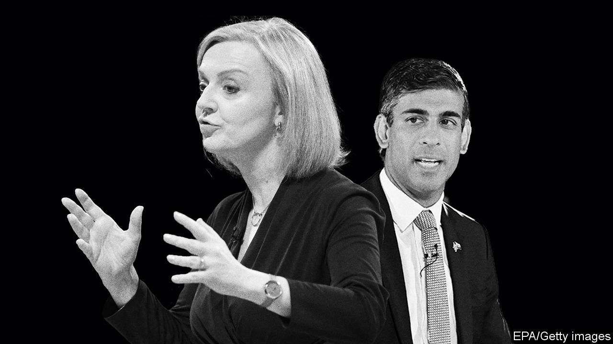

###### The Tory leadership

# What kind of prime minister will Britain get? 

##### It will be a technocrat who knows what to do, or a politician who knows how to do it 

 

> Aug 18th 2022 

In these tumultuous times, running the Conservative Party is as hard as running the country. On September 5th Britain will get its fourth prime minister in six years.  will be handed the keys to 10 Downing Street by the grace of roughly 160,000  as everyone else looks on. Whoever wins—and just now it seems likely to be Ms Truss—will inherit a  and a party that forced out its three previous leaders while they were still in office. It is not a record that breeds confidence.

This is a cause for worry. After 12 years of Conservative-led government, Britain is suffering from a bout of inflation and a chronic . At the same time, politics has become unstable as old alignments have broken down. One or more of these phenomena is roiling most of the rich world. It is hard to think of a country that has such a severe case of all three. 

Neither Mr Sunak nor Ms Truss is especially inspiring. On the campaign one child in Peterborough said they would have preferred the next prime minister to be Larry the Cat, No 10’s chief mouser. The good news is that both would be better than the man who resigned in July. Characteristically, Boris Johnson has so far lacked the follow-through even to turn up to his own farewell tour. By contrast, both contenders can master a brief and see it through without losing interest. They appear to want to be in office to get things done more than because they crave attention. And, though it sounds quaint, they stretch the truth like politicians rather than rip it in two like a con man. 

The bad news is that the next prime minister is walking into a tempest. Inflation is expected to pass 13%, worse than any other country in the g7. Real wages next year are forecast to fall more rapidly than they have in decades. The typical annual household energy bill may reach £4,300 ($5,200) in January, triple what it was in 2021. Strikes are spreading, across the railways, into the courts, the ports, logistics and local councils. They could reach the nhs in England, where waiting lists already contain one in eight of the population. This cost-of-living crisis could trip up Mr Sunak or Ms Truss before their feet are under the cabinet table. Labour this week put down a marker, promising to cap average annual energy prices for households at an annualised £1,971 for an extra six months (). 

Both candidates have been left looking flat-footed. Perhaps because most Tory party members are not much affected and because Mr Sunak and Ms Truss want to emphasise their long-term goal of a smaller state, they are loth to say how much money they would hand out. Mr Sunak is more plausible, having offered a mix of tax cuts, rebates and targeted benefits. Ms Truss’s claim that her payroll-tax cut would help makes no sense for the poorest, who do not contribute. But she is cutting green levies and has kept open the option to give away money if she wins office.

The hope is that events will not stop the next prime minister getting to Britain’s second, deeper problem—its long-term economic weakness. To their credit, both candidates have made this the heart of their campaign. Both embrace supply-side reform. 

Ms Truss has put forward a warmed-up Reaganite agenda of deficit-funded tax-cuts and deregulation. She is right that Britain, an early privatiser, needs to overhaul its regulated industries. Today’s rules lock up capital that pension funds and insurers could use to back innovative British firms. In that spirit, there’s no harm in looking at the mandate of the Bank of England, though talk of targeting the money supply is, frankly, odd. 

Mr Sunak’s plans are more coherent. Rather than cutting overall corporate taxes, which does little to boost investment or growth, he would target relief on capital spending and r&amp;d. He is more likely to preserve fiscal space for an emergency, such as another pandemic, and for the demands of climate change and an ageing population. He is less likely to ruin relations with the European Union which, by a fact of geography, is and will remain Britain’s biggest trading partner. But he, too, has his foibles, pledging to restrict planning even though Britain’s most successful cities cannot expand, holding back the economy.

That contradiction reflects Mr Sunak’s clumsy efforts to cope with the changing allegiances upending British politics. Just as the Labour Party struggles to please both its traditional and metropolitan voters, so Conservative Party members and mps are a rabble of social conservatives, big-government populists, red-trousered country folk and bomb-throwers. Mr Johnson always told everyone what they wanted to hear, and even he could not unite them for long.

Mr Sunak’s tin ear has been exposed by the campaign. Having won the vote among mps by 39% to 32%, he defined himself to party members as a sound-money Thatcherite. But then he started offering up gimmicks. When news broke in April that his wealthy wife had saved millions thanks to her special tax status, it undermined the authority of a minister then responsible for hm Revenue &amp; Customs. Believing that it was nobody’s business, he turned out not to have a ready-made defence.

By contrast, Ms Truss has repeatedly been underestimated. Despite a reputation for oddity, she has rubbed along in the cabinets of three very different prime ministers. She sat out the exit of Mr Johnson which, given that unruly Tory members already want him to stay, now looks tactically astute (if morally dubious). During the campaign she has been hungrier and more convincing. The question is whether she would have the ruthlessness to distance herself from the baleful influence of her toxic early supporters, such as Nadine Dorries and David Frost.

The choices they make

Britons will not choose the next prime minister: he or she will be imposed by the Conservative Party’s factious members. They are facing a choice between an urbane technocrat, with a sounder grasp of what needs doing, and a tested politician, with a cannier instinct for how to do it. As prime minister, Mr Sunak would be unlikely to act foolishly, but the job is inherently political. Ms Truss would be a riskier bet, but may also be more likely to succeed. Whatever their reasons, it looks as if the Tories have opted to be risk-takers. They may be proved right. ■

