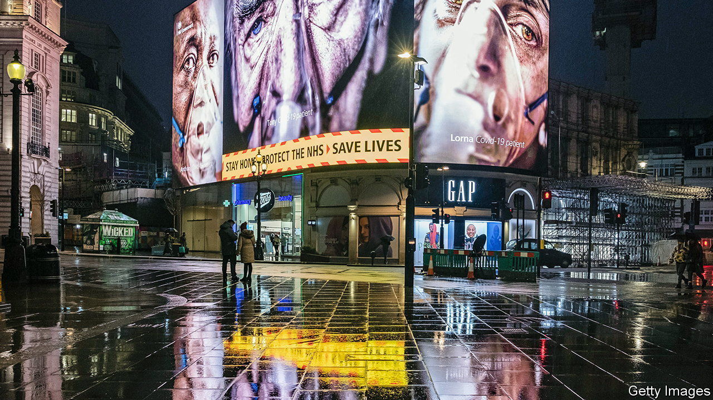
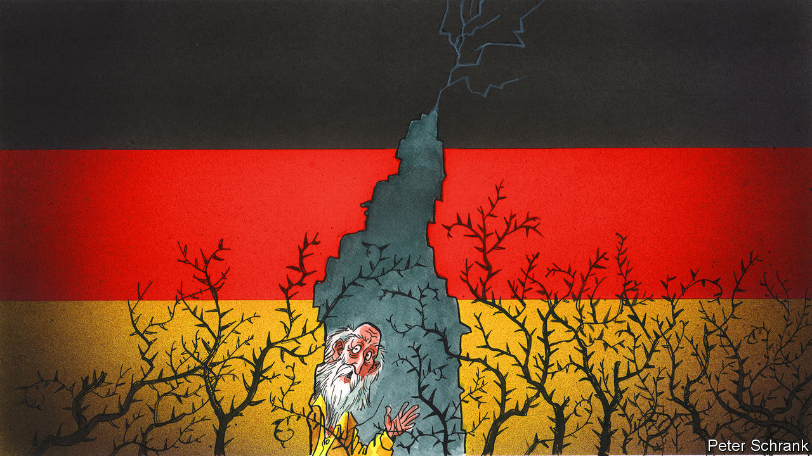
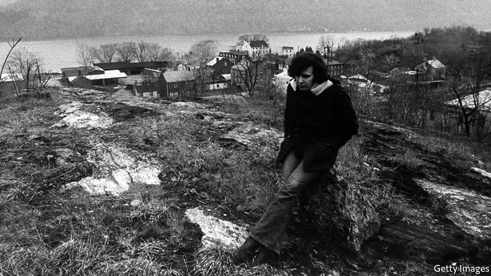

###### On nudge policies, German energy, careers, Russian colonialism, our summer issue, Don McLean

# Letters to the editor 

##### A selection of correspondence 

 

> Aug 18th 2022 

A push in the right direction

As the original public policy “nudge” unit, the Behavioural Insights Team shares your interest in research in the field (“”, July 30th). The dangers of publication bias are not new, which is why we have allowed independent researchers to examine our results and publish their findings. A study reviewing 347 bit and American government “basic nudge” interventions was recently published by Stefano DellaVigna and Elizabeth Linos in . It found the effects of the interventions were “sizeable and highly statistically significant”. 

The average effect size was 8%. In contrast, comparable academic studies claimed larger effect sizes, but this was entirely driven by publication bias and smaller samples. So there is a problem with academic incentives, but let’s not jump from that to throwing out a general-purpose tool that can boost and improve outcomes and public-service productivity. 

You missed the bigger point. Researchers should focus their attention on why and how behavioural science interventions vary by context and population. That will help us drive up that 8%, and spare people from nudges that don’t work or aren’t relevant.

david halpern

Chief executive

Behavioural Insights Team


The English word “nudge” should be replaced by its Yiddish cousin “noodge”. The meanings are similar, but noodge better conveys the unwelcome intrusions described in your article.


ALAN LEWIS


 


Germany’s energy use

 rightly emphasised the unintended consequences of reducing Germany’s domestic energy supply by banning fracking and phasing out nuclear power (July 23rd). However, the idea that the country’s prosperity rests on “cheap imported energy” is the real fairy tale. German gas consumption has stagnated over the past 20 years. Today Germany uses and imports less energy, and less gas, per unit of gdp than most of its European peers. 

The proposition that Vladimir Putin “seduced” German business and politicians with low prices is equally untenable. Why would Russia sell gas to Germany at a lower price than to others and thus forgo revenues? Gas is a fungible commodity with a highly integrated market in Europe and consequently very similar wholesale prices across countries. Data from the European Commission show that German industry has actually paid slightly more for gas than its competitors in other European Union countries.

Germany’s elite was blind to the danger of depending on one supplier, but cheap imported energy played no role in German prosperity.

daniel gros

Distinguished fellow

Centre for European Policy Studies


 


It’s not all about the money

The real conclusion from our research and that described in “” (July 23rd) is that different people want different things. In a large-scale survey of what motivates business students and professionals, we consistently found that most thought “positioning” was the biggest motivation for career opportunities, followed by “lifestyle” (free time and flexibility). That was the case before the pandemic. But the data now show a neat flip. It is as if those future opportunities lost their sheen as the very concept of “future” grew hazier and more uncertain. By contrast, the lifestyle afforded by remote work, once the realm of science fiction, was shown to be not only possible but desirable or even necessary. Hence “lifestyle” overtook “positioning” for the first time. 

Until recently companies focused on the motivating power of compensation, which is appealing (although with a diminishing return) and easy to measure. By over-focusing on compensation, employers do a disservice both to the people they are trying to motivate and to their shareholders. Why not give a little more autonomy as a reward to the employee who finds it gratifying, a little more recognition for someone who craves that? You will be fine-tuning your rewards to fit the individual employee, and doing it free.

james waldroop

President

CareerLeader


Russian colonialism

Sergei Lavrov, Russia’s foreign minister, churned out the anti-colonial rhetoric during his tour of Africa (, July 30th). But the fact is, Russia, in its various guises, has an older colonial history than most Western powers. Russian colonialism began in earnest by the mid-1500s, with Muscovy’s conquest of the Khanates. The list of peoples and places conquered and incorporated into Russia is long. Kalmyks, Chechens, Crimean Tatars, Georgians. Dagestan, Khiva, Kokand. It takes committed expansion over centuries to get as big as the Russian Empire. It takes violence, too. Armed conquest, intimidation, forced settlements, deportation, ethnic cleansing, slaughter. Maybe a million Circassians were expelled, resettled or killed during and after their conquest in the 19th century. 

The Russian government talks as if Crimea is primordially Russian, but this is a lie. It was simply stolen from the Tatars. This is Russia’s record, and it is damnable. What makes Mr Lavrov’s anti-colonial posturing the more shameless is that this past is also Russia’s present. 

ethan menchinger

Lecturer in Islamic history

University of Manchester

Our summer issue

Why did you publish a summer double issue ()? I can understand the Christmas bumper edition to manage the festive holidays, but not a summer one. I thought everything shutting down for trade holidays was a fading part of history. One reason I subscribe to  is that it has a paper version, since I do not enjoy reading articles on a screen. And you made it seem like a great event by padding out the edition with pieces from magazine, which I would never pay for. What I do pay for is 51 weekly issues of  a year.

trevor hogg


The lengthy and edifying article in  on Muhammad bin Salman (“”, July 30th), together with the news of his chummy meetings with Vladimir Putin, places the predicament of Western democracies in troubling context. Authoritarianism is on the march, armed with powerful new technologies. When one thinks of the longer perspective it is easy to think that we are witnessing the twilight of Enlightenment rationalism and humanist hope, championed by  since 1843. Have we now arrived where we feared we might? The cruel fates of Jamal Khashoggi, Alexander Litvinenko and others suggest that we are in an age in which previous assumptions of state restraint are losing their force. 

gavin marshall


 


Drinking whiskey and rye

Reading your article about the cryptic significance of the lyrics to Don McLean’s “American Pie”, reminded me of a comment he made at the time of its release in 1971. When asked what the song meant he replied, “It means I never have to work again” (“”, digital editions, July 19th).

tim jordan


