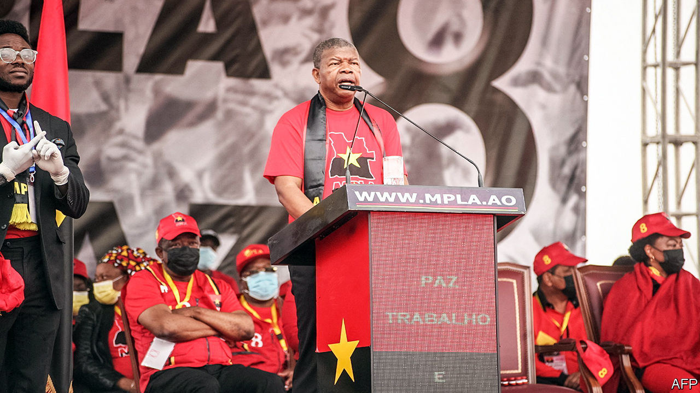

###### Dead but not forgotten

# A dictator’s ghost haunts Angola’s upcoming elections 

##### Despite a resurgent opposition, the ruling party is expected to rig its way to victory 

 

> Aug 18th 2022 

How much is a dead dictator worth? Quite a lot, judging by the squabble over the corpse of José Eduardo dos Santos, the kleptocratic ruler of Angola from 1979 to 2017, who died in a hospital in Barcelona on July 8th. João Lourenço, current president of the southern African country, wants to bring his predecessor’s body home for a state funeral ahead of a general election on August 24th. He hopes that a grand ceremony would unite supporters of the ruling People’s Movement for the Liberation of Angola (mpla).

But Mr dos Santos’s children have other ideas. They say it is a matter for the family; one daughter, Welwitschia dos Santos, popularly known as Tchizé, insists that the burial should be in Spain. She denies that the family is using the body as a bargaining chip to seek amnesty for the various corruption charges faced by its members. 

However unseemly, the saga reveals much about Mr Lourenço’s presidency. When he took office in 2017 the former defence minister pledged to root out alleged corruption centred on the dos Santos clan. He said he would diversify the economy. But the campaign against graft has stalled and the economy still depends on oil. 

Opening the mpla’s election campaign almost five years later, he called on Angolans to “honour the memory” of his predecessor, who led the country during a long civil war, by voting for the ruling party. The rhetoric hints at how Mr Lourenço’s popularity has waned since his heady early days—and how the mpla faces its strongest electoral challenge since it took power after independence from Portugal in 1975. 

The president has been dealt a poor hand. Oil accounts for about half of Angola’s gdp and nearly all its exports. The low price of crude for most of his tenure meant prolonged recessions, a bail-out from the imf and a negotiated delay of debt repayments to China. The pandemic exacerbated the economic pain and complicated the government’s efforts to curb wasteful public spending. The recent rise in the oil price has been welcome, but will be mostly channelled into a pre-election spending binge. Though a stronger local currency has helped ease inflation this year, Angola’s prices are still more than 20% higher than they were a year ago. 

Such economic difficulties have helped opposition parties, most notably the National Union for the Total Independence of Angola (unita), the mpla’s old opponent in the civil war. Under the leadership of Adalberto Costa Júnior, the party is attracting large crowds, especially in the urban areas that account for 65% of the country’s population. A survey published in May by Afrobarometer, a pan-African pollster, suggested that support for the mpla had dipped from 38% in 2019 to 29% earlier this year, while backing for unita had risen from 13% to 22%. (Some 31% refused to say whom they would support, while the rest did not know or said they would not vote.) 

An upset is unlikely, however. Like ruling parties across the continent, the mpla uses the power of the state to tilt the playing field. Another Afrobarometer survey this year found that only 21% of Angolans said they trusted the national electoral commission, down from 27% three years ago, making it the least trusted of all the country’s institutions, a notch below the dreaded tax authorities. Nearly half of Angolans questioned by the same company two years ago said that they “felt unfree to speak their minds”.

The constitutional court, which is packed with pliant judges, has hounded unita, forcing it to redo its internal elections and preventing it from forming an opposition coalition. Last year the rubber-stamp parliament changed the electoral law to centralise vote-counting, a move that opposition parties say is designed to make rigging easier. The powerful security apparatus around the president suppresses protests quickly and violently. 

All this shows how little has changed under Mr Lourenço. Angola remains under the thumb of the mpla, a paranoid party dominated by securocrats, spouting revolutionary rhetoric while gorging on the fruits of crony capitalism. Even if Mr dos Santos’s body is not buried in Angola, his spirit will still haunt the country as it goes to the polls. ■

