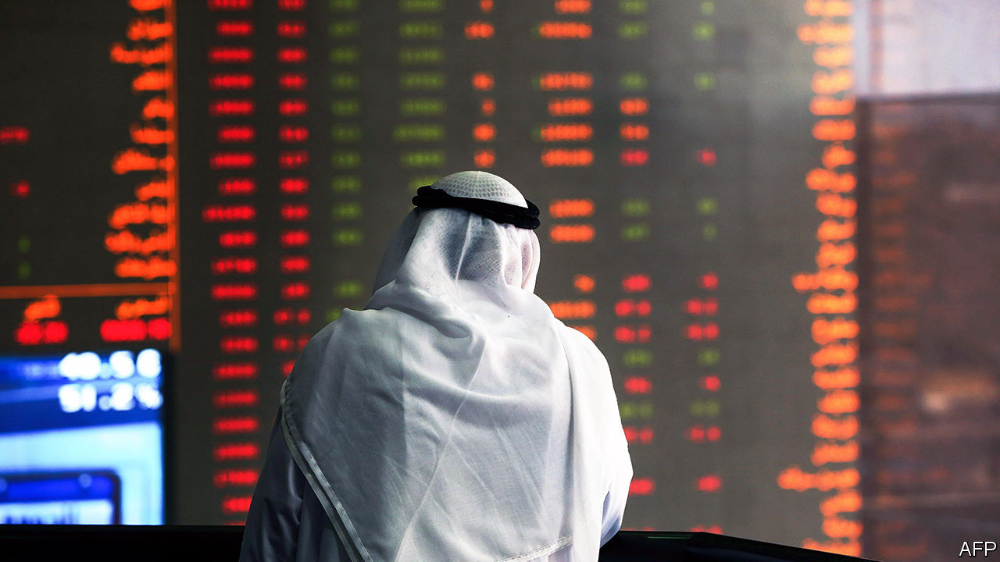

###### Follow the leader

# Arab central banks are tagging along with America’s rate rises 

##### This may slow growing economies and widen deficits 

 

> Aug 17th 2022 

Overseeing monetary policy in the Middle East these days, jokes a banker, is like taking your kids on a rollercoaster. You would rather be watching from the ground, but there you are, strapped in, trundling up a hill and waiting fearfully for the drop on the other side.

America’s Federal Reserve has raised interest rates four times this year, most recently on July 27th, when it increased its benchmark rate by three-quarters of a percentage point. That has compelled many Arab central banks to do the same—even if they would rather not. Some countries worry that higher borrowing costs will act as an unnecessary drag on economies that are not overheating. Others fear that, to maintain capital inflows, they will need to push rates painfully high, hobbling their economies and squeezing budgets.

To one side are the six members of the Gulf Co-operation Council (gcc), a club of oil-producing monarchies. Five of them peg their currencies to the greenback. This helps provide stability, given that most government income and economic activity is tied to the price of oil, which is typically traded in dollars. But to maintain the pegs, they must usually follow the Fed’s interest-rate decisions, irrespective of local economic conditions.

Since the start of the year Saudi Arabia has raised its main rate from 1% to 3%. The United Arab Emirates (uae) has more than doubled its lending rate to 3.75%. If the Fed raises rates again later this year, as expected, most Gulf states will go along, at least partially matching America’s moves.

They will do so despite modest inflation, which the imf projects will reach just 2.5% in Saudi Arabia and 3.7% in the uae this year. Energy subsidies and cheap migrant labour are holding down prices relative to other rich countries. Annual economic growth (excluding the volatile oil industry) is a healthy 3-4%.

The impact of higher rates may be muted. Flush with cash from an oil boom, governments will not need to borrow much this year. Consumers may put off buying new cars and other expensive items, but the property market should be less affected. Mortgages are less common in the gcc than in other parts of the world. Brokers have seen a flood of new applications for loans in the first half of 2022, as borrowers rush to lock in rates before they rise more.

Businesses may feel the biggest pinch. The uae’s central bank says demand for credit in the first quarter of 2022 was the highest since 2014. It has already begun to drop. Credit growth has dipped slightly in Saudi Arabia, too, to its lowest level in almost two years, says Emirates nbd, a bank. 

But the region’s oil importers will suffer much more—Egypt in particular. It had not raised rates since 2017 but has done so twice since March, including a monster jump in May of two percentage points. The central bank had reason to be resolute: annual inflation is running above 13%.

Fighting inflation is not its only concern, however. Since it reached a deal worth $12bn with the imf in 2016, Egypt has relied on inflows of private capital to finance its hefty imports and government deficit. Investors were happy to oblige. Egyptian debt offered some of the world’s best yields, at a time when returns elsewhere were minuscule.

As rates climb elsewhere, though, Egypt faces more competition. It admitted in May that $20bn (5% of gdp) in foreign capital had flowed out of the local debt market this year. Fitch, a rating agency, thinks the government will “feel pressure to preserve the attractiveness of Egypt’s real interest rates”—by raising them. 

This will be painful for the already anaemic private sector. The purchasing-managers index, a measure of business activity, has shown a contraction in all but nine of the past 72 months. Local investors have parked their money in banks rather than channel it into businesses.

Egypt’s bill for debt service has quadrupled in the past decade. Next year’s budget assumes $36bn in payments to creditors (45% of total revenue) and a deficit of $30bn. It will have to borrow at higher rates, swelling the interest bill even further. The government is back in talks with the imf about another bail-out. The Gulf states may get off the rollercoaster next year. Egypt faces a longer, wobblier ride. ■

