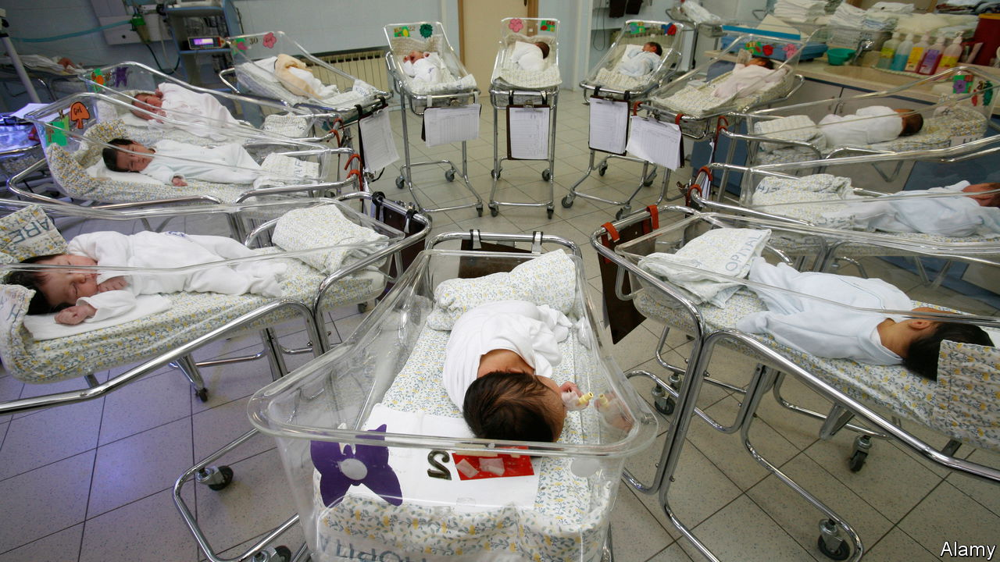
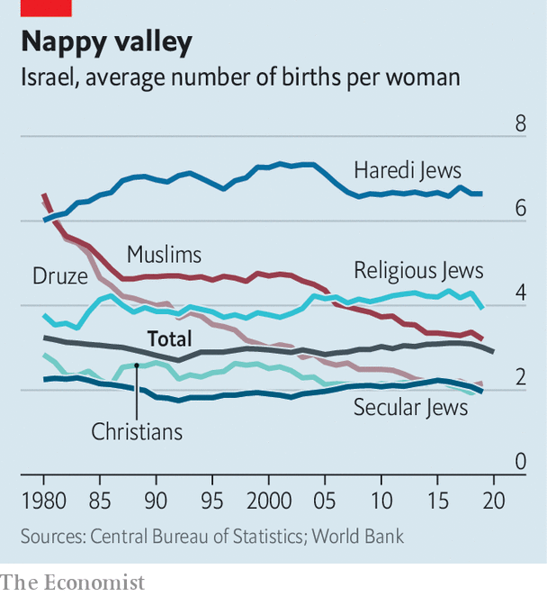

###### Go forth and multiply

# In Israel, birth rates are converging between Jews and Muslims 

##### Religious Jews there have bucked the trend of falling fertility elsewhere 

 

> Aug 18th 2022 

“If an israeli woman has fewer than three children, she feels as if she owes everyone an explanation—or an apology.” That, at any rate, is the view of a leading Israeli demographer. When she visits London she is struck by its dearth of toy shops. Israelis  than their counterparts elsewhere in the rich world. Whereas the average Israeli woman has 2.9, her British and French peers have 1.6 and 1.8 respectively. 

Demography in the Holy Land has geopolitical as well as economic consequences. Of Israel’s population of 9.5m, Israeli Arabs, mostly Muslim, make up about 21% of the total, while Jews account for roughly 74%. But include people in the Israeli-occupied West Bank and Gaza, and the Jewish majority falls to barely half. 

This, in a nutshell, is the basis of Israel’s trilemma. It cannot have at the same time a strong Jewish majority, all the land it conquered in 1967 and full democracy that does not discriminate against Arabs. So numbers matter. Israeli and Palestinian leaders have long scrutinised birth rates.

Yasser Arafat, who led the Palestinians for three-and-a-half decades, described “the womb of the Arab woman” as his “strongest weapon”. Demographic projections used to suggest that Arabs living between the Jordan river and the Mediterranean would eventually outnumber Jews. This certainly worried Binyamin Netanyahu before he became Israel’s longest-serving prime minister. In 2003 he lamented that the birth rate of Israeli Arabs, then much higher, was imperilling Israel’s Jewishness, irrespective of the trend in the West Bank and Gaza. 

At the time there was indeed a wide demographic gap. In Israel itself Arab women were having almost twice as many babies on average as Jewish women. But in the past few decades this gap has disappeared, as the birth rate of Israeli Arabs has fallen while that of Israeli Jews has risen.

 


In 1960 the fertility rate of Israeli Arabs stood at 9.3. In the next 35 years it dropped by almost half, to 4.7, before sliding to 3.0 today (see chart). The birth rate of Palestinians in Gaza and the West Bank also declined, from 4.6 in 2003 to 3.8 in 2019. In this Palestinians and Israeli Arabs have followed a path trodden by women elsewhere. Across the oecd, a club mostly of rich countries, the average fertility rate has fallen from almost three in 1970 to 1.6, well below the rate of about 2.1 needed to . 

Globally Muslims have the highest fertility rate of any religious group, according to the Pew Research Centre. Yet even this rate has fallen sharply, from 4.3 in 1995 to 2.9 in 2015. Seven Arab countries were among the 12 recording the world’s biggest drops in fertility between the late 1970s and mid-2000s. In Iran, whose religious leaders have long called on women to have more babies, the birth rate has fallen from 7.0 in 1984 to 1.7. 

This makes the rising birth rate of Jewish Israelis all the more surprising. Between 1960 and 1990 their fertility declined from 3.4 to 2.6, suggesting they were in step with their sisters elsewhere. But then they began to buck the trend, driving the birth rate back up to its current level of 3.1. 

Prayers v productivity

Almost all this increase is caused by Israel’s growing number of ultra-Orthodox (or Haredi) Jews, who have a fertility rate of 6.6, more than double the national average and three times the rate of secular Jews. As a result the share of Haredim in Israel’s population has more or less doubled every generation, notes Dan Ben-David, an economist at Tel Aviv University and the Shoresh Institute, a think-tank. Though Haredim are just 13% of the population, their offspring make up 19% of Israeli children under the age of 14, and 24% of those under the age of four. Israel’s statistical agency reckons that under present trends half of Israeli children will be Haredi by 2065. 

Such fruitfulness may please rabbis and Jewish nationalists. But it is also changing the character of Israel and threatening its economy, argues Mr Ben-David. Most ultra-Orthodox Jews send their boys to study Torah in religious schools rather than make them learn subjects, such as maths and science, needed for a job in Israel’s . Less than half of Haredi men enter the workforce: most keep studying ancient texts in adulthood. They are often financially supported by their wives and subsidised by the state. 

There are several reasons why the birth rate among Haredim has remained so high. Many want big families to make up for the millions of Jews killed in the Holocaust, or believe they are serving God by multiplying. “I didn’t do any [family] planning,” says Yerach Toker, who has six children. “A lot of things are in God’s hands, and this is one of them.”

Haredi women also tend to marry and have children at a younger age than secular Jews. And because ultra-Orthodox communities have tried hard to close themselves off from outside influences such as television and the internet, they may be somewhat insulated from the forces pushing down fertility in the rest of the world. 

But it is harder to explain why secular Jewish Israelis also have more children than the norm. Most work; paid leave for Israeli parents is not especially generous. Nor is child care cheaper than in other rich places. Some argue that Jewish Israelis make more babies because they foresee a rosier future: Israel ranks among the world’s top ten countries in happiness.

Another reason may be that the state encourages baby-making by, for instance, bankrolling fertility treatment. It subsidises in-vitro fertilisation to the tune of $150m a year. Tiny Israel has about the same number of frozen embryos as America. This may have only a slight effect on Israel’s birth rate, but it signals that the government wants its citizens to procreate. 

One more explanation may be that Israeli grandparents tend to help out more than their peers in many other rich countries. Since Israel is small and densely populated, grandma is never far away. In one survey 83% of secular Jewish mothers aged 25-39 said they were supported by their child’s grandparents, whereas only 30% of German mothers said the same. In Israel the traditional family structure is still strong. In France and Britain more than half of babies are born out of wedlock. In Israel it is under 10%. 

The convergence of birth rates between Israeli Jews and Arabs suggests demography will be far less important than either Israeli doom-mongers feared or Palestinian nationalists once hoped. Since neither community is likely to swamp the other with babies, both will still have to work out how to live together peacefully in their disputed slice of the Middle East. ■

