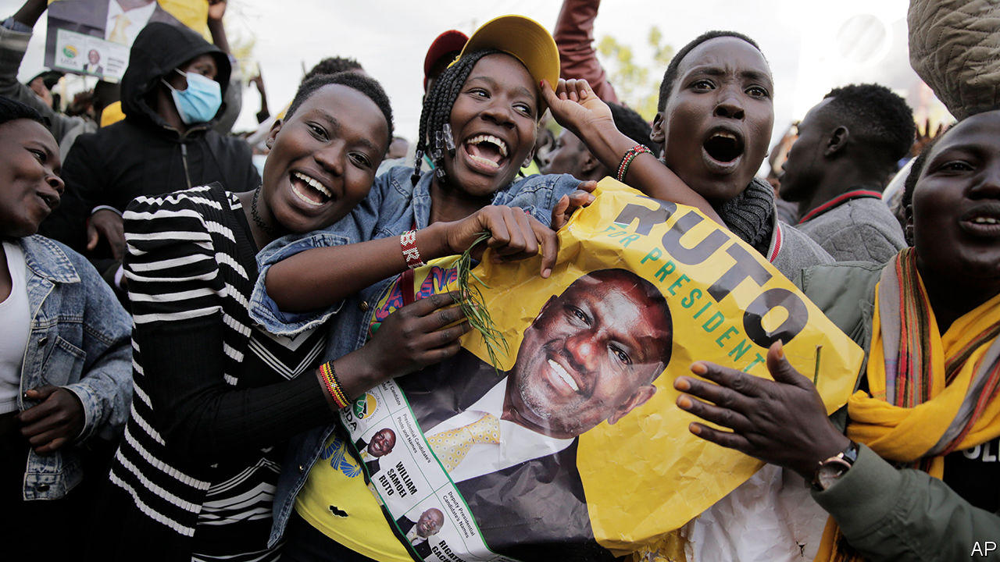

###### Winner by a wafer

# William Ruto is declared Kenya’s next president 

##### The populist candidate stirs hope and alarm in equal measure 

 

> Aug 18th 2022 

It had all gone so well. For days, ballots cast in Kenya’s presidential election had been meticulously and transparently counted. But just as Kenyans were hoping to consign their murky electoral history to the past, all hell broke loose. Sensing that their man was about to lose, allies of Raila Odinga, the outgoing government’s favoured candidate, rushed the stage as the electoral commission’s chairman, Wafula Chebukati, prepared to declare William Ruto, the anti-establishment candidate, the winner. Throwing punches, they hurled the podium into the auditorium. Mr Chebukati fled, as did assembled Western ambassadors. A choir, supposedly symbolising national harmony, sang bravely on.

When Mr Chebukati returned under police protection he was alone. Of his six fellow commissioners, two were receiving medical attention, while four others had gone off in a huff after finding fault with the final tallying process. He duly announced that Mr Ruto had secured 50.5% of the vote, just enough to avoid a run-off. Mr Odinga, with 48.8%, was defeated for the fourth time in a row. 

The declaration will not, however, be the end of the affair. Mr Ruto may be president-elect, but Mr Odinga has signalled that he will challenge the result in the Supreme Court. The split in the electoral commission will feature heavily in his petition. Yet the dissenting commissioners gave little substance to their grievances.

Among their main objections was the claim that the number of votes declared by Mr Chebukati added up to 100.01%. This amounted to 142,000 unaccounted ballots of the 14.2m cast, potentially enough to prompt a run-off, they insisted. As Kenyans quickly noticed, however, Mr Chebukati had merely rounded the results to two decimal places. Besides, 0.01% of 14.2m is 1,420—not 142,000. Mr Odinga will need more than four innumerate commissioners to convince the judges.

Kenya’s judiciary has a reputation for independence. The Supreme Court upheld Mr Odinga’s petition against the previous election in 2017 and ordered it to be held again; Mr Odinga boycotted the rerun. This time, despite the messy finale, electoral officials appear neither to have bungled the count nor winked at rigging. Electronic results from 46,000-plus polling stations were uploaded for all to see and scrutinise within hours of the polls closing on August 9th. So Mr Odinga faces an uphill battle to prove something was amiss. Mr Ruto seems untroubled.

The transparency of the count, coupled with faith in the judiciary, has so far limited unrest to a handful of protests in Mr Odinga’s strongholds. Political apathy may also be helping to douse passions. Mr Odinga has spent most of his working life as an opposition firebrand. This time he ran as the establishment’s candidate after making up with Uhuru Kenyatta, the outgoing president, who vigorously endorsed him (and appointed the dissenting commissioners). With his reformist image tarnished by this co-option, Mr Odinga, who is 77, may find it harder to raise the street. Even some of his own Luo people whisper that he has had his day.

Provided that the last-minute row within the electoral commission does not lead to mayhem, Kenya should still be able to burnish its claim to be one of Africa’s best-functioning democracies. Mr Kenyatta is the third president in a row to respect constitutional term limits, making him a rarity on the continent. None of Kenya’s neighbours can match its history of holding truly competitive elections. Only one outgoing Kenyan president has managed to get his favoured successor to replace him. So it is an irony that the man who could pose the greatest threat to this progress is Kenya’s new president.

Mr Ruto, presuming he is confirmed in power, may prove a capable leader. He is a formidable, hard-working, eloquent politician with a prodigious ability to organise and inspire. But he also has the whiff of the strongman about him. “He will make the trains run on time, both in the good sense and the bad,” says a seasoned analyst.

His past inspires little confidence. A disputed election in 2007 unleashed the worst political violence since independence. Mr Ruto, who had positioned himself as the kingpin of the Kalenjin tribal federation, was charged by the International Criminal Court (icc) at The Hague with helping to instigate violent clashes that killed more than 1,300 people. The court later suspended the case but, noting allegations that witnesses had been intimidated, pointedly declined to acquit Mr Ruto. He has also been dogged by allegations of corruption ever since taking high office, first as a cabinet minister and then, from 2013, as deputy president to Mr Kenyatta. Mr Ruto denies everything.

His past aside, much about Mr Ruto echoes the tones of populist strongmen elsewhere. Like India’s Narendra Modi, who once sold tea for a living, he makes much of how he used to flog chicken to lorry drivers to make ends meet. Like Brazil’s Jair Bolsonaro, he has forged a coalition that combines liberal economists with thuggish types. His running mate has been charged with corruption; three political allies are being investigated on murder charges. Yet he has charmed some Western diplomats, politicians and journalists.

By presenting himself as the voice of the poor, he has at least partially transcended ethnicity to become the first leading Kenyan politician to win support based more on class than tribe. Mr Kenyatta, who hails from the grandest family of the country’s biggest ethnic group, the Kikuyu, stridently backed Mr Odinga. Yet most Kikuyus plainly plumped for Mr Ruto. 

Mr Ruto played energetically to the gallery. Dynasts like Mr Kenyatta, with whom he fell out, and Mr Odinga, sons of Kenya’s first president and vice-president respectively, were responsible for Kenya’s inequality and corruption, he declared. Who better to take them on than someone who had once been a poor nobody himself?

But Mr Ruto’s political outlook is changeable, to say the least. Just as he has promised to drain the political and dynastic swamp which he has cheerfully inhabited for the past 30 years, he also pledges to defend Kenya’s progressive constitution of 2010, despite having led the campaign against its adoption. Poor Kenyans are unused to someone who speaks so clearly for them. That Mr Ruto is vastly rich only adds to his appeal as a self-made man. If he has a ruthless streak, many think, so much the better. “Kenya needs a strong leader,” said Njoki Maina, a Kikuyu kiosk operator, after casting her ballot for Mr Ruto.

Why nerves are jangling

Senior Kenyan journalists say that some of the most disturbing pressure they have experienced in the past ten years has come from Mr Ruto’s office. Seeing that his coalition will hold the largest number of seats in both houses of parliament, Kenya’s civil society is already crossing its fingers that the new president accepts constitutional restraints. It will be essential that the opposition hold him to account with unabated zeal. Mr Odinga once filled that role. But his famous reconciliation with Mr Kenyatta in 2018 took the sting out of Kenya’s opposition. Human-rights campaigners and journalists will have to rediscover their voices to protect the constitution, should it come under attack.

Mr Ruto will anyway face big challenges. The poor will have high expectations. He promises to end the profligacy of the Kenyatta years by eschewing expensive vanity projects funded by China. Instead he says he will lend to poor farmers and small businesses. As food prices soar and a debt crisis looms, he may find this hard. 

To divert attention he may go after the vastly rich Kenyatta family. Under Mr Kenyatta Kenya’s public debt nearly quintupled. Should Kenya default, the ex-president would make an easy scapegoat. On balance Mr Ruto is likely to stay his hand, since seeking to have his predecessor punished would set a dangerous precedent.

But whatever the difficulties ahead, Mr Ruto’s victory suggests the era of the tribal kingpins who have dominated Kenyan politics for the past three decades may be passing into history. Mr Odinga is unlikely to contest the next election. Mr Kenyatta did not try to groom a Kikuyu heir. The election rows and economic headaches may look worryingly familiar, but Kenyan politics may be changing for the better. ■

