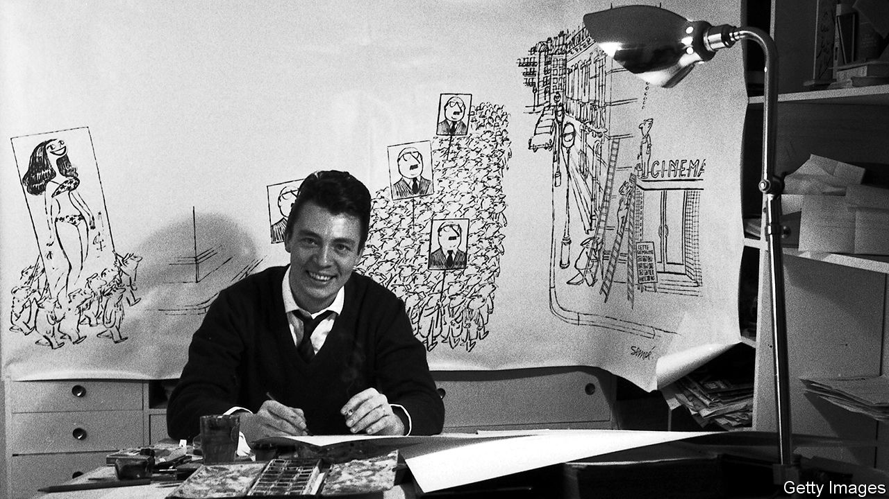

###### The joy of small things

# Jean-Jacques Sempé was an unparalleled observer of the human condition 

##### The much-loved cartoonist, creator of New Yorker covers for three decades, died on August 11th, aged 89 

 

> Aug 18th 2022 

At the edge of the gigantic sea, his clothes left in a pile, his arms hugging his shivering body, a frail, tiny figure wondered whether to take the plunge. In an immense plain, under a huge black cloud, a woman in a sunhat furiously pedalled her bicycle, with its basket of precious vegetables, towards some distant home. Amid an infinity of fir trees two ant-size cyclists almost met, but their paths diverged before contact. In a landscape of rampaging lushness and glorious views a pipe-smoking painter worked at his easel. His human subject, insignificant in the long grass, called “Remember not to forget me!” 

In cityscapes—the tall grey buildings and mansard roofs of Paris, the massed skyscrapers of New York—the proportions were the same. Here the human ants often moved in crowds, through the rainy streets, into opulent concert halls, towards political rallies, usually in the same direction. Yet in the city, too, they broke away and became solitary among the enormous towers. On a flat roof, a little girl jumped a skipping rope. In one lit window, a trainer coaxed a tiger through a hoop. From one balcony, a couple leaned out dangerously to catch the crescent moon through a canyon of high walls. In an immense lamplit colonnade, a furtive tuba-player smoked behind a column. 

Images like these, in ink and wash or gentle watercolour, featured for decades in dozens of French magazines, in Britain’s  and on the covers of the . They filled books that sold in the millions. His little figures, coping with the world, made Jean-Jacques Sempé internationally famous. But why, he wondered, did humans assume they were big? They were tiny, little scraps of things. Their lives were a mess, his own especially. He had been brought up petit-bourgeois and poor in south-west France, never knowing his real father, feeling therefore he was built on nothing. His foster parents almost killed him, and his stepfather—when his sales of canned anchovies went well—would come home drunk and beat him. He was expelled from school at 14 for being , too distractable. When he looked for work, everyone rejected him. 

His tiny figures were haunted by notions of greatness. Under an enormous statue to music, in an overgrown park, a weary man trudged with a violin. Before a colossal monument to some ancient hero wrestling a stallion, a glum businessman waited for the crossing light to change. Backstage, among soaring fly-towers, half a dozen child ballerinas lined up nervously to go on. Dreams of what they might do were limitless, but what might befall if they tried? His own ambitions had been, first, to be a brilliant jazz pianist like Duke Ellington. He had even met him once, in Saint Tropez, and they had banged out “Satin Doll” for a few bars. He still dreamed of reprising that, duelling with the Duke. An even bolder hope had been to be centre forward in the French national team. But by some conspiracy he had not been called. 

In default of greatness, his little figures did whatever they could. In the midst of one of his exuberant forests, a couple with a caravan laid out a garden and mowed a lawn. A middle-aged woman in a housecoat polished the railway tracks that ran past her cottage. One plump, balding husband, home from work, serenaded his wife with a cello; another, rising from the supper table, took a bow in the sunlight that streamed through the window. In a garden shed, a mousy little man forged a knight’s shining sword. 

As for him, he became an artist. It was not easy. In his youth he had only doodled, nothing serious. He never drew from life, only from his head, which contained everything necessary. When he started to sell drawings for a living, a last resort, he came across copies of the  with drawings by Saul Steinberg and James Thurber. He decided they were just too great, little dreaming that in 1978 he would dare to ask to do the same. But at the , as elsewhere, he felt he did nothing remarkable. Though he teased philosophers with the titles of his collections (“Nothing is Simple”, “Everything is Complicated”, “Unfathomable Mysteries”), he just drew the world as he saw it, striving for a new idea every day. He filled big sheets and canvases with the smallest details of grass, birds, mouldings, chandelier drops, creating a whole world for a single image which often required no words. 

That world was old-fashioned, more interesting than the modern one. On his rural roads there were no cars. Women stayed around the house; men put on hats and went to work, or sat in neighbourhood bistros, among the half-net curtains and bentwood chairs, talking politics and football. His cartoon-novel, “Monsieur Lambert”, was set entirely there. He did not care to update himself. Nor would he do satire or mockery, only humour of the sort that friends and colleagues indulged in. The gently nudging sort. How could he mock, when in every image he was drawing his own vulnerability?

The hero of “Le Petit Nicolas”, a series of books for children created with René Goscinny in 1959, also looked vulnerable and small. But Nicolas caused chaos on all sides with his daydreams and his pranks. He lay on his bed with his football, scheming, surrounded by toy cars and the discarded pages of his lessons. He was scolded at school, while behind the master’s back his friends leered and laughed. Off diving boards he jumped cheerfully into nothingness, holding his nose for luck. Little Nicolas had the happy-go-lucky childhood he himself never had. That made his own a bit easier to take. 

Childlike instincts helped generally. A middle-aged businessman kicked up fallen leaves in a park; an office worker, returning home, flicked the pedal of a drum kit. Another, smiling blissfully, rocked on a playground swing to contemplate the sunset. A plutocrat sat splashing in his villa’s private pool. Cyclists, the happiest of beings, raced down tracks together, brought cities alive with their colours and coasted solo above gridlocked traffic over the Brooklyn Bridge. At the edge of the gigantic sea, on a vast beach, a tiny figure in red shorts did a handstand for sheer joy. ■

