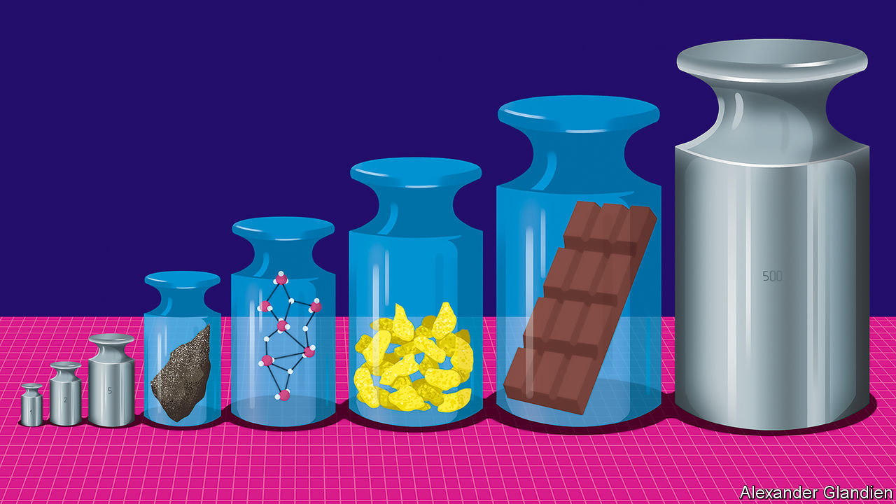
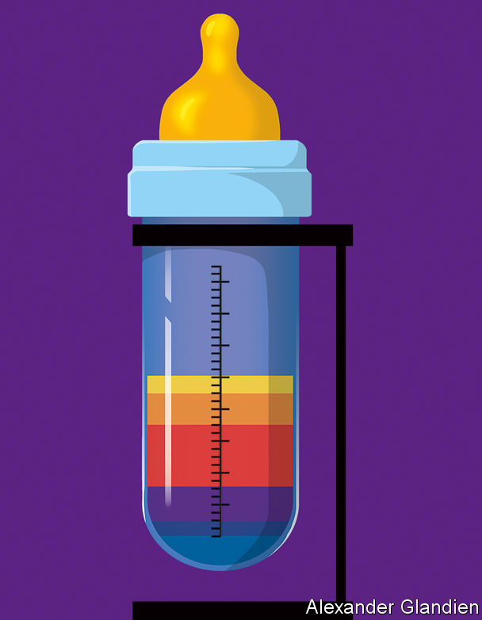

###### Metrology

# Keeping up America’s standards is the job of NIST 

##### Its scientists try to make all things equal 

 

> Aug 17th 2022 

“About every six months, I get an email: why is the peanut butter so expensive? Can I eat it? What does it taste like? Can you just send me a spoonful?” 

Melissa Phillips is a research chemist at the  in Gaithersburg, Maryland, and makes a spirited defence of the peanut butter her agency sells—a snip at $1,069 for 510 grams. The American government is notorious for overpaying its suppliers, but consider what it charges as a seller. That same $1,069 gets you precisely 455 grams of baking chocolate. Meanwhile 60 grams of breakfast cereal or 50 grams of dry cat food will cost you a mere $1,064. These are among more than 1,100 Standard Reference Materials (srms) in the catalogue, which also includes New Jersey soil, whale blubber, urban dust, mussel (not muscle) tissue and slurried spinach. The prices vary, but are invariably high.

Dr Phillips’s department represents a fascinating facet of nist’s overarching mission: standardisation. Standard methods and units are the bedrock of scientific endeavours from atom-smashing to astronomy. To carry out equivalent work on different continents, or to compare results from different decades, researchers must all agree, to eye-watering levels of precision, the standards against which they are making their measurements.

nist is America’s agency charged with safeguarding those standards. Most big countries have something similar. Often they began as repositories for lumps of metal of precisely a kilogram’s mass or a metre’s length, though these fundamental units are now defined in terms of natural phenomena rather than iridium-platinum artefacts. Now, they have wider remits. In particular, they are crucial to smoothing commerce and upholding regulations. In practice, that means agencies need more than merely written definitions. They need physical embodiments of the standards they define.

Soon after its foundation in 1901 nist’s predecessor, the National Bureau of Standards (nbs), faced a growing problem. As railway networks expanded, the breakage of wheels and buckling of tracks led to more and more derailments. No one had yet set standards for the iron and steel used for these purposes, and some of the alloys employed were brittle. The nascent nbs worked with iron founders to define the precise alloys that railway-builders should use. These srms are still for sale today: numbers 4l, 5m and 6g.

Staying on the rails

srms provide a material certified by the institute to contain exactly so many micrograms of this and percent-by-weight of that—the kinds of things regulators stipulate to ensure market harmonisation or safety or nutritional content. Manufacturers of everything from iron alloys to peanut butter have their own analytical kit to measure their own products. But every now and then they must ensure their methods and their equipment are up to snuff—and that their numbers are precisely as the law stipulates. 

At this moment they buy in an srm, which comes with a lengthy certificate. When the chemists run their usual measurements on such a sample they should come up with the numbers recorded on the certificate. If they do not, it is time to recalibrate the machine (or the chemists). The srm might be exactly the product they make. Or it may be a material that, from an analytical-chemistry perspective, is a good enough proxy. All it must do is prove that their methods are sound and accurate.

Early on, nist’s srm catalogue contained mainly alloys, ores, gases and other stuff of heavy industry. But the multiplication of regulations has led to a Topsy-like growth. Mussel tissue (catalogue number 2974a) is there because bivalves are good sentinels for pollution. Urban dust (1649b) acts as a reference point for those worried about toxic chemicals known as pcbs and cancer-causing compounds called pahs. 

Among the food srms, options seem weirder still. And for foodstuffs the stakes can be enormous, with a litany of vitamin requirements and toxin limits to deal with. If regulators allege that a sample of a manufacturer’s peanut butter contains some aflatoxin from a naturally occurring peanut mould, its makers may have to dump tonnes of their product, or recall it from store shelves. Or the matter might end up in court. That $1,069 jar of peanut butter could be the arbiter in a multi-million-dollar lawsuit.

The price tag arises because developing srms is a complex business—taking, on average, six years and costing $1m. First, nist collaborates with manufacturers to establish what measurements are needed. Then it must acquire a big batch of the product in question, so that the same reference material will be available for a long time, as it is sold off bit by bit over the years. In 2007 its supply of fortified breakfast cereal (3233) arrived in a pair of 200kg boxes. Nestlé, a multinational food giant, has recently delivered a whole pallet of baby food. 

Triangulating the truth

A suitable supply secured, the institute’s scientists make their own measurements. They also send samples to outside laboratories and to manufacturers themselves, for reality checks. The final tally of nutrients, toxins and so on that each srm’s certificate lists is the result of a grand statistical number-crunching designed to minimise the many sources of error that can arise in the course of such measurements. 

Apart from being solidly representative examples of the materials in question, there is nothing special about srms. “You’re not paying for what’s in there,” says Greg Jaudzems, a senior chemist at Nestlé who regularly purchases them. “You’re paying for the certificate.” Here it should be said that the taste of nist’s peanut butter is reportedly unremarkable.

A peanut butter srm is ideally suited to the needs of a peanut-butter maker. There is not an srm for every food, though. Given the effort involved in developing them, there cannot be. This helps explain why the list contains slurried spinach (2385) but not slurried kale. And baking chocolate (2384) but not the kind for eating. Since the purpose of an srm is to permit the calibration of equipment, something close, but not identical to a manufacturer’s product will usually be good enough.

At a basic nutritional level, every foodstuff can be seen as a combination of fat, protein and carbohydrate. A triangle with those as its vertices contains everything edible. Peanut butter is a bit more than half fat, one-quarter protein and one-fifth carbohydrate. Breakfast cereal is nine-tenths carbohydrate and nearly no fat. The idea is that whatever food a manufacturer is measuring, there is an srm near enough to it in the triangle to be used to validate its composition. Baking chocolate is, from this perspective, clearly a good proxy for the eating kind. But it is also not a bad comparator for avocados and black olives.

This matters because each spot in the triangle presents its own measurement challenges. There is no analysis machine so fancy that chemists can just throw peanut butter or chocolate or spinach into it. Foods must be separated into various components and then tested for many different things (“measurands”, in the parlance). Vitamins a, d, e and k tend to hang around in fats, so an analytical process that involves skimming off the oily bits of peanut butter must ensure that all those vitamin molecules do in fact come along for the ride, and that the process of separation does not destroy any of them. In the end, a laboratory must develop methods which tot up all the things enumerated on a label, and usually quite a few more that are not. 

This focus on completeness and precision reaches apotheosis with baby foods and, in particular, infant formula. It is not just a long history of scandals and scares in this area that contributes to paranoia here. Mr Jaudzems says that, from a regulator’s point of view, formula is “right on the cusp of a pharmaceutical”, because it is many babies’ sole source of nutrition. Getting exactly the recommended levels of vitamins—not 90%, not 110%—is crucial.

 


Yet those recommended levels change year after year as the science changes. At the same time, the kit that sniffs out toxins gets ever more sensitive, bringing what was once “undetectably low” into quantitative view. That presses regulators to move the goalposts, as happened after 2017, when a charity called the Environmental Defence Fund found that a number of foods, including products intended for babies, contained detectable levels of lead.

Along with other toxic elements, such as cadmium and arsenic, lead occurs naturally in soils. Some level of it in foods is therefore unavoidable. Paediatricians might reason that no level is acceptable. But, as Don Gilliland, a consultant chemist who has spent much of his career thinking about baby food and infant formula, puts it, “to an analytical chemist, there’s no such thing as zero.” Tellingly, a newly launched initiative by America’s Food and Drug Administration (fda), to revamp its baby-food limits, is called “Closer to Zero”.

This thrust and parry between those doing the regulating and those doing the measuring presses relentlessly against the limits of technology. “I‘ve been involved with a number of projects where there is a disconnect between what the regulators want and what the analytical capabilities can provide,” says Dr Gilliland. Try not to think about how much lead, arsenic and the like you may have consumed, back when no one could measure it.

Even the regulators’ in-house experts understand the limits. “There are hundreds of toxins, pesticides, nutrients,” says Kai Zhang, a chemist who specialises in fungal toxins for the fda. “There’s no way you can check everything. You have to prioritise your to-do list.”

Measure for measure

And that list is endlessly changing. Infant-formula makers, for example, are coming up with ever more additives that bring their products closer in composition to breast milk. This may affect what regulators want to be measured. Even altering the artificial flavour of a nutrition shake from vanilla to chocolate might change the way its contents are best measured accurately, says Mr Jaudzems. 

Then there are the entirely new vistas that open from time to time. At nist Dr Phillips is already thinking about a Wild West not so different from the golden days of the railway barons. Marijuana is legal for medical or recreational use in dozens of countries and in a majority of American states. Cannabidiol derived from hemp is sold around the world as a relaxing nutritional supplement, adding a potential new measurand to the list. In many places these industries have grown like weeds over the years without the kind of gentle guiding to market that results in standards. 

At last nist is stepping in. Dr Phillips is part of a team quantifying not only the psychoactive components of hemp and marijuana, but also more conventional fare such as metals, pesticides, fungal toxins and even moisture. Given time, they might just come up with the most expensive gram of marijuana ever sold. ■


