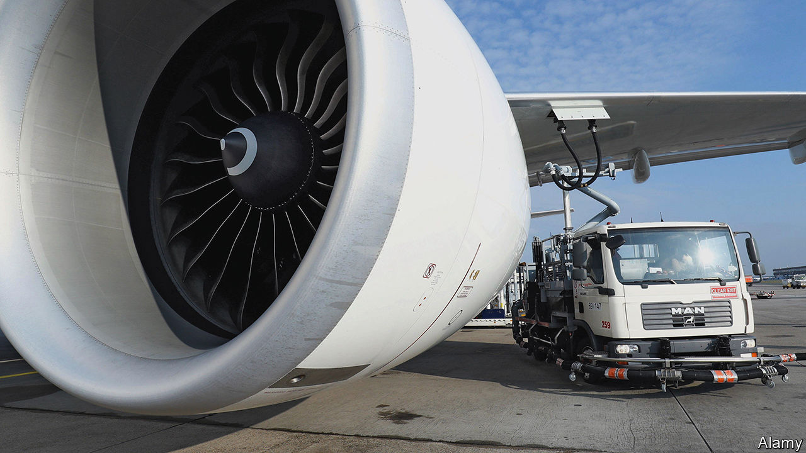
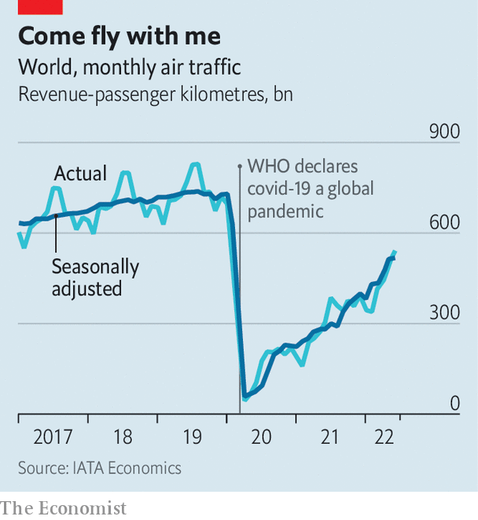

###### Air travel

# Ways to make aviation fuel green 

##### Airlines hope to become carbon neutral by 2050 

 

> Aug 17th 2022 

Travelling by air is by no means the biggest source of anthropogenic greenhouse-gases. At the moment, it contributes about 2.5% of them. But, after a covid-induced dip, air travel is once again growing (see chart), and its emissions are high-profile and hard to deal with. For short-range, small-capacity planes batteries show some immediate promise. But for bigger aircraft the technofantasy of using compressed hydrogen (made from green sources, natch) either as jet fuel in its own right, or to run fuel cells which then drive electric motors, is likely to remain just that—a fantasy—for decades.

 


Hence the popularity of the idea of sustainable aviation fuel (saf). This magical substance would match existing fuel in all relevant parameters and would thus, in the argot, be a “drop-in” replacement for the kerosene currently burned by planes. But instead of being distilled from crude oil, saf would be manufactured either directly or indirectly from carbon dioxide. 

Ideally, this CO will have come recently from the atmosphere, so that when it returns to the air no net greenhouse effect is created. At minimum, though, it will be extracted from the exhaust of an industrial process, enabling it at least to substitute for fossil-fuel emissions elsewhere before it is released.

Do this at a price competitive with stuff from a refinery and the world is your oyster. Airlines have already undertaken some 450,000 flights using saf as part of the fuel mix. The industry aims to be carbon neutral by 2050, and so far saf seems the only practical way to get there. But making saf is an uphill task. Stripped to its chemical essentials it means taking the equivalent of engine exhaust and turning it into something resembling what went into that engine in the first place. This requires “fixing” the carbon of carbon dioxide into big energy-rich molecules. Not surprisingly, the result is around three times as costly as ordinary jet fuel.

Such saf as has so far made it to market relies on photosynthesis to do the carbon fixing. It is derived from discarded cooking oil and animal fats, the triglyceride molecules of which trace their existence to the action of sunlight on chlorophyll. 

To make saf, triglycerides are hydrotreated, an established way of producing biodiesel for ground transport. A triglyceride molecule consist of three hydrocarbon tails attached to an oxygen-containing head. Hydrotreating combines the oxygen with hydrogen, to yield water. This liberates the tails and turns the head into a molecule of propane. The liberated tails can then be processed into drop-ins.

Boarding now

At the moment, the biggest producer of hydrotreated saf is Neste, a Finnish firm. It is expanding a biodiesel plant in Rotterdam for saf production and also enlarging a purpose-built one at Porvoo, in its home country. Neste aims, by the end of 2023, to be turning out 1.9bn litres of saf per year—some 15 times total world production in 2021 (though still less than 2% of global jet-fuel consumption). A milestone of sorts was reached in July when American Airlines took delivery of the first batch of saf to be verified as green by corsia, the Carbon Offsetting and Reduction Scheme for International Aviation, which benchmarks aviation-emission standards. 

Neste, though, is not the only company using hydrotreating to make saf from recycled cooking oils and fats. In America a firm called World Energy employs a former oil refinery in Paramount, California, to do something similar. Paramount was, indeed, the first plant to make saf commercially, having been converted to do so in 2016 by Bryan Sherbacow, a green entrepreneur. World Energy, to which Mr Sherbacow sold the plant in 2018, has teamed up with Air Products, a specialist in industrial gases, and Honeywell, an engineering firm, to expand the operation. By 2025, it expects to make around 1.3bn litres of saf a year. Mr Sherbacow himself, meanwhile, has set off in a different direction. This is to widen the range of waste materials that can be turned into saf. 

A big obstacle to expanding the triglyceride approach to saf is the supply of raw materials. Adding value to catering waste is something all can applaud. But for it to make a serious contribution to the jet-fuel market would mean buying fresh oils and fats that might otherwise be used as food. This would raise prices and encourage the spread of oil-palm plantations, both of which will bring problems of their own.

Mr Sherbacow’s new project, Alder Fuels, is on the case. Alder’s raw material is also waste—but in this case, leftovers from forestry and agriculture. Such “biomass” consists mainly of cellulose, hemicellulose and lignin—three structural polymers that act, in essence, as a plant’s skeleton. 

Structural polymers cannot be processed by anything resembling hydrotreating. Instead, Alder uses pyrolysis, which breaks the material concerned into smaller molecules by applying heat. The result is condensed into a hydrocarbon-rich liquid that the firm calls greencrude. This can be processed into saf in existing refineries and Boeing, America’s biggest aircraft maker, announced in July that it would use some of its planes to test and qualify the result. Alder hopes to begin commercial production in 2024. 

Waste not, want not

One problem with using biomass as raw material is that it is bulky, and thus expensive to gather, transport and store. To get around this, Alder is looking at a “hub-and-spoke” system, in which the processing plants are at the ends of the spokes, near sources of biomass, and the resulting greencrude is transported in tankers to a refinery at the hub. 

According to Alder’s calculations, forestry and agricultural waste are, if processed this way, abundant enough in America to supply three-quarters of the country’s current demand for aviation fuel, with no need to establish new plantations, or to compete with food production. Even so, others propose yet a different strategy. This is to fix carbon dioxide directly in an industrial plant, rather than relying on biology to do the job.

The most popular approaches to such direct fixation are called power-to-liquid processes. These yield what are known as e-fuels (an abbreviation of electrofuels, as production relies, at least in part, on electricity). Power-to-liquid processes vary. But all have in common the creation of a mixture of hydrogen and carbon monoxide, known as syngas. 

The value of syngas is that, at appropriate temperatures and pressures, and in the presence of suitable catalysts, its constituents react to yield hydrocarbons and water. This is called the Fischer–Tropsch process, after the German chemists who invented it in the 1920s, and it was used by Germany during the second world war to convert coal into liquid fuels, to make up for the country’s lack of access to petroleum.

That wartime approach involved the partial oxidation of the coal to create carbon monoxide. But this ingredient can also be made by the partial reduction of CO—hence the interest in its use for saf. The CO in question could come from many sources. Some dream of plucking it directly from the atmosphere, using what is known as direct air capture (dac) to filter it out. Others, more pragmatically, suggest extracting it as a by-product from methane-generating biodigesters, or from fermentation plants, such as breweries. 

If renewable electricity is then used to make the hydrogen, by electrolysing water, the resulting e-fuel is pretty green. One country with abundant hydro and wind power which can be taken advantage of in this way is Norway. And it is here that a consortium called Norsk e-Fuel is building a dac plant to produce saf. Production of 12.5m litres a year should start in 2024. 

Another source of renewable power is the sun. Synhelion, a Swiss firm, employs a field of mirrors to reflect sunlight to a receiver at the top of a tower. This heats a transfer fluid in the receiver to a temperature in excess of 1,500°C and that fluid, in turn, powers a reaction chamber which produces syngas by reducing water to hydrogen and CO to carbon monoxide. To start with the company is using a nickel-based catalyst and taking gas from a biomass plant, although it is developing other processes and will later add dac to the system. By having some of the transfer fluid pass through a heat store, to garner a proportion of its thermal load for later use, the process should be able to operate round the clock. 

On August 17th Synhelion announced that an experimental plant was producing syngas at “an industrial scale”, and it is now putting the finishing touches to a facility near Cologne, Germany, from which it hopes, next year, to deliver saf to airlines in the Lufthansa group. If all goes well it will open a further plant in Spain, in 2025, to take advantage of higher levels of sunshine there. By 2030, with additional plants coming on stream, the firm’s output could rise to some 850m litres a year—enough to meet around half the needs of Swiss carriers. The target, by 2040, is 50bn litres a year. That, if it came to pass, would make a serious dent in the jet-fuel market

Jetting to a greener future

In a separate project, Synhelion has linked up with cemex, a Mexican company that is one of the world’s biggest producers of cement. Part of cement-making involves heating limestone to drive off CO. This fact makes the industry responsible for about 8% of anthropogenic emissions of the gas. The CO in question is pretty pure, though, and thus itself ideal as a raw material. Having tested the idea successfully in Spain, the two companies aim to build a trial plant at one of cemex’s works. Though making e-fuel in this way would not be as green as plucking the CO concerned from the atmosphere, it would extract at least some environmental value from a product that would otherwise be entirely waste. 

Oil companies are also keen to get in on the act. Repsol, a Spanish firm, has teamed up with Saudi Aramco, Saudi Arabia’s petroleum giant, to build a plant in Bilbao that will make fuel not just for planes, but also for cars, lorries and boats, using green hydrogen and CO fed from a nearby oil refinery. This plant, planned to open in 2024, will employ a catalytic process developed by Johnson Matthey, a British chemicals company, to do the Fischer–Tropsching.

Further down the track, a third approach to making saf, distinct from employing organic waste or the Fischer-Tropsch process, is to use biotechnology. One idea which has been around for a while is to utilise photosynthesis directly, by engineering single-celled algae to make conventional drop-ins. Another, suggested in July, is a decidedly unconventional bioengineered drop-in based on a molecule made by bacteria to defend themselves against fungi. So far, though, these proposals are confined to the laboratory.

One way or another, then, the technology for making green aircraft fuels does seem to be coming into existence. Nor need such alternatives replace standard jet fuel completely to meet the airlines’ carbon-neutral-by-2050 target, says Sebastian Mikosz, head of environment and sustainability for iata, the trade group which represents most of the airline industry. The group’s calculations suggest saf could account for 65% of aviation’s carbon mitigation, with the rest coming from electric and hydrogen-powered aircraft, more-efficient airline operations, offsetting emissions and carbon capture. Yet that still requires 450bn litres of saf a year by the middle of the century.

Scaling up saf production to such a level may need government nudging. To this end, Joe Biden’s administration in America has announced tax credits and other incentives for saf production as part of the country’s new spending bill. Instead of carrots, the eu is using a stick. Member states are being asked to impose saf targets at individual airports. One proposal suggests these would rise from 2% in 2025 to 85% by 2050. Get the incentives right to expand production and reduce costs, though, and a point may yet come when the environmentally sensitive can board an aircraft with a clear conscience. ■


