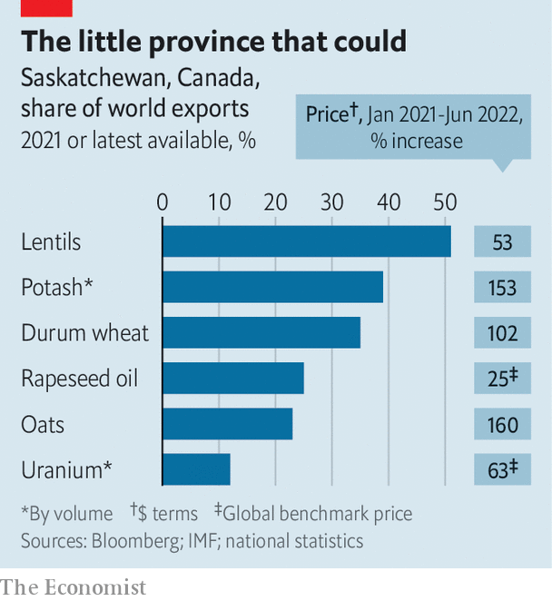

###### Pots of pink gold

# A remote Canadian province luxuriates in the global supply crunch 

##### Saskatchewan is enjoying wild growth in the wake of war in Europe 

 

> Aug 18th 2022 

Gerrid gust’s great-grandfather was from near Dubno, a town that is now in western Ukraine. He settled between the two biggest towns in the Canadian province of Saskatchewan, Saskatoon and Regina, on a plot of 160 acres which he bought for C$10. The farm is now a patchwork of properties 100 times the size which Mr Gust runs with his father and brother. Each year they harvest wheat, lentils and rapeseed.

Every planting season 23-metre-wide “drillers” shoot seed and fertiliser directly into the soil for 16 hours a day. Then it is all down to the heavens. Nearly all of Saskatchewan’s crops depend on rain rather than irrigation. Last year “was desperately dry”, says Mr Gust. “We can’t afford another bad year.” Nor, it seems, can the world. The 15m tonnes of wheat and 20m tonnes of other crops that the province produces in a typical year will be vital to markets roiled by the war between Russia and Ukraine. So, too, will almost everything else Saskatchewan produces. 

When Ukrainian immigrants first streamed into Canada at the end of the 19th century, the government of the day had a role in mind for them: to settle the vast prairies between the forests of Ontario and the Rocky Mountains. The minister of immigration knew what he wanted: “a stalwart peasant in a sheepskin coat, born on the soil, whose forefathers have been farmers for ten generations, with a stout wife and a half-dozen children.” Those with uncalloused hands could look elsewhere. 

It was a good match. The landscape reminded many of Bukovina and Galicia in western Ukraine. Its aspen forests needed clearing but the soil was lush and the land dirt cheap. By the first world war tens of thousands had come, settling around onion-domed churches, often living next to the same neighbours they had back home. That migration established what would become the world’s second-largest Ukrainian diaspora, behind Russia’s. 

In Saskatchewan, where a tenth of the population has Ukrainian roots, events in eastern Europe are again shifting local fortunes. Russia’s invasion of Ukraine has not quite prompted a stampede towards the prairie—the refugees arriving in Canada mostly prefer the comfort and energy of cities in the east. But it has caused the price of many of the commodities which drive Saskatchewan’s see-sawing economy to rocket like never before. 

 


Just about everything the province produces in abundance has seen its price shoot up as a result of the war. This includes the wheat and oats first grown by early settlers, Ukrainian or otherwise, as well as newer crops like rapeseed, pulses (lentils, chickpeas and the like) and mustard (see chart ). It is a bonanza that will reach far and wide. Saskatchewan is set to grow by 6% this year, more than any other Canadian province. 

Most important of all is what lies beneath the earth: oil, gas, uranium and above all potash, a jagged, crystalline mix of soluble salts of potassium that is a crucial ingredient in fertilisers. It is sometimes called “pink gold” for the hue it takes before it is refined into a white powder. Saskatchewan produces a third of the world’s output, and exports almost all of it. 

Russia and Belarus, the world’s two other potash powers, together produce about what Saskatchewan does on its own. But the world has lost access to much of their output, owing to sanctions and shipping blockades. Ken Seitz, the boss of Nutrien, a Canadian potash miner, recently told Reuters that the stranded supplies could amount to 8m tonnes this year, a fifth of global potash exports. 

That means the biggest importers, such as Brazil, India and Indonesia, as well as Europe, will find it harder to procure the fertiliser they need to plant crops and keep citizens fed. Saskatchewan is one of the few places in the world that can boost production at short notice, says Bronwyn Eyre, until recently the province’s minister of energy and resources. Ambassadors and other officials have been calling with urgent demands. For them, “it’s a national security concern.”

Saskatchewan is often said to be Canada’s heartland, full of cheerful, guileless folk who are just a generation or two off the farm if not still on it. The ups and downs of farm life helped forge a culture of mutual support. The province was the first place in North America to provide universal health care, in 1962. But recent prosperity, and perhaps the influence of Alberta, an oil-soaked neighbouring province with a secessionist bent, have changed things a bit. Today’s Saskatchewanites seem to want smaller government and lower taxes. Ms Eyre’s conservative Saskatchewan Party caters to that.

The potash industry is at the centre of this new mood. The tallest steel-and-glass office building in Saskatoon, the largest city, is the Nutrien tower. Mosaic’s building in the provincial capital, Regina, is almost as prominent. The firms’ names adorn stadiums and events. To anyone who takes the Yellowhead Highway across the province, half a dozen mines and their huge pink-white tailing piles can be seen across the pancake-flat landscape. 

Firms are scrambling to take advantage of what one boss describes as “outrageous” prices, which have tripled in a year. But new mines take time. Potash deposits are a kilometre or so beneath the earth, under a thick layer of pressurised water. To sink a shaft down the water must be frozen from above, a procedure that can take two years or more. bhp, the world’s biggest mining firm, is rushing to finish its first potash mine, in Saskatchewan, a year before it was due to open in 2027. 

Efforts are under way to ramp up production at existing mines, too. Nutrien plans to extract an extra 1m tonnes of potash in 2022, equal to 7% of its output. Mosaic has reactivated a mine it had mothballed in 2019. But transport problems hamper such plans. What Canada needs, says Ms Eyre, is more pipelines to move oil and gas about, which would free rail capacity to move more potash and crops to ports to be shipped abroad. The left-leaning prime minister, Justin Trudeau, disagrees. 

Like most of Canada, the province also suffers from a shortage of workers. No other province has seen such slow population growth. Over the past century the ranks of Saskatchewanites have increased by half to 1.2m while the country’s population has quadrupled. The provincial government has been keen to take as many Ukrainian refugees as it can get. But despite ample jobs, cheap housing and a diaspora, Ukrainians have not come flocking. ■

