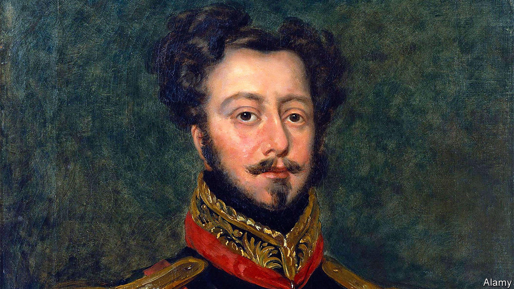

###### State organ

# Brazil’s monarchy is gone but not forgotten 

##### The republic puts the heart of its old emperor on display 

 

> Aug 18th 2022 

When celebrating milestone anniversaries, Brazil has an odd habit. In 1921, ahead of its centenary, it brought home the corpse of its last emperor, Pedro II. At 150 years it summoned the body of his father, Pedro I: for five months the military regime of the day lugged his coffin around the country in a cortege. Given that independent Brazil had just two monarchs, you might assume that no remains remain to be flown in for the country’s bicentenary on September 7th. Not so. On August 22nd Brazil will receive from Portugal, with full military honours, a glass jar filled with formaldehyde. Floating inside is a gory grey tentacular blob: Pedro I’s heart. 

With two months left in a bitter presidential election campaign haunted by fears of unrest, the royal organ may escape widespread notice. For decades the monarchy, ousted by the army in 1889, has been simply an old relic. But although Jair Bolsonaro, the right-wing president, is above all else smitten with the armed forces, he has grown close to those who would like to reinstate royal rule. Footsoldiers for this obscure movement have found new vigour in the slipstream of the president’s modern populism, entering the parliament and cabinet. Upon its arrival, the heart may further inflame monarchist passions. 

Obtaining it took months of talks. It will spend just 20 days in Brazil before returning to Portugal, which was reluctant to part with it. But the sharing is apt, for Pedro I (pictured) was a royal with two homes. In 1807 his father transferred the royal court from Lisbon to Rio de Janeiro as Napoleon’s army advanced. In 1822, after one Portuguese attempt too many to subdue the restless colony, it was he, at 23 years of age, who unsheathed his sword and uttered: “Independence or death!” After delivering Brazil its independence, he returned to Portugal and left his heart to the city of Porto in his will. 

For Luiz Philippe, a royal descendant who is a congressman and an ally of Mr Bolsonaro, the heart’s display will shine a light on what he sees as an impressive record. The monarchy, the only one to reign in independent Latin America for any length of time, kept Brazil intact while Spanish colonies in the hemisphere splintered upon independence.

Moreover, campaigners contend, republican life since 1889 has been replete with coups, corruption and chaos. Suely Silveira says she became a monarchist when she “woke up and started to study history”. Republican Brazil has stalled, she says, while many parliamentary monarchies abroad have grown enviably rich. Of the nine presidents since the end of military rule, one died before taking office, two were impeached and five have faced investigation for graft. Monarchists wonder if the country might be sturdier with the calming influence of a king. 

But those who believe the resurrection of the past is the answer to what ails Brazil are “reclaiming a past that never existed”, says Jurandir Malerba of the Federal University of Rio Grande do Sul. A return to the ways of the 19th century sounds less enthralling to the millions of Brazilians who are indigenous or poor. In a referendum in 1993 voters were asked whether Brazil should be a republic or a monarchy. The republic won the day by 87% to 13%. Current polls show a similar landslide. 

Militarists and monarchists, once opponents, get along better these days. In 2018 Mr Bolsonaro considered picking Mr Phillipe as his vice-president. Upon the death on July 15th of Luiz of Orléans-Braganza, the head of the defunct royal house, the president declared a day of official mourning. 

The current would-be emperor is 81 and childless. But many monarchists think the third in line, Rafael Bragança, a 36-year-old consultant living in west London, is royal material. In Britain, Mr Bragança explains between sips of a double macchiato, he can admire a good constitutional monarchy in action, one that brings continuity and unity to a stormy political environment. Would he like to do the same at home? “I don’t want to impose anything,” he says, without skipping a beat. “There would need to be a plebiscite. But if it is needed, I’m there.” ■

