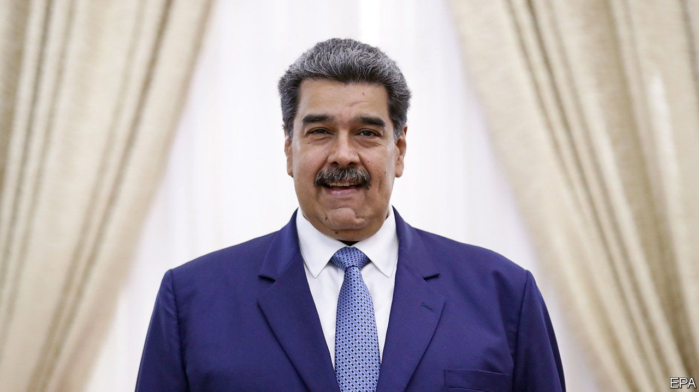

###### Maduro’s mates

# Venezuela’s dictator is less isolated than he once was 

##### A regional tilt left and high oil prices are shoring up Nicolás Maduro’s rule 

 

> Aug 18th 2022 

As regional leaders descended on Bogotá for the elaborate inauguration on August 7th of Colombia’s first left-wing president, one man was notable by his absence. The outgoing conservative president, Iván Duque, used his last dregs of power to make sure of that. He barred Nicolás Maduro, the dictator next door in Venezuela, from stepping on Colombian soil until the very moment Gustavo Petro was sworn in. So Mr Maduro stayed home and played television presenter, standing by a large screen in his palace and commenting on events in Bogotá as they unfolded. 

Missing the ceremony has not dampened Mr Maduro’s enthusiasm for the political change sweeping Colombia, America’s staunchest ally in the region. Like many tyrants, Mr Maduro hails democracy when it works to his liking. “New times are coming,” he tweeted shortly after the victory of Mr Petro, a guerrilla-turned-senator, in June. The leftist Mr Petro has promised a thaw in his country’s frosty relations with Venezuela. To start, he says he will restore diplomatic relations, severed since 2019. 

But Mr Maduro’s elation is based on more than just a leftward tilt in Colombia. He seems to think the election of left-wingers such as Gabriel Boric in Chile and Pedro Castillo in Peru will undermine the campaign to isolate his regime. The United States, meanwhile, appears too worried about an oil shortfall to keep piling pressure on the regime. All this will help make the Venezuelan president less of a pariah in the region. Even right-wing governments quietly accept that Mr Maduro (pictured) is here to stay. 

It is ironic that the wily Mr Maduro may benefit from the ascension of left-wing leaders, whose rise he has actually impeded. After boosting socialist movements across Latin America in its heyday, Venezuela has become a political headache for leftists trying to get elected. On the campaign trail conservatives portray Venezuela’s agony as what awaits voters if they plump for the left. Candidates often end up caught between centrist allies, whose support they need to govern effectively, and the radical bits of their base who still idolise Mr Maduro’s regime. 

That may be why Mr Petro, who concedes the point that the regime is “dictatorial”, made no mention of Venezuela in his inauguration speech and is likely to proceed with great caution. Colombian-Venezuelan relations have been in tatters since 2019 when Mr Duque and much of the West recognised Juan Guaidó, the head of Venezuela’s national assembly, as the rightful leader of the country and demanded that Mr Maduro step down. Mr Duque, a technocrat friendly to the United States, became a prominent supporter of Mr Guaidó’s prolonged but fruitless bid for power. 

There is nevertheless plenty of room for co-operation. An obvious step would be the reopening of the 2,200km (1,400-mile) border between the two countries. Since 2015 most vehicles have been unable to cross; almost all transit and trade takes place on foot. That has been calamitous for livelihoods across what was once among South America’s busiest frontiers. Trade worth $7bn in 2008 shrank to just $142m in the first four months of this year. Fernando Grajales, who manufactures jeans in the Venezuelan border town of Ureña, says production is just 10% of what it was back in 2015, and that 80% of clothing firms in the town have closed. “We want Colombian consumers here,” he said. 

Less enthusiastic about the détente are many of the 1.7m Venezuelans who have moved as refugees to Colombia in recent years. A fifth of the population, some 6m people, has fled Venezuela since its economic crisis deepened in 2014. Some fear that Mr Petro’s interventionist instincts will set their new home on a familiar path towards ruin. “We know how this film ends,” sighs Jorge Moreno, a young engineer who moved from Venezuela to Bogotá four years ago. Others fretting include members of Venezuela’s opposition, who have made Bogotá their headquarters since 2019. Some may opt to leave the country.

Grander geopolitical events further perturb Mr Maduro’s enemies: the war in Ukraine and the United States’ subsequent hunt for alternatives to Russian oil. President Joe Biden has had to reassess ties with Venezuela, which sits on the world’s largest proven oil reserves, but whose state oil firm, pdvsa, strains under sanctions. Mr Biden has dispatched negotiators to Venezuela twice this year. Officials insist the talks are an effort to jump-start negotiations with the opposition and free American prisoners, two of whom returned home after the first visit in March. 

And yet the United States seems poised to let Venezuelan oil flow. In June two European oil firms won its permission to buy oil from pdvsa—the first such approvals in two years. Chevron, a Western energy firm still in Venezuela, is said to be working on a deal to ship oil from its joint venture with pdvsa straight to the United States, after pdvsa drops its stake to just below 50%. For the Biden administration, such obscure schemes can “reduce the political cost” of dealing with a despot in order to lower oil prices, says Francisco Rodríguez, a Venezuelan economist and anti-sanctions campaigner. 

Mr Biden is not likely to formally accept Mr Maduro as Venezuela’s rightful leader, let alone give him a fist-bump as he did Saudi Arabia’s crown prince, Muhammad bin Salman. But the quest for cheap oil is not the only reason for the United States to ease up on the Venezuelan government. It will also not want to strain relations with the growing ranks of left-wing governments in the region by demanding that they ostracise Mr Maduro. ■

