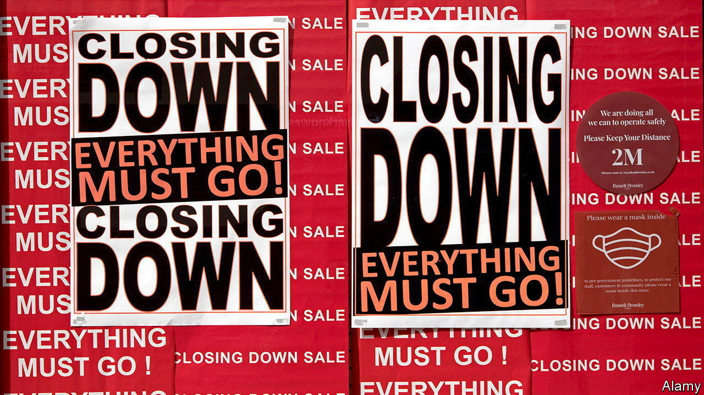

###### The Economist explains

# What is a recession? 

##### The definition is contested—and political 

 

> Aug 12th 2022 

WIKIPEDIA EDITORS cannot agree on the definition of “recession”. Last month the site barred new and unregistered users from editing its page on the subject, after a fierce dispute over the claim that two consecutive quarters of falling GDP indicates a recession. The page, which had previously been tweaked just 24 times in 2022, was edited 180 times in a week. Nor is the debate confined to interested amateurs. In America it has been the subject of political sparring. On August 12th Britain’s Office for National Statistics announced that  had shrunk in the second quarter of the year; economic forecasters think further declines lie ahead. So what constitutes a recession?

In short, a period of significant decline in economic activity. A recession typically leads to drops in output and investment, falling profits for businesses and rising unemployment. The global financial crisis of 2007-09 shaved almost 4% off economic growth worldwide. In some countries, including Britain, France and Germany, the convention is that two quarters of negative GDP growth indicates a recession. But many economists believe this definition is too narrow. Japan’s cabinet office uses multiple indicators, including factory output, retail sales and employment. America’s government has ceded the authority to declare a recession entirely. It defers to the National Bureau of Economic Research (NBER), a private, nonprofit research group.

A panel of eight NBER economists—known as the Business Cycle Dating Committee (BCDC)—has been America’s arbiter of recessions since 1978. As in Japan, the committee defines a recession using a range of factors, including employment, personal income and industrial production. Considering GDP alone, says one former member, is akin to diagnosing a patient’s illness only by checking their temperature. This is one reason why America is not officially in a recession, despite its GDP falling in the first and second quarters of the year. Unemployment is low and job growth robust: the country , more than twice as many as expected. It has now recovered all those lost during the pandemic.

Another reason is that the committee does not make real-time judgments, much less predictions. It prefers to be retrospective, thereby avoiding the possibility of error. (In 2013, for instance, it became apparent that Britain had not in fact gone into recession the previous year, after GDP figures for 2012 were revised.) The BCDC usually flags a recession once it is well under way—and sometimes after it is over. The pandemic-induced downturn in 2020 lasted from February to April, according to an official pronouncement made in June that year. The usual lag between the start of a recession and the committee’s announcement is almost 12 months. The BCDC concluded in December 2008 that the recession in America caused by the global financial crisis had begun in December the previous year.

The NBER may be inclined to wait before making an official pronouncement. But its cautious approach seems to hold little sway with Americans. In a survey conducted by CNN last month 64% of respondents reckoned a recession had already begun. (In June 73% of Britons responding to an Ipsos poll thought the same.) Republicans lambast Democrats for causing a downturn and warn they will pay the price in mid-term elections on November 8th. Democrats maintain that no such recession exists. They may be technically correct—but have good political reason to be defensive too. In the past three recessions that took place around the time of a presidential race, the party controlling the White House lost power. Such political consequences are not uniquely American. In countries where people are reluctant to trust their politicians, economic downturns are especially likely to trigger a change in leadership.

For all the political noise, if a recession  it is likely to be relatively mild. It may not be so everywhere. Britain is forecast by the Bank of England to face five quarters of declining output. For poor and middle-income countries the forecast is even worse. In many, says the World Bank, “recession will be hard to avoid”.


