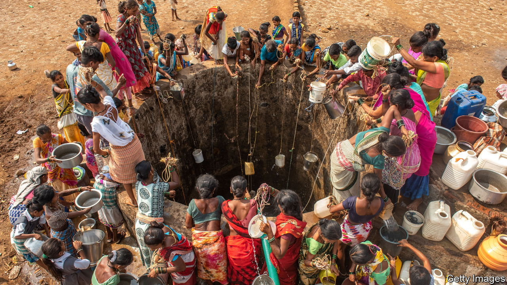

###### The Economist explains

# Why monsoon season will not solve India’s water crisis 

##### The country is rapidly depleting its groundwater 

 

> Aug 15th 2022 

AFTER A SCORCHING summer, most parts of India are enjoying a drenching from monsoons that arrived in late May. But the downpours will provide only limited relief. Several eastern and northern states had the driest July on record; the India Meteorological Department has warned that below-average rainfall is likely to continue this month and next. Many parts of the country will continue to suffer acute water shortages in the coming year—and for many years to come. Why?

Some 600m Indians—more than 40% of the population—rely on agriculture for their living. A little over half of the country’s farmland is not irrigated. Instead it is watered by the rains. But climate change has made monsoon patterns . A study published in  in 2017 found that rainfall in India’s central belt decreased by 10% between 1950 and 2015. The impact of that decline was compounded by the increase in particularly heavy downpours, the frequency of which rose by 75% over the same period. Heavy rain does not penetrate and irrigate the soil, but erodes it, damaging farmland rather than helping crops to flourish. That India’s rainfall is concentrated into shorter periods also means that dry spells are lengthier. This year Kolkata went 61 days without rain, its longest stretch since 2000.

That encourages Indians to use  to preserve their crops. A law passed in 1882 gives every landowner the right to use the water under their land as they choose. Starting in the late 1960s, Indian agriculture began to modernise: this so-called “Green Revolution” made the country a net food exporter. But it also led to the widespread construction of tube wells. India now pumps more groundwater than America and China put together. Last year a study in found that by 2025 large portions of north-western and southern India will have “critically low groundwater availability.”

These pressures leave many ordinary Indians struggling. In June a viral video showed a woman in Madhya Pradesh, a central state, climbing down a large tube well, using the bricks for handholds, to find water. Farmers in Punjab, a large northern state, are protesting against the scarcity. According to UNICEF, a United Nations aid agency, less than half of Indians have access to safely managed drinking water. Much of India’s groundwater contains high levels of fluoride, which can cause skeletal fluorosis, a condition that deforms bones and joints, leaving patients in excruciating pain. At least 25m people are affected, with a further 66m at risk. According to the government, 209 districts in 25 states have arsenic in their groundwater; Human Rights Watch, an NGO, warns that long-term exposure can cause various ills, including cancer, cardiovascular disease and lung disease. A study by  in May estimated that in total polluted water causes more than 500,000 premature deaths in India in 2019.

The government has begun to act. It has earmarked $45bn over the next five years to supply clean tap water to all rural homes. In Punjab, India’s leading wheat-producing state, several schemes provide farmers with cash incentives to pump less groundwater. Some states use techniques that are centuries old, harvesting run-off from monsoons and building dams to help replenish groundwater. These traditional efforts may prove more effective than sweeping national schemes, which are hampered by graft and bickering among state governments. In a country that has 18% of the world’s population but just 4% of its water, every drop counts. ■


